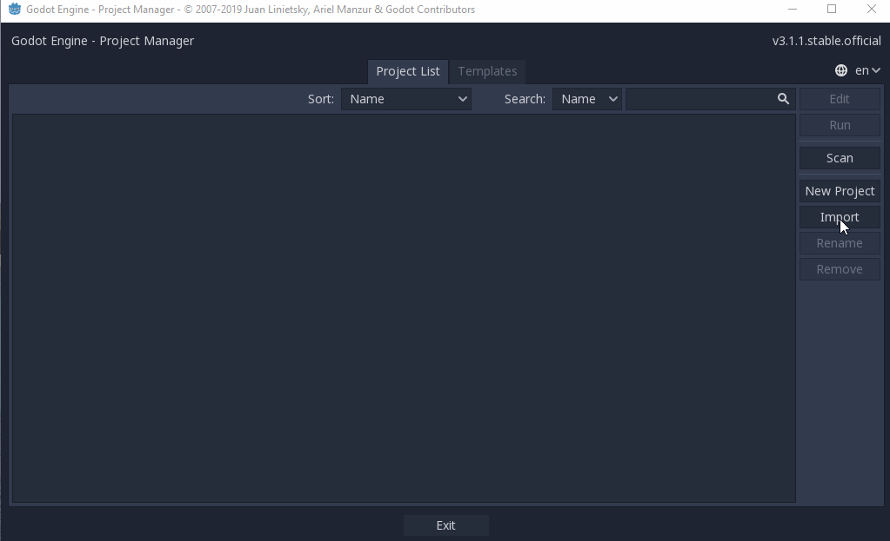
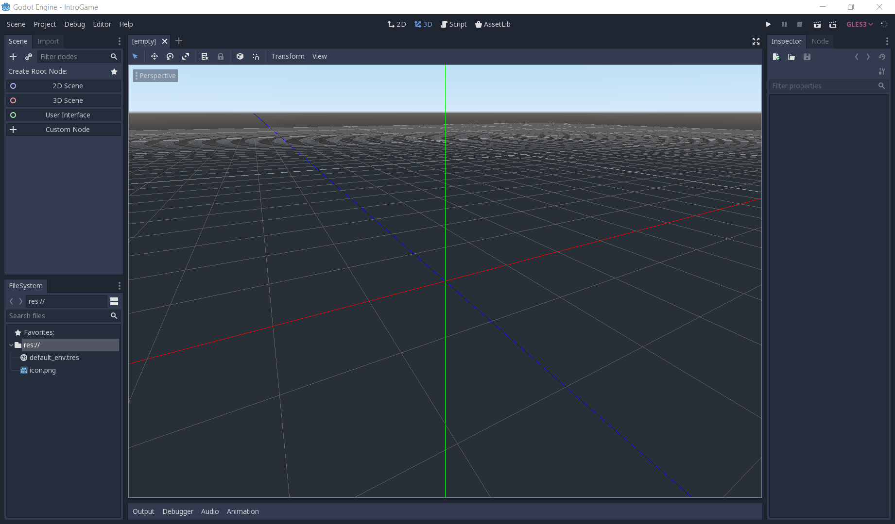
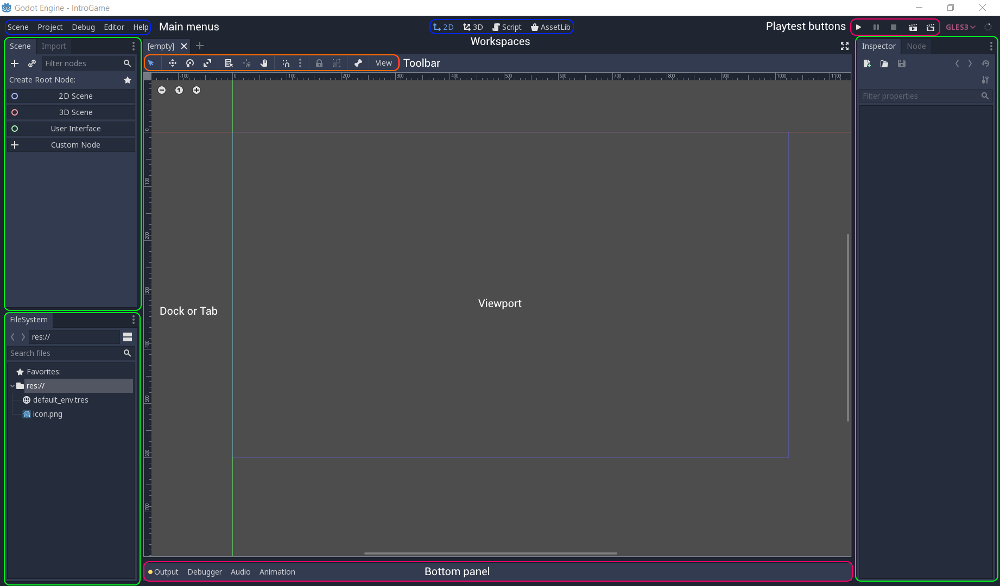
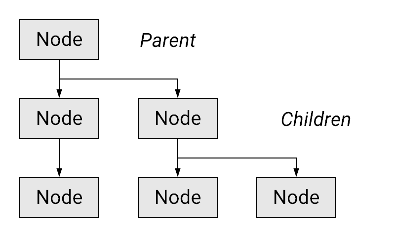
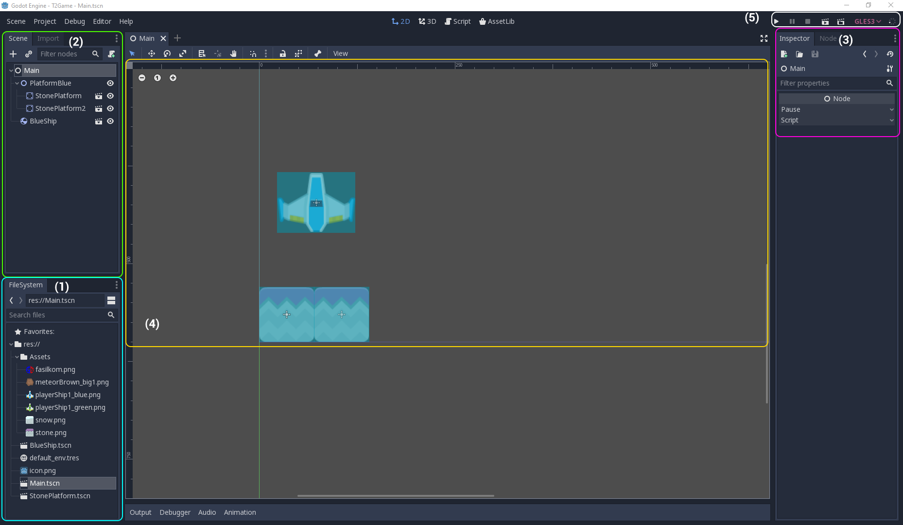

# Tutorial 2 - Introduction to Game Engine

Selamat datang pada tutorial kedua kuliah Game Development! Pada tutorial
kali ini, kamu akan berkenalan dengan _game engine_ Godot dan mencoba
memahami fitur-fitur dasar Godot secara singkat. Di akhir tutorial ini,
diharapkan kamu paham dengan penggunaan Godot Editor, penerapan konsep
_node_ dan _scene_, dan menyimpan hasil tutorialnya di sebuah repositori
Git daring.

Sekadar mengingatkan, pastikan kamu:

- Telah mengunduh dan memasang [Godot v3.5.3](https://godotengine.org/download/3.x/)
  edisi **Standard** sesuai dengan _development environment_ yang kamu gunakan.
- Telah menjadi anggota kelompok tugas proyek akhir.

## Daftar Isi

- [Tutorial 2 - Introduction to Game Engine & Version Control](#tutorial-2---introduction-to-game-engine)
  - [Daftar Isi](#daftar-isi)
  - [Pengantar](#pengantar)
  - [Persiapan Awal](#persiapan-awal)
  - [Antarmuka Godot Editor](#antarmuka-godot-editor)
  - [Konsep Node dan Scene](#konsep-node-dan-scene)
  - [Inspeksi Node dan Scene](#inspeksi-node-dan-scene)
  - [Latihan: Playtest](#latihan-playtest)
  - [Latihan: Memanipulasi Node dan Scene](#latihan-membuat-node-dan-scene)
  - [Latihan Mandiri: Membuat Level Baru](#latihan-mandiri-membuat-level-baru)
  - [Pengumpulan](#pengumpulan)
  - [Referensi](#referensi)

## Pengantar

Tutorial ini disusun dengan mengambil beberapa referensi dari dokumentasi
resmi [Godot v3.5](https://docs.godotengine.org/en/3.5/) dimana
kamu akan mengikuti instruksi-instruksi di dalam dokumen ini untuk mengenal
_game engine_ Godot dan menggunakannya untuk membuat sebuah game sangat
sederhana. Namun beberapa gambar yang ada di tutorial ini diambil dari Godot v3.1.1.
Jadi nanti ikuti tutorialnya harap teliti ya, bisa jadi ada sedikit tulisan yang berbeda
antara perintah yang diberikan dan gambar visualisasinya. Terakhir, mungkin
masih ada yang bertanya-tanya:
"_Mengapa harus belajar menggunakan game engine seperti Godot, Unity, atau
Unreal, untuk membuat game?_"

Salah satu jawaban singkat dari pertanyaan di atas adalah **software/component reuse**.
Dengan menggunakan _game engine_, pengembang game tidak harus mengimplementasikan ulang komponen-komponen penting di dalam game,
seperti _game loop_, _audio system_, AI, _graphics/rendering system_, UI, dan lain-lain.
_Game engine_ menyediakan komponen siap pakai dan memberikan keleluasaan bagi
pengembang untuk mengimplementasikan hingga mengubah komponen yang ada sesuai
dengan kebutuhan.

_Game engine_ pada umumnya juga menyediakan _editor_ yang perannya seperti IDE
(Integrated Development Environment) yang biasa kamu gunakan di kuliah-kuliah
pemrograman lainnya. Dalam hal ini, kemampuan _editor_ dalam _game engine_
tidak hanya sekadar sebagai _text editor_. _Editor_ dalam _game engine_ dapat
digunakan juga untuk membuat aset, manajemen aset, hingga melakukan komposisi
aset ke dalam dunia game. Hal ini yang akan kamu lihat dan coba lakukan di
dalam tutorial ini.

Singkat kata, atau **TL;DR: _Game engine_ akan mempermudah proses implementasi game.**

## Persiapan Awal

Langkah-langkah awal yang perlu dilakukan dalam pengerjaan tutorial ini adalah
sebagai berikut:

1. Buka repositori [_template_ proyek Tutorial 2](https://github.com/CSUI-Game-Development/tutorial-2-template) di GitHub.
   Pilih "Use this template" untuk membuat repositori baru berdasarkan _template_ tersebut ke dalam akun GitHub milikmu.
2. Setelah membuat repositori Git baru berdasarkan _template_ proyek Tutorial 2, salin repositori Git proyek Tutorial 2 ke mesinmu.
3. Unduh Godot dahulu. Pastikan kamu mengunduh Godot versi 3.5 (LTS).
   Kemudian _extract_ ke suatu lokasi di dalam _filesyste_ komputer.
4. Jalankan Godot. Apabila Godot kamu merupakan instalasi baru (_fresh_), maka
   akan muncul _modal window_ yang menanyakan apakah kamu ingin membuka **Assets Library**.
   Pilih **Open Assets Library**, lalu tunggu beberapa saat hingga proses
   _loading_ selesai dan pilih _tab_ **Projects**.

   > Catatan: **Assets Library** adalah repositori aset siap pakai yang dapat
   > digunakan dalam proyek game Godot. Bagi yang pernah menggunakan _game engine_
   > Unity, fungsinya serupa dengan Unity Assets Store.
5. Impor proyek game `T2`/`Tutorial 2` dengan menggunakan fitur **Import** di tampilan
   Projects.

   
6. Jika Godot sudah selesai impor proyek `T2`/`Tutorial 2`,
   maka akan muncul tampilan Godot Editor.
   Tampilan _default_ Godot Editor dapat dilihat pada cuplikan gambar berikut:

   

   Tampilan Godot Editor di atas menampilkan ruang kerja (_workspace_) 3D.
   Untuk kebutuhan tutorial ini, ganti _workspace_ ke mode 2D dengan tombol
   _shortcut_ F1 atau klik tombol 2D yang berada di bagian atas _editor_.

   

## Antarmuka Godot Editor

Tampilan Godot Editor terdiri dari beberapa panel yang akan dijelaskan
sebagai berikut:

- Viewport
  Jendela yang menampilkan _scene_ dalam game, _code editor_, atau Asset
  Library sesuai dengan apa yang dipilih pada Workspaces.
- Workspaces
  Panel untuk mengganti apa yang ditampilkan pada Viewport. Ada 4 jenis:
  2D, 3D, Script, dan AssetLib.
  - 2D menampilkan _scene_ dengan tampilan dua dimensi.
  - 3D menampilkan _scene_ dengan tampilan tiga dimensi.
  - Script menampilkan _code editor_ dan _debugger_.
  - AssetLib menampilkan _library addons_, _scripts_, dan aset-aset gratis.
- Playtest Buttons
  Panel untuk menjalankan proyek atau _scene_.
- FileSystem
  _Tab_ untuk mengatur dan menyusun berkas-berkas dan aset-aset di dalam proyek
  yang sedang dibuka.
- Scene
  _Tab_ yang menampilkan hirarki dari objek-objek yang berada di dalam _scene_
  yang sedang aktif.
- Import
  Jendela untuk melakukan pengaturan _import_ pada berkas aset yang sedang
  dipilih.
- Inspector
  Menampilkan rincian spesifik dari objek yang sedang dipilih dalam _scene_.
  Pada umumnya terdapat komponen **Transform** yang mengatur posisi, rotasi,
  dan skala dari objek yang dipilh. Selain itu, juga terdapat pengaturan
  spesifik tergantung dari tipe objek yang sedang dipilih.
- Node
  _Tab_ terdiri dari dua bagian: **Signals** dan **Groups**. Signals mengandung
  daftar _events_ atau sinyal sesuai dengan tipe objek yang sedang dipilh.
  Groups digunakan untuk mengelompokkan objek yang sedang dipilih ke dalam
  kelompok tertentu supaya memudahkan untuk mencari atau mengatur beberapa
  objek serupa dalam satu kelompok.
- Output
  Menampilkan _console log_ dari Godot Engine.
- Debugger
  Mengandung beberapa _tools_ yang dapat digunakan untuk melakukan _debugging_
  ketika menemui masalah dalam pengembangan. _Tools_ yang tersedia adalah:
  - Debugger menampilkan proses _runtime_.
  - Error menampilkan _error_ yang muncul ketika menjalankan game.
  - Profiler menampilkan _profile_ dari setiap _function call_ yang terjadi
    di dalam game.
  - Monitor menampilkan _performance parameter_ dari game, seperti FPS (frame
    per second), _physics collisions_, dan lain-lain.
  - Video Mem menampilkan penggunaan memori dari game yang sedang berjalan.
  - Misc menampilkan opsi-opsi _debug_ lainnya.
- Audio
  _Tab_ yang membantu melakukan pengaturan audio dalam _game_.
- Animation
  Jendela untuk membuat dan mengatur _timing_ dan _keyframe_ dari animasi
  yang digunakan.

Untuk mempercepat beberapa operasi pada Godot Editor, terdapat beberapa tombol
_shortcut_ yang dapat kamu gunakan, seperti:

- F1: Ganti _viewport_ ke mode 2D.
- F2: Ganti _viewport_ ke mode 3D.
- F3: Ganti _viewport_ menjadi _script editor_.
- Shift + F1: Buka tampilan pencarian dokumentasi.
- Q: Ganti mode manipulasi menjadi **Select**.
- W: Ganti mode manipulasi menjadi **Move**.
- E: Ganti mode manipulasi menjadi **Rotate**.
- S: Ganti mode manipulasi menjadi **Scale**.
- R: Ganti mode manipulasi menjadi **Ruler**

Tombol-tombol _shortcut_ lainnya dapat dilihat di menu Editor > Editor
Settings > Shortcuts.

Selanjutnya kamu akan berkenalan dengan konsep **Node** dan **Scene** yang
merupakan komponen fundamental dalam game yang dibuat menggunakan Godot.

## Konsep Node dan Scene

Salah satu alasan mengapa kuliah Game Development di Fasilkom UI membutuhkan
kuliah Struktur Data & Algoritma (SDA) sebagai prasyarat adalah agar dapat
memahami bagaimana sebuah objek game dalam Godot terstruktur. Godot
merepresentasikan dunia game beserta objek-objek di dalamnya dalam bentuk
hirarki pohon (_tree_). Sebuah objek, abstrak maupun konkrit, dalam Godot
direpresentasikan sebagai sebuah **Node**, dimana _node_ tersebut bisa
memiliki struktur hirarki yang rekursif layaknya _tree_.

Sebuah _node_ pada Godot Engine memiliki atribut/sifat berikut:

- Memiliki nama.
- Memiliki atribut-atribut (_properties_) yang dapat diubah.
- Dapat menerima fungsi _callback_ untuk diproses per _frame_ (atau dengan
  kata lain: diproses setiap 1 kali iterasi _game loop_).
- Dapat di-_extend_ untuk memiliki lebih banyak fungsi. Dengan kata lain,
  sebuah _node_ bisa memiliki hubungan seperti _inheritance_ di paradigma
  pemrograman objek (OOP).
- Dapat ditambahkan/dicangkokkan ke _node_ lain sebagai anak _node_
  (_child node_).

Sebuah hirarki _node_, atau selanjutnya disebut sebagai _tree_, dapat membentuk
sebuah **Scene** di dalam Godot. Sifat khusus dari _scene_ yang berbeda dari
_node_ adalah sebuah _scene_ dapat disimpan ke media penyimpan, dapat dibaca
kembali dari media penyimpan, dan dapat dibuat menjadi _instance_ baru di dalam
sebuah _scene_ yang berbeda.

> Catatan: Bagi kamu yang familiar dengan _game engine_ Unity, konsep _scene_
> di Godot mirip dengan _prefab_ dan `GameObject` pada Unity, dimana _scene_
> pada Godot dapat dikomposisikan sebagai anak sebuah _scene_ lain. Selain
> itu, _scene_ di Godot pada saat yang bersamaan juga seperti _scene_ di Unity,
> yaitu representasi dari ruang dimana permainan berlangsung. Di Unity, _scene_
> digunakan lebih harfiah, yaitu untuk merepresentasikan 1 atau lebih
> `GameObject` sehingga membentuk ruang permainan.

Untuk memperjelas konsep _node_ dan _scene_, ada baiknya jika kamu langsung
praktik melihat _node_ dan _scene_ yang sudah disiapkan.

## Inspeksi Node dan Scene

Pada panel **FileSystem**, klik 2x berkas bernama `MainLevel.tscn`. **Viewport** pada
Godot Editor akan menampilkan visualisasi sebuah _scene_. Perhatikan juga panel
panel **Scene** yang menampilkan hirarki _node_ pada _scene_ `Main` yang sedang
dibuka.

Perhatikan bagian-bagian penting dari _scene_ yang sedang dibuka:

1. Panel **FileSystem** menampilkan koleksi berkas yang ada di dalam proyek
  `T2`/`Tutorial 2`. Saat ini, ada 3 buah berkas _scene_ yang berakhiran `.tscn`
   di dalam folder `scenes` dan ada folder `assets` berisi berkas-berkas gambar dengan format PNG.
   Perlu diingat bahwa semua aset pada game Godot perlu ditaruh dalam folder proyek game.
2. Panel **Scene** menampilkan hirarki _node_ di dalam _scene_ yang sedang
   dibuka. _Scene_ `MainLevel` memiliki sebuah _root node_ bernama `MainLevel`, dimana
   _node_ tersebut memiliki tiga buah _child node_, yaitu `PlatformBlue`,
   `BlueShip`, dan `ObjectiveArea`. Selanjutnya, masing-masing `PlatformBlue` dan `ObjectiveArea` juga memiliki dua _child node_.

   > Catatan: Kamu juga dapat mengetahui **Type** dari suatu _node_ dengan
   > menaruh pointer mouse di atas nama _node_. Akan muncul _popup_ yang
   > menampilkan tipe _node_ yang ada di bawah pointer.
3. Panel **Inspector** dapat menampilkan atribut (_properties_) dari _node_
   yang sedang dipilih melalui Viewport atau panel Scene. Pada gambar di atas,
   panel Inspector menampilkan atribut dari _node_ `Main`. Apabila kamu klik
   _tab_ **Node** di panel tersebut, maka akan muncul daftar fungsi _callback_
   yang dimiliki oleh _node_.
4. **Viewport** menampilkan visualisasi dari _scene_ yang sedang dibuka. Saat
   ini ada kotak samar-samar dengan garis biru yang melambangkan area pandang
   game ketika game dijalankan kelak. Area dalam kotak bergaris biru di dalam
   Viewport akan divisualisasikan ke layar PC ketika permainan dimulai.

   > Catatan: Kamu juga dapat melihat ada semacam penggaris (_ruler_) di bagian
   > terluar Viewport. _Ruler_ tersebut memberikan informasi posisi koordinat
   > dalam _scene_. Satu hal lagi yang perlu kamu ketahui adalah titik `(0, 0)`
   > pada sistem yang menampilkan citra di komputer umumnya mulai dari pojok
   > kiri atas bidang. Tidak seperti yang telah kamu pelajari dari matematika
   > dasar, yaitu dari pojok kiri bawah bidang.
5. **Playtest Buttons** memiliki tombol untuk menjalankan _game loop_ pada
   proyek atau _scene_ yang sedang dibuka. Jika kamu menekan tombol **Play**
   (_shortcut_: F5), maka akan muncul _popup_ jika belum ada **Main Scene**.
   Silakan mengikuti petunjuk untuk mengatur agar _scene_ `MainLevel` menjadi
   **Main Scene** proyek game ini. Jika kamu ingin menjalankan _scene_ yang
   dibuka terlepas apakah _scene_ tersebut berupa **Main Scene** atau tidak,
   kamu bisa menggunakan tombol **Play Scene** (_shortcut_: F6).

## Latihan: Playtest

Coba jalankan contoh tutorial 2 ini dengan menekan tombol **Play**, kemudian tekan tombol panah Atas dan Bawah.
Kamu dapat melihat objek landasan dapat bergerak ke atas dan ke bawah.
Selain itu, objek pesawat juga akan ikut bergerak setelah terkena efek _physics_ ketika bergesekan dengan landasan.

Saat ini contoh tutorial 2 sudah mengandung implementasi mekanika pergerakan landasan di sumbu vertikal.
Pergerakan di sumbu vertikal ditangani menggunakan _scripting_ sederhana pada _scene_ `PlatformBlue`.
Apabila pemain menekan tombol panah Atas, maka objek landasan akan bergerak ke atas.
Sebaliknya, jika pemain menekan tombol panah Bawah, maka objek landasan akan bergerak ke bawah.
Implementasi _event handling_ untuk penekanan tombol ini dapat dilihat di berkas `PlatformBlue.gd` yang sudah diasosiasikan ke _scene_ `PlatformBlue`.

Sekarang coba gerakkan objek landasan ke atas sehingga objek pesawatnya hampir menyentuh batas atas area permainan/_window_.
Kemudian jawablah pertanyaan-pertanyaan berikut:

- Apa saja pesan _log_ yang dicetak pada panel **Output**?
- Coba gerakkan landasan ke batas area bawah, lalu gerakkan kembali ke atas hingga hampir menyentuh batas atas.
  Apa saja pesan _log_ yang dicetak pada panel **Output**?
- Buka _scene_ `MainLevel` dengan tampilan _workspace_ 2D.
  Apakah lokasi _scene_ `ObjectiveArea` memiliki kaitan dengan pesan _log_ yang dicetak pada panel **Output** pada percobaan sebelumnya?

Dari latihan di atas, kamu baru saja melihat fitur lain dari _scripting_ pada Godot.
`ObjectiveArea` menggunakan sistem **Signal** untuk mengimplementasikan _Observer Pattern_ untuk keperluan _event-handling_.
Beberapa _event_ yang dapat dibuat oleh _node_ dapat diasosiasikan ke sebuah fungsi melalui sistem **Signal** milik Godot.
Kamu dapat melihat contohnya pada _scene_ `ObjectiveArea`, tepatnya pada kumpulan _signal_ dari _node_ `Area2D` yang dimiliki _scene_ `ObjectiveArea`.
Fungsi _event handler_-nya dapat dilihat pada berkas `ObjectiveArea.gd`.

> Catatan: Pembahasan lebih lanjut mengenai _scripting_ akan diperkenalkan pada tutorial berikutnya mengenai **Game Programming**.

Tuliskan hasil observasi kamu ke dalam berkas Markdown bernama `README.md` di repositori pengerjaan tutorial 2.
Jangan lupa untuk membaca dokumentasi Godot untuk dapat mengelaborasikan jawaban dengan lebih rinci.

## Latihan: Memanipulasi Node dan Scene

Sekarang coba kamu buka _scene_ `BlueShip`. Tampilan Viewport dan beberapa
panel lainnya akan berubah. Kamu akan melihat bahwa _scene_ `BlueShip`
memiliki sebuah _root node_ bernama `BlueShip` dan memiliki dua buah
_child node_, yaitu `Sprite` dan `CollisionShape2D`. Pilih _node_ `BlueShip`
dan fokus pada tampilan **Inspector**.

**Inspector** menampilkan semua atribut yang dimiliki oleh _node_ `BlueShip`.
Atribut-atribut yang dimiliki merupakan hasil dari hubungan _inheritance_
dari hirarki tipe _node_. Jika kamu masih ingat _node_ `MainLevel` di _scene_
`MainLevel`, _node_ tersebut adalah _node_ dengan tipe `Node` dimana atributnya
hanya ada dua, yaitu `Pause` dan `Script`. Tipe `Node` adalah tipe _node_
paling dasar pada hirarki tipe _node_ dalam Godot. Semua tipe _node_ pasti
merupakan anak atau turunan dari tipe `Node`. Pada kasus _node_ `BlueShip`,
tipe _node_ `BlueShip` adalah `RigidBody2D`, dimana `RigidBody2D` adalah
subtipe dari `PhysicsBody2D`, dan seterusnya hingga mencapai tipe paling dasar,
yaitu `Node`. Hirarkinya ditampilkan secara _reverse-order_ di dalam panel
**Inspector**.

> Catatan: Bagi kamu yang familiar dengan _game engine_ Unity, kamu akan sadar
> bahwa tidak semua objek dalam Godot bisa memiliki komponen Transform. Objek
> abstrak pada Godot bisa direpresentasikan sebagai sebuah _node_ bertipe
> `Node`. Jika ada kebutuhan objek abstrak untuk memiliki lokasi/posisi/rotasi,
> maka bisa gunakan _node_ dengan tipe `Node2D` (atau ekuivalennya di game 3D).

Sekarang coba kamu inspeksi _scene_-_scene_ pada contoh proyek tutorial 2
dan jawablah pertanyaan-pertanyaan berikut:

- _Scene_ `BlueShip` dan `StonePlatform` sama-sama memiliki sebuah _child node_
  bertipe `Sprite`. Apa fungsi dari _node_ bertipe `Sprite`?
- _Root node_ dari _scene_ `BlueShip` dan `StonePlatform` menggunakan tipe yang
  berbeda. `BlueShip` menggunakan tipe `RigidBody2D`, sedangkan `StonePlatform`
  menggunakan tipe `StaticBody2D`. Apa perbedaan dari masing-masing tipe _node_?
- Ubah nilai atribut `Mass` dan `Weight` pada tipe `RigidBody2D` secara
  bebas di _scene_ `BlueShip`, lalu coba jalankan _scene_ `MainLevel`. Apa yang
  terjadi?
- Ubah nilai atribut `Disabled` pada tipe `CollisionShape2D` di _scene_
  `StonePlatform`, lalu coba jalankan _scene_ `MainLevel`. Apa yang terjadi?
- Pada _scene_ `MainLevel`, coba manipulasi atribut `Position`, `Rotation`, dan `Scale`
  milik _node_ `BlueShip` secara bebas. Apa yang terjadi pada visualisasi
  `BlueShip` di Viewport?
- Pada _scene_ `MainLevel`, perhatikan nilai atribut `Position` _node_ `PlatformBlue`,
  `StonePlatform`, dan `StonePlatform2`. Mengapa nilai `Position` _node_
  `StonePlatform` dan `StonePlatform2` tidak sesuai dengan posisinya di dalam
  _scene_ (menurut Inspector) namun visualisasinya berada di posisi yang tepat?

> Catatan: Jangan lupa ada _shortcut_ Shift + F1 untuk memunculkan dokumentasi tipe-tipe
> _node_ pada Godot.

Tuliskan hasil observasi kamu ke dalam berkas Markdown bernama `README.md` di repositori pengerjaan tutorial 2.
Jangan lupa untuk membaca dokumentasi Godot untuk dapat mengelaborasikan jawaban dengan lebih rinci.

## Latihan Mandiri: Membuat Level Baru

Silakan baca referensi yang tersedia untuk belajar bagaimana caranya untuk membuat _node_ dan _scene_ di Godot.
Kemudian silakan berlatih untuk membuat level baru berisi tipe pesawat dan landasan yang berbeda dari level awal.
Gunakan aset gambar pesawat dan landasan yang berbeda dari `BlueShip` dan `StonePlatform` untuk membuat tipe pesawat dan landasan baru.

Pada level baru ini, diharapkan kamu dapat membuat:

1. [ ] Objek pesawat baru.
2. [ ] Objek landasan baru.
3. [ ] Desain level yang berbeda dari level awal dengan menempatkan `ObjectiveArea` di pojok kanan atas atau pojok kana bawah area permainan di level baru.
4. [ ] Silakan berkreasi jika ingin memoles level awal maupun level baru. Beberapa ide _polishing_:
    - [ ] Implementasi reset kondisi level ketika pesawatnya jatuh ke luar area permainan.
    - [ ] Implementasi transisi level awal ke level baru ketika pemain berhasil mencapai `ObjectiveArea`.
      Misalnya menampilkan pesan kemenangan sesaat sebelum pindah level.
    - [ ] Menambahkan gambar latar.
    - [ ] Menambahkan rintangan objek statis pada level baru.
    - Dan lain-lain. Silakan berkreasi!

## Pengumpulan

Tulis jawaban dan hasil observasi kamu pada berkas teks `README.md`.
Teks ditulis dengan rapi menggunakan format [Markdown](https://docs.gitlab.com/ee/user/markdown.html).
Lalu jangan lupa untuk menyimpan hasil pengerjaan tutorial seperti _scene_ baru dan _script_ baru.
Kumpulkan semua berkasnya berkasnya ke dalam Git dan _push_ ke repositori Git pengerjaan tutorial.
Apabila kamu mengerjakan latihan mandiri, pastikan _scene_ dan _node_ sudah tercatat masuk ke dalam repositori Git.

Tenggat waktu pengumpulan adalah **21 Februari 2024 pukul 21:00**.

## Referensi

- [Introduction to Godot's Editor](https://godot.readthedocs.io/en/3.1/getting_started/step_by_step/intro_to_the_editor_interface.html)
- [Scenes and Nodes](https://godot.readthedocs.io/en/3.1/getting_started/step_by_step/scenes_and_nodes.html#introduction)
- Materi tutorial pengenalan Godot Engine, kuliah Game Development semester
  gasal 2021/2022 Fakultas Ilmu Komputer Universitas Indonesia.
