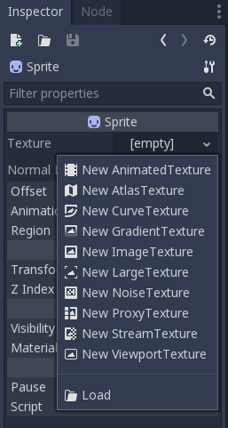

# Tutorial 3 - Introduction to Scripting w/ GDScript for Implementing Basic 2D Game Mechanics

Selamat datang pada tutorial ketiga kuliah Game Development. Pada tutorial
kali ini, kamu akan mempelajari dasar-dasar _syntax_ bahasa utama Godot Engine, GDScript beserta penggunaannya dalam konsep _node_ dan _object_ Godot Engine. Di akhir tutorial ini,
diharapkan kamu paham dengan penggunaan GDScript serta penerapan mekanik dasar _2D Platformer_.

## Daftar Isi

- [Tutorial 3 - Introduction to Scripting w/ GDScript for Implementing Basic 2D Game Mechanics](#tutorial-3---introduction-to-scripting-w-gdscript-for-implementing-basic-2d-game-mechanics)
  - [Daftar Isi](#daftar-isi)
  - [Pengantar](#pengantar)
    - [Is Scripting an Instrument?](#is-scripting-an-instrument)
    - [GDScript Example](#gdscript-example)
  - [Basic 2D Plane Movement](#basic-2d-plane-movement)
    - [Setting things up](#setting-things-up)
    - [Making a Script](#making-a-script)
    - [Writing and Using a Script](#writing-and-using-a-script)
    - [Gravity and Jumping](#gravity-and-jumping)
    - [KinematicBody2D vs RigidBody2D](#kinematicbody2d-vs-rigidbody2d)
  - [Extra: Mechanic Exploration](#extra-mechanic-exploration)
  - [Skema Penilaian](#skema-penilaian)
  - [Pengumpulan](#pengumpulan)
  - [Referensi](#referensi)

## Pengantar

### Is Scripting an Instrument?

Pekan lalu kita telah mencoba membuat objek sederhana sebagai _scene_ yang terdiri dari komposisi satu atau lebih _node_.
Objek di dalam permainan bisa saja berupa objek statik yang tidak memiliki peran apapun di dalam permainan, seperti menjadi hiasan atau rintangan.
Namun pada umumnya, kita membutuhkan objek yang memiliki peran dan dapat berinteraksi dengan objek lainnya di dalam sistem permainan.
Peran dan interaksi antar objek di dalam sistem permainan serta hubungannya dengan interaksi pemain dapat didefinisikan menggunakan pemrograman berbasis _scripting_.

Pemrograman menggunakan _script_ biasanya mengacu pada penggunaan bahasa pemrograman yang langsung dijalankan (atau, diinterpretasikan) oleh sebuah _runtime_.
Contoh pemrograman menggunakan _script_ yang terkenal antara lain adalah bahasa Python dan JavaScript.
Jika kamu masih ingat pengalaman belajar bahasa Python di kuliah pemrograman dasar, maka kamu pasti ingat bahwa Python tidak membutuhkan _compiler_ apapun.
Program Python dapat langsung berjalan tanpa melalui proses kompilasi terlebih dahulu.
Contoh lain bahasa _script_ adalah JavaScript.
Kode JavaScript akan dijalankan oleh _runtime_ seperti _engine_ JavaScript di dalam _browser_ atau _runtime_ khusus untuk menjalankan kode JavaScript di luar browser seperti Node atau Deno.

_Engine_ Godot versi 3 mendukung empat (4) bahasa pemrograman: GDScript, Visual Script, C#, dan C++.
Pada mata kuliah Game Development ini, kamu akan belajar sintaks dan cara penggunaan bahasa GDScript.
Beberapa alasan mengapa GDScript dipilih sebagai bahasa pemrograman utama adalah:

- Integrasi penuh dengan _engine_ Godot dan komponen editornya.
- Sederhana dan cepat.
- Sintaks yang mirip dengan bahasa _scripting_ populer lainnya seperti Python dan Lua.

> Catatan: bagi pembaca yang sudah berpengalaman menggunakan bahasa C# dan _engine_ Unity,
> sebenarnya Godot juga menyediakan varian _engine_ yang menerima bahasa C#.
> Dukungannya juga sudah relatif stabil di versi Godot terkini.
> Namun untuk keperluan pembelajaran bagi seluruh peserta kuliah,
> kita akan fokus menggunakan bahasa GDScript selama satu semester ini.

### GDScript Example

Contoh sebuah _script_ yang dituliskan dalam GDScript adalah berikut:

```
# example.gd

# A file is a class!

# Inheritance

extends BaseClass

# (optional) class definition with a custom icon

class_name MyClass, "res://path/to/optional/icon.svg"

# Member Variables

var a = 5
var s = "Hello"
var arr = [1, 2, 3]
var dict = {"key": "value", 2:3}
var typed_var: int
var inferred_type := "String"

# Constants

const ANSWER = 42
const THE_NAME = "Charly"

# Enums

enum {UNIT_NEUTRAL, UNIT_ENEMY, UNIT_ALLY}
enum Named {THING_1, THING_2, ANOTHER_THING = -1}

# Built-in Vector Types

var v2 = Vector2(1, 2)
var v3 = Vector3(1, 2, 3)

# Function

func some_function(param1, param2):
    var local_var = 5

    if param1 < local_var:
        print(param1)
    elif param2 > 5:
        print(param2)
    else:
        print("Fail!")

    for i in range(20):
        print(i)

    while param2 != 0:
        param2 -= 1

    var local_var2 = param1 + 3
    return local_var2

# Functions override functions with the same name on the base/parent class.
# If you still want to call them, use '.' (like 'super' in other languages).

func something(p1, p2):
    .something(p1, p2)

# Inner Class

class Something:
    var a = 10

# Constructor

func _init():
    print("Constructed!")
    var lv = Something.new()
    print(lv.a)
```

> Catatan: contoh di atas diambil dari dokumentasi resmi Godot berikut:
> https://docs.godotengine.org/en/3.5/tutorials/scripting/gdscript/gdscript_basics.html

Beberapa hal yang perlu kita bahas:

- Bahasa GDScript memiliki paradigma _object-oriented_ (OO) dan _imperative_.
  Sebuah _script_ akan memiliki hubungan _inheritance_ ke sebuah _superclass_.
  Jika tidak mendeklarasikan _inheritance_ secara eksplisit, maka sebuah _class_ di GDScript secara implisit merupakan turunan dari sebuah _root superclass_ bernama [`Object`](https://docs.godotengine.org/en/3.5/classes/class_object.html).
- Bahasa GDScript memiliki _type system_ yang bersifat _dynamic_.
  Kamu bisa mendeklarasikan variabel ataupun fungsi tanpa tipe data.
  Namun sangat disarankan untuk secara eksplisit tetap mendeklarasikan tipe data pada variabel dan fungsi.
  Tujuannya untuk membantu _autocompletion_ dan dokumentasi yang disediakan oleh _editor_.
- Standar penulisan GDScript menyerupai Python. Misalnya, blok kode dibedakan menggunakan _indent_.
  Untuk lebih lengkapnya, silakan merujuk ke dokumen [GDScript style guide](https://docs.godotengine.org/en/3.5/tutorials/scripting/gdscript/gdscript_styleguide.html).
  Untuk mempermudah konsistensi penulisan kode di lingkungan pengembangan, kamu dapat merujuk ke berkas `.editorconfig` yang tersedia di _template_ Tutorial 3 serta memanfaatkan program Python bernama [`gdtoolkit`](https://pypi.org/project/gdtoolkit/) yang menyediakan _linter_ dan _code formatter_ GDScript.

## Basic 2D Plane Movement

Pada tutorial ini, kita akan mengimplementasikan mekanika dasar sebuah permainan berjenis (_genre_) _platformer_.
Pemain akan dapat menggerakkan sebuah objek ke kiri dan ke kanan serta melompat.
Tutorial ini akan mendemonstrasikan:

- Membuat sebuah objek `Kinematic2D` dengan _child node_ `Collision2D` dan `Sprite`.
- Membuat _script_ dan memasangkan _script_ tersebut ke objek di dalam permainan.
- Implementasi _physics_ dasar.

### Setting Things Up

Mulai tutorial ini dengan membuat salinan [repositori Git _template_ proyek Tutorial 3](https://github.com/CSUI-Game-Development/tutorial-3-template).
Buka laman GitHub repositori Git _template_ proyek Tutorial 3, lalu klik "Use this template" untuk membuat salinan _repositori_ Git tersebut ke dalam akun GitHub pribadi.
Selanjutnya, _clone_ repositori _template_ proyek Tutorial 3 dari akun GitHub milikmu ke lingkungan pengembangan lokal.
Kemudian buka proyeknya menggunakan Godot.

Setelah berhasil membuka proyeknya menggunakan Godot, buka folder `scenes` dan buka _scene_ `Main.tscn`.
Di dalam mode _workspace_ 2D, kamu dapat melihat ada _ground_ atau landasaran yang melayang di dalam _scene_.
Kita akan menaruh objek yang dapat bergerak disana.


Buat _scene_ baru dan tambahkan _root node_ `Kinematic2D` pada _scene_ tersebut.
Ubah nama _node_ tersebut menjadi `Player`.
Tambahkan _child node_ `Sprite` dan `CollisionShape2D` dengan menggunakan menu Add Child Node.


Pilih node CollisionShape2D dan buka panel Inspector. Tambahkan Shape pada node tersebut dengan memilih new RectangleShape2D.


Pilih node Sprite dan buka panel Inspector. Pada menu texture, pilih menu Load dan buka folder Assets, kemudian pilih salah satu dari sprite pesawat yang ada.



Save Scene tersebut dalam folder Scenes. Objek ini akan menjadi target scripting.

> Catatan: Nama node, scene, dan pilihan sprite dibebaskan. Kamu diperbolehkan untuk menggunakan aset milik sendiri.

Tampilan Godot Editor terdiri dari beberapa panel yang akan dijelaskan pada subbab berikutnya.

### Making a Script

Pada panel Scene, klik kanan pada node Player. Pilih Attach Script pada menu yang muncul. Akan muncul dialog untuk membuat script. Akan ada beberapa pilihan yang tersedia, diantaranya nama script, bahasa script, dll.

Karena script akan dipasang pada KinematicBody2D, script otomatis meng-_inherit_ class tersebut. Pada dasarnya, ini adalah skema dari GDScript, karena kita ingin menambahkan fungsionalitas baru pada node yang kita inginkan.

Ubah nama script menjadi `Player.gd` kemudian simpan script pada folder script.


Script akan otomatis terbuka pada Godot Editor. Setiap script yang dibuat akan diberikan template:


Terdapat dua fungsi dasar yang hampir selalu ada pada bermacam-macam script: `_ready()` dan _process. Fungsi `_ready()` akan selalu dipanggil ketika sebuah node menjadi aktif pada sebuah scene. Fungsi `_process(delta)` akan dipanggil berkala pada setiap frame update.

> Catatan: Game Engine memroses banyak frame dalam satu detik. Tergantung hardware, rata-rata komputer memiliki kecepatan proses 60 _frames per second_ (fps). Artinya, dalam satu detik fungsi `_process(delta)` dipanggil 60 kali.
> Bagi yang sudah mengenal engine Unity dan/atau Unreal, kedua fungsi ini memiliki fungsi yang sama dengan `Awake()`/`Start()` dan `Update()`.

### Latihan: Implementasi Pergerakan Horizontal Menggunakan Script

Sebuah script jika dipasang ke suatu node akan memberikan node tersebut atribut tambahan. Script dapat digunakan untuk mengendalikan node tersebut dan semua child node yang ada.

Tujuan kita adalah menggerakan node Player secara horizontal. Tambahkan cuplikan kode ini pada `Player.gd`:

```
extends KinematicBody2D

export (int) var speed = 400

var velocity = Vector2()

func get_input():
    velocity = Vector2()
    if Input.is_action_pressed('right'):
        velocity.x += speed
    if Input.is_action_pressed('left'):
        velocity.x -= speed

func _physics_process(delta):
    get_input()
    velocity = move_and_slide(velocity)
```

Jika kamu sedang mengambil atau pernah mengambil mata kuliah aljabar linier,
maka kamu akan melihat salah satu manfaat dari ilmu yang dipelajari dari mata kuliah tersebut.

"Dunia" di dalam permainan beserta objeknya akan memiliki tiga buah komponen utama untuk merepresentasikan wujud objek tersebut di dalam permainan.
Tiga komponen tersebut adalah: posisi, rotasi, dan skala. Dalam bahasa Inggris, ketiga komponen tersebut biasa disebut sebagai _position_, _rotation_, dan _scale_.
Ketiga komponen tersebut biasa direpresentasikan secara internal sebagai struktur vektor (game 2D) dan matriks (game 3D).
Sehingga apabila kita akan menyimulasikan interaksi antar objek seperti pergerakan objek di dalam dunia permainan,
maka kita akan menggunakan operasi-operasi di aljabar linier untuk dapat memanipulasi objek tersebut.
Namun jangan khawatir, bukan berarti kamu harus mengimplementasikan operasi-operasi tersebut dari nol.
_Game engine_ biasanya sudah menyertakan fungsi-fungsi terkait manipulasi objek di _standard library_.

Mari mulai dengan contoh sederhana di tutorial ini, yaitu menggerakkan objek. Perhatikan hal-hal berikut:

1. `export (int) var speed = 400` merupakan deklarasi variabel. Export membuat variabel speed dapat diakses lewat visual editor.
2. `var velocity = Vector2()` adalah deklarasi private variable Vector2. Vector2 adalah tipe data Vector built-in Godot yang memiliki dua arah (x,y).
3. `get_input()` adalah wrapper function untuk membaca input kemudian menambahkan velocity (kecepatan) pada Player.
3. `Input.is_action_pressed(String signal)` merupakan fungsi bawaan Godot yang membaca input.
4. `_physics_processs(delta)` dipanggil secara berkala untuk membaca input.
4. `move_and_slide(Vector2 vector)` merupakan fungsi KinematicBody2D. Ketika fungsi ini dipanggil, KinematicBody2D akan bergerak sebanyak input Vector2.

> Catatan: _physics_process(delta) tidak jauh berbeda dari _process(delta). Fungsi ini dipanggil secara berkala, namun memiliki waktu panggil yang konstan tanpa bergantung pada fps.

Jalankan Scene dan gunakan arrow keys. Player dapat bergerak secara horizontal.

### Latihan: Implementasi _Physics_ Sederhana (Gravitasi dan Loncat)

Jika dilihat, `Player` hanya bergerak horizontal dan tidak dipengaruhi gravitasi. Objek Player tetap diam diatas meskipun tidak berada pada suatu pijakan.
Hal ini merupakan karakteristik dari `KinematicBody2D`, dimana _node_ **tidak** dipengaruhi oleh _physics_ yang tersedia dari _game engine_.
Sedangkan untuk dapat membuat objek terpentaruh _physics_, maka seharusnya objek tersebut menggunakan _node_ lain bertipe `RigidBody2D`.

Salah satu alasan mengapa kita tidak memakai `RigidBody2D` yang dapat dipengaruhi physics Game Engine adalah konsistensi. Dengan memakai KinematicBody2D, objek yang digerakan oleh pemain akan selalu merespon terhadap input yang diberikan, dimana objek RigidBody2D akan mudah terpengaruh oleh physics diluar kendali pemain.

Apabila kita ingin membuat Player kita melompat, maka kita harus bisa membuat Player dipengaruhi gravitasi. Setidaknya, Player harus bisa jatuh. Untuk itu, kita harus menambahkan fungsi physics sendiri, karena kita tidak bisa menggunakan gravitasi Game Engine. Tambahkan baris berikut pada `Player.gd`:

```
extends KinematicBody2D

export (int) var speed = 400
export (int) var GRAVITY = 1200

const UP = Vector2(0,-1)

var velocity = Vector2()

func get_input():
    velocity.x = 0
    if Input.is_action_pressed('right'):
        velocity.x += speed
    if Input.is_action_pressed('left'):
        velocity.x -= speed

func _physics_process(delta):
    velocity.y += delta * GRAVITY
    get_input()
    velocity = move_and_slide(velocity, UP)
```

Beberapa hal yang ditambahkan:

1. Variabel `GRAVITY` sebagai angka arbitrer.
2. Konstanta `UP` merupakan _shorthand_ untuk Vector2 yang mengarah keatas. Pada Godot Engine, koordinat y negatif mengarah keatas.
3. `velocity.x = 0` memastikan bahwa Player akan berhenti apabila tidak ada tombol yang ditekan.
4. `velocity.y += delta * GRAVITY` merupakan fungsi gravitasi untuk Player. Setiap diproses, `velocity.y` Player ditambahkan sejumlah konstanta gravitasi (mengarah kebawah).

Jalankan scene. Objek Player akan jatuh.


Sekarang Player kita butuh sebuah pijakan. Buka Scene Main.tscn. Tambahkan Scene (objek) Player pada scene main, kemudian jalankan scene. Player akan jatuh, namun berhenti ketika menyentuh tanah. Ketika di tanah, Player masih dapat bergerak secara horizontal.


Apabila kita ingin Player melompat, salah satu cara yang bisa digunakan adalah mengubah `velocity.y` menjadi negatif. Tambahkan cuplikan kode pada `Player.gd`:

```
extends KinematicBody2D

export (int) var speed = 400
export (int) var jump_speed = -600
.
.
func get_input():
    velocity.x = 0
    if is_on_floor() and Input.is_action_just_pressed('up'):
        velocity.y = jump_speed
    if Input.is_action_pressed('right'):
        velocity.x += speed
    if Input.is_action_pressed('left'):
        velocity.x -= speed
.
.
```

Perhatikan bahwa:

1. `is_on_floor()` merupakan fungsi bawaan KinematicBody2D dimana node akan mengecek otomatis apabila Collider yang sedang bersentuhan merupakan floor atau bukan.
2. `Input.is_action_just_pressed('up')` merupakan fungsi input Godot Engine yang mengecek input pertama dari sebuah tombol.

Jalankan Scene. Player sekarang bisa melompat.

Selamat, kamu telah menyelesaikan tutorial ini!


## Latihan Mandiri: Mechanic Exploration

Apabila masih ada waktu atau ingin lanjut berlatih mandiri, silakan baca referensi yang tersedia untuk belajar mengimplementasikan mekanik tambahan. Tidak ada kriteria khusus untuk ini, kamu bebas menambahkan apapun yang kamu suka. Beberapa contoh yang bisa diimplementasikan:

- Double Jump
- Dashing
- dll.

## Skema Penilaian

Pada tutorial ini, ada empat kriteria nilai yang bisa diperoleh:

1. **A** apabila kamu mengerjakan tutorial dan latihan melebihi dari ekspektasi
   tim pengajar.
1. **B** apabila kamu hanya mengerjakan tutorial sesuai yang diminta oleh
   deskripsi tutorial.
1. **C** apabila kamu mengerjakan tutorial secara minimalis atau tidak
   lengkap/tuntas.
1. **E** apabila kamu tidak mengerjakan apapun atau tidak mengumpulkan.

## Pengumpulan

Kumpulkan dengan memasukkan berkasnya ke dalam Git dan _push_ ke _fork_ materi
tutorial ini di repositori milik pribadi. **Jangan _push_ atau membuat Merge
Request ke repositori _upstream_ materi tutorial kecuali jika kamu ingin
kontribusi materi atau memperbaiki materi yang sudah dipublikasikan!**

Tenggat waktu pengumpulan adalah **20 September 2021 pukul 21:00**.

## Referensi

- [Kinematic Character (2D)](https://docs.godotengine.org/en/3.1/tutorials/physics/kinematic_character_2d.html)
- [Scripting](https://docs.godotengine.org/en/3.1/getting_started/step_by_step/scripting.html#scripting-a-scene)
- [2D Movement Overview](https://docs.godotengine.org/en/3.1/tutorials/2d/2d_movement.html)
- [Kenney Assets](https://kenney.nl/assets/platformer-characters-1)
- Materi tutorial pengenalan Godot Engine, kuliah Game Development semester
  gasal 2020/2021 Fakultas Ilmu Komputer Universitas Indonesia.
