# Tutorial 4 - Basic 2D Level Design

Selamat datang pada tutorial keempat kuliah Game Development.
Pada tutorial kali ini, kamu akan mempelajari cara membuat level sederhana pada bidang 2D menggunakan _engine_ Godot.
Selain itu, kamu juga akan mempelajari mekanisme _event handling_ menggunakan sistem _signal_ di Godot
dan implementasi objek _spawner_ untuk membuat rintangan di dalam permainan.
Di akhir tutorial ini, diharapkan kamu paham dengan penggunaan _tilemap_ dan sistem _signal_ di Godot.

## Daftar Isi

- [Tutorial 4 - Basic 2D Level Design](#tutorial-4---basic-2d-level-design)
  - [Daftar Isi](#daftar-isi)
  - [Pengantar](#pengantar)
  - [Latihan: Membuat Tile Map](#latihan-membuat-tile-map)
  - [Latihan: Membuat Kamera](#latihan-membuat-kamera)
  - [Latihan: Membuat Kondisi Akhir Permainan Menggunakan Signal](#latihan-membuat-kondisi-akhir-permainan-menggunakan-signal)
  - [Latihan: Membuat Rintangan Membuat Spawner](#latihan-membuat-rintangan-menggunakan-spawner)
  - [Latihan Mandiri: Membuat Level Baru Dengan Tile Map & Obstacle Berbeda](#latihan-mandiri-membuat-level-baru-dengan-tile-map--obstacle-berbeda)
  - [Skema Penilaian](#skema-penilaian)
  - [Pengumpulan](#pengumpulan)
  - [Referensi](#referensi)

## Pengantar

### What Is a Level?

Pada tutorial sebelumnya kita sudah membuat sebuah objek _player_ sederhana yang dapat bergerak ke kanan dan kiri dan juga dapat melompat.
Namun tempat ia bergerak masih sangat terbatas dan belum memiliki tujuan (_objective_) di dalam permainan.
Oleh karena itu, kita memerlukan sebuah _level_ supaya pemain memiliki tujuan di dalam permainan ketika mengendalikan objek _player_.

Sebuah _level_ pada dasarnya adalah tempat dimana _player_ dapat melakukan _action_ dan mungkin memiliki sebuah _goal_.

### Level Example

Contoh sebuah level yang terlihat sederhana:

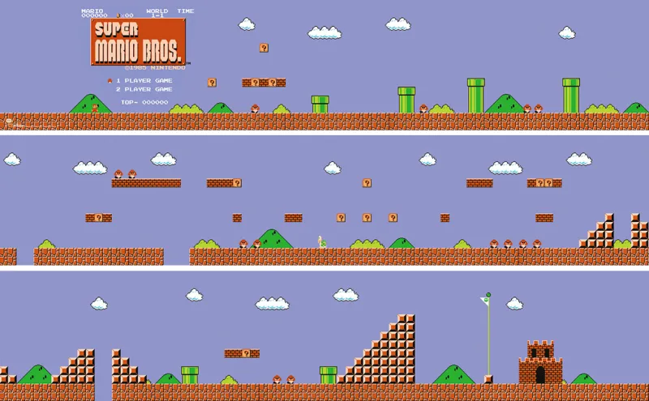

> Super Mario Bros World 1-1, Nintendo 1985

Kita akan membuat sebuah level 2D sederhana menggunakan salah satu fitur _engine_ Godot yaitu _tile mapping_ menggunakan `TileMap`.

Pada tutorial ini akan didemonstrasikan:

- Membuat `TileSet` untuk `TileMap`.
- Membuat level menggunakan `TileMap`.
- Membuat kamera mengikuti objek _player_.
- Membuat pemicu kondisi (_trigger_) menang dan kalah.

## Creating A Simple Level using TileMap

### Preparation

Mari memulai tutorial ini dengan membuat [salinan repositori Git _template_ proyek Tutorial 4](https://github.com/CSUI-Game-Development/tutorial-4-template).
Buka laman GitHub repositori _template_ proyek Tutorial 4
dan klik "Use this template" untuk membuat salinan repositori Git tersebut ke dalam akun GitHub pribadi.
Kemudian atur _visibility_ repositori Git proyek Tutorial 4 kamu menjadi **Public**
dan salin (`git clone`) repositori Git Tutorial 4 milikmu ke lingkungan pengembangan lokal.

Jika sudah membuat salinan repositori Git proyek Tutorial 4 secara lokal,
buka proyek Tutorial 4 menggunakan Godot.
Kemudian buka _scene_ `Level1.tscn` dan coba jalankan _playtest_ pada _scene_ tersebut.
Kamu akan melihat ada suatu makhluk yang akan langsung jatuh ketika _scene_ dimainkan.

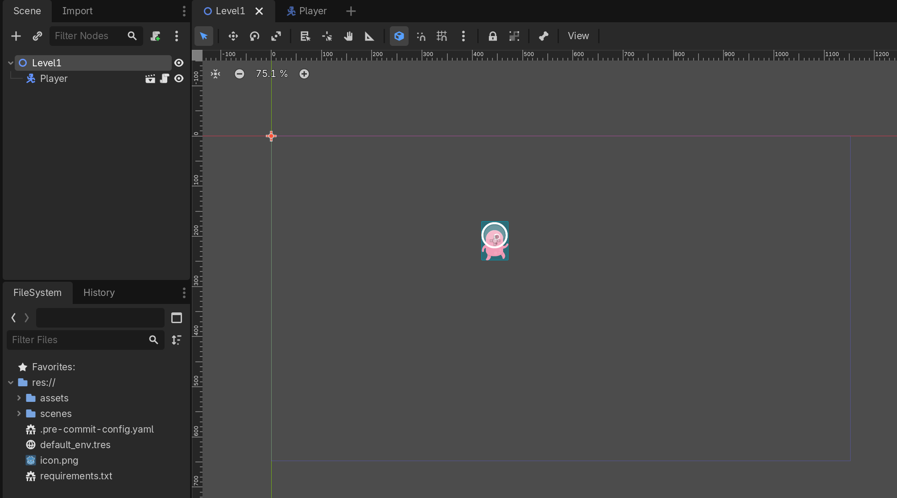

Klik kanan pada _node_ `Level1` dan pilih "Add Child Node", kemudian pilih `TileMapLayer`.

Setelah itu, anda perlu meng-klik `Tile Set` dan memilih opsi `new Tileset`

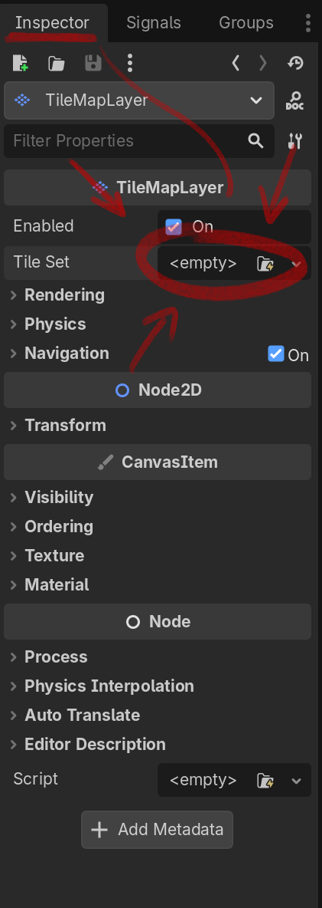

Setelah Tileset berhasil ditambahkan akan terlihat _grid_ samar-samar berwarna oranye pada _scene_ seperti gambar dibawah ini.
(Jika tidak terjadi apa-apa, coba pilih _node_ `TileMap` pada scene tab)

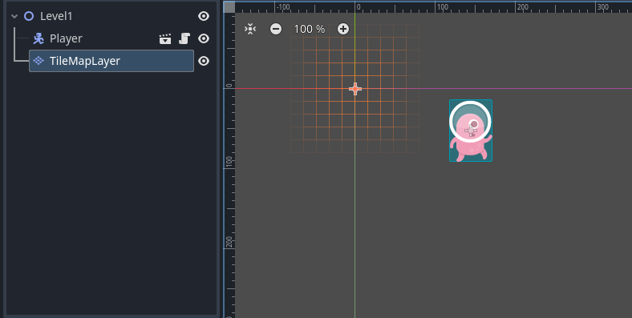

Pada tab Inspector, Tekanlah Tileset yang barusan Anda buat. Akan muncul atribut `tile size` atur `tile size` menjadi 128 untuk X dan Y, angka 128 ini berdasarkan dengan ukuran tiap tile anda, kasarnya Anda mengatakan kalau ukuran 1 tile adalah 128 pixel ke sumbu X, dan 128 pixel ke sumbu y.

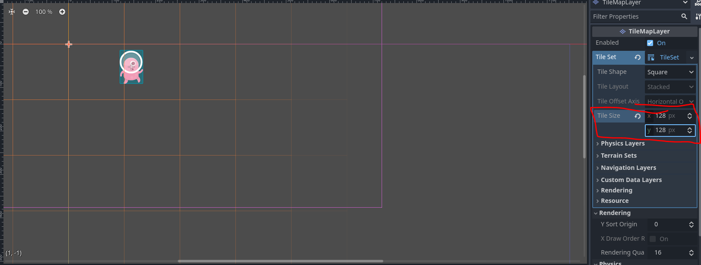

### Latihan: Membuat Tile Map

Jika diibaratkan dengan melukis, kita baru saja mempersiapkan kanvas dan kuas. Kita masih kekurangan cat untuk melukis.
Untuk mempersiapkan cat. Pada menu di bagian bawah, kalian perlu memilih Tileset.

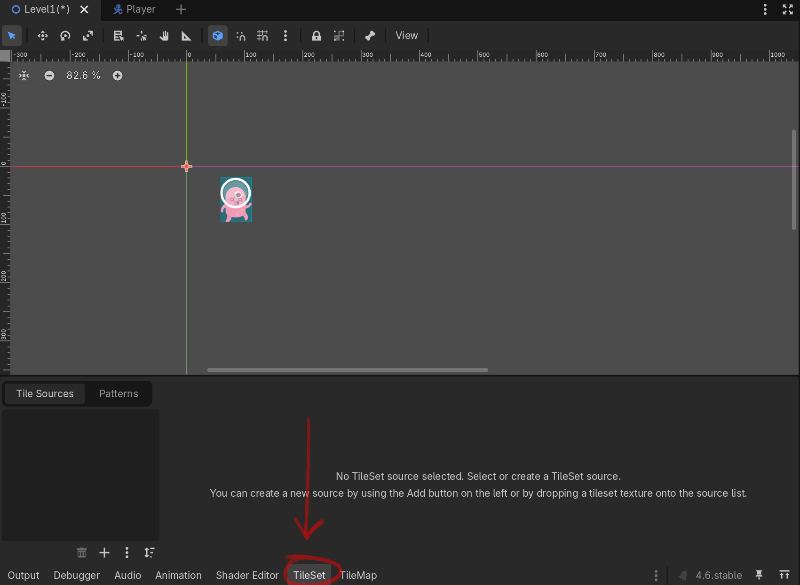

Setelah itu, kalian dapat membuka file `assets/kenney_platformerpack/Spritesheets/spritesheet_gr_dirt.png` dan mendragnya, ke dalam persegi berwarna biru gelap.

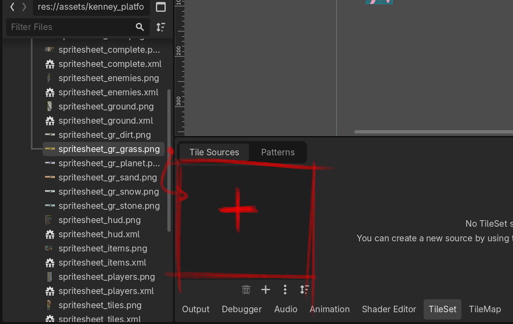

Setelah Anda drop filenya, akan muncul pop-up seperti ini. Untuk tutorial ini kami sarankan Anda memilih **YES**. Hal ini akan menyebabkan godot memotong spritesheet anda sesuai dengan ukuran tileset yang tadi anda tentukan (128x128). Jika Anda memilih `No` maka Anda bisa menentukan cara memotong tiap objek pada spritesheet sendiri. Ini berguna jika Anda memiliki objek yang berbentuk 2x1, dsb.
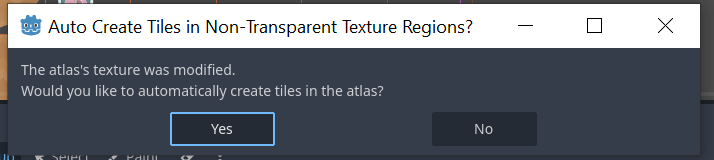

Untuk memulai menggambar dengan tileset yang Anda baru saja buat. Pilih kembali menu TileMap pada menu di bawah. Pilih lah tool Paint(D) pada toolbar TileMap, kemudian pilih salah satu tile Anda. Ketika sudah dipilih, silahkan lah mulai menggambar pada scene dengan menekan tombol kiri mouse, dan tombol kanan mouse untuk menghapus

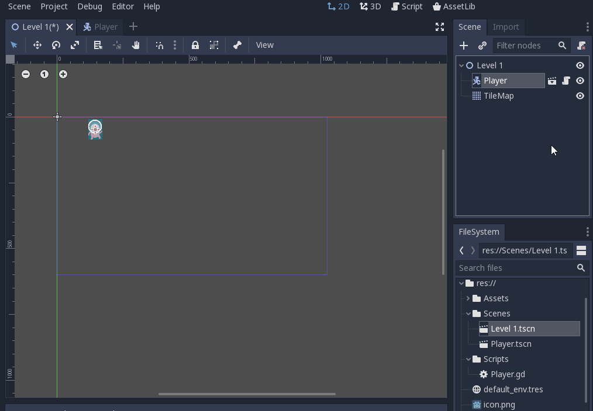

Anda mungkin sekarang bertanya-tanya, Jadi apa perbedaan antara tileset dan juga tilemap. Sederhananya, tileset menu dimana kita mempersiapkan cat yang akan kita gunakan untuk menggambar, seperti kolisi tiap tile, bentuk navigasi tiap tile, light ocullisionnya, dll. Sedangkan TileMap lebih berfokus pada canvas bagi tileset Anda, bagaimana Anda memposisikan tiap-tiap tile. 

Jika Anda sudah mencoba mem-_play scene_ Level1.tscn atau membaca paragraf sebelumnya, Anda mungkin menyadari sesuatu. Tilemap yang kita buat belum memiliki kolisi. :O

Supaya player dapat _collide_ dengan tile, kita perlu menambahkan _collider_ pada tile tersebut. Bagaimana cara kita melakukannya?

Untuk melakukannya, kita perlu menambahkan layer physics terlebih dahulu dengan menekan tombol berikut pada tab Inspector TileMapLayer/TileSet.
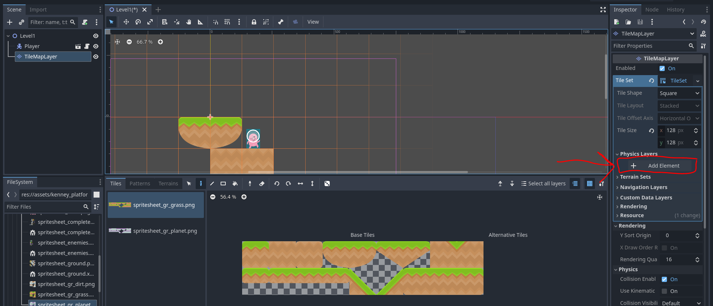

Jika Anda sudah menekan tombol tersebut, akan muncul tampilan seperti berikut

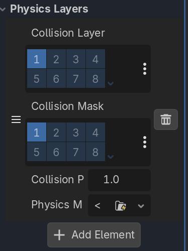

Anda disarankan untuk mencoba-coba mengubah settings pada physics layer. Untuk mencari tahu apa pengaruh kedua settings tersebut. Namun untuk sekarang, default setting sudah cukup.

Lanjut ke tahapan selanjutnya untuk memberikan kolisi pada TileMap. Anda perlu berada pada menu TileSet, kemudian menekan menu paint. Disana akan terdapat dropdown bernama `Select a property editor`. Jika Anda menekan dropdownnya, akan terdapat opsi Physics Layer 0. Anda perlu memilih opsi tersebut.


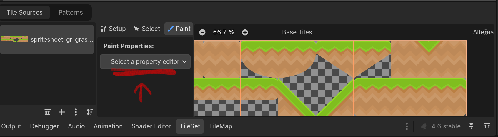

Akan muncul tampilan seperti di bawah ini. 

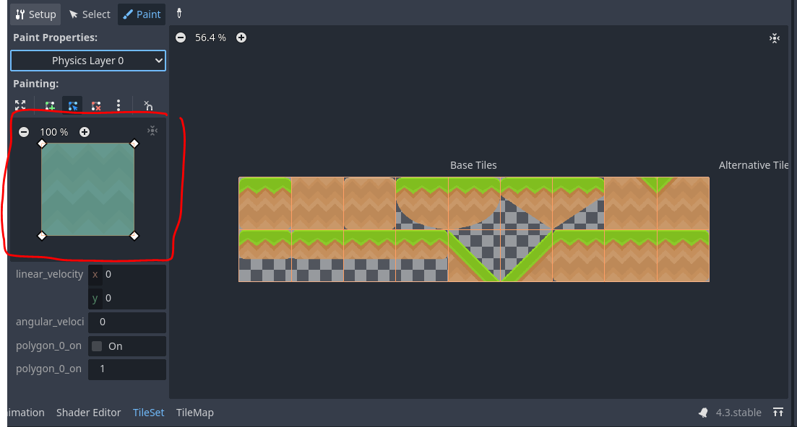

Pada bagian kiri, Anda dapat menggambar bentuk kolisi yang Anda inginkan selayaknya Anda membuat node CollisionPoligon2D. Anda dapat menambahkan node, menghapus node, dan juga menggesernya untuk membuat kolisi yang Anda suka.

Ketika Anda sudah menggambar bentuk kolisi yang memuaskan bagi Anda, klik lah salah satu tile pada bagian kanan. Sekarang, tile tersebut akan mendapatkan kolisi yang Anda gambar barusan. Hati-hati saat menekan tile pada sisi kanan menu, karena tile yang ditekan akan langsung terupdate bentuk kolisinya dengan gambar terbaru Anda pada sisi kiri.

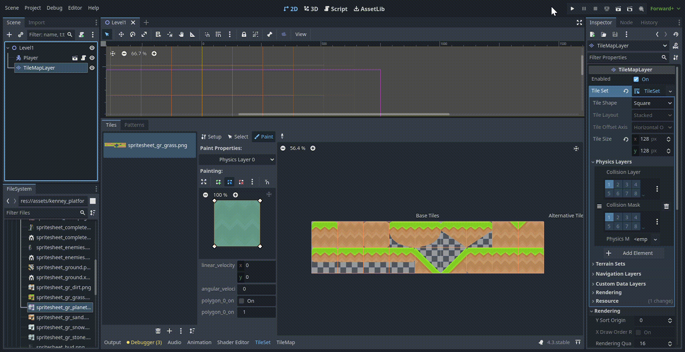

Jika sudah berhasil, klik node TileMapLayer pada tab Scene dan Tile Set tadi akan tampil dan siap untuk digunakan. Selamat berkreasi.

> Note : Node TileMap di scale menjadi 0.5 pada X dan Y agar ukuran tile tidak terlalu besar dibanding player.
> (Tab Inspector > Transform > Scale)

## Latihan: Membuat Kamera

Sekarang kita sudah memiliki sebuah level, namun jika scene di-_play_ kamera akan diam di tempat awal dan membatasi apa yang bisa dilihat.
Oleh karena itu kita akan membuat kamera yang akan mengikuti kemanapun mahluk pink itu pergi.

Buka scene `scenes/Player.tscn`, tambah _node_ `Camera2D` sebagai _child node_ dari `Player`.


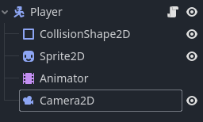

Sekarang kamera akan selalu mengikuti mahluk itu kemanapun ia pergi.


Kalian dapat melakukan eksperimen mandiri terhadap pengaturan pada inspector `Camera2D`. `limit` yang berguna membatasi pergerakan `Camera2D`.

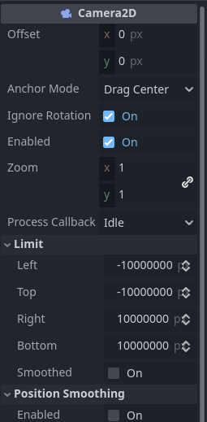

## Latihan: Membuat Kondisi Akhir Permainan Menggunakan Signal

Sebuah level tidak lengkap tanpa tujuan akhir, atau jika si mahluk terpleset dan jatuh ke jurang, dia hanya bisa berkontemplasi sampai akhir jaman.
Supaya mahluk tersebut tidak bernasib sama seperti [Kars](https://jojowiki.com/Kars), mari kita buat zona untuk _lose_ dan _win condition_.

Pertama buat scene baru (nama bebas) dengan `Area2D` sebagai _root node_.


Lalu tambahkan node `CollisionShape2D` sebagai _child node_ `Area2D` tadi.
Jangan lupa untuk membuat _collision shape_ pada node `CollisionShape2D` (Kamu seharusnya sudah pernah melakukannya pada tutorial sebelumnya).

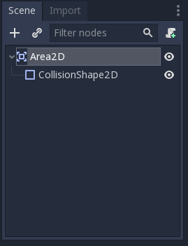

Kemudian buat dan tempelkan sebuah _script_ pada _node_ `Area2D` (penamaan bebas, misal: `LoseCondition`, `LoseArea`).
Hapus semua baris pada _script_ baru tersebut kecuali _statement_ `extends`.
Kita akan menggunakan _Signals_ untuk fitur ini.

### What is Signals?

Sesuai dengan namanya, _Signals_ berfungsi untuk memberikan "tanda" jika suatu kondisi khusus terpenuhi.
Yang dimaksud dengan memberikan tanda disini adalah mengeksekusi suatu fungsi yang kita definisikan sendiri.
Jenis _Signals_ yang ada pada suatu node akan berbeda-beda tergantung tipe node tersebut.

### Using Signals

Pertama pilih node `Area2D` lalu buka tab `Node`.
Lalu pada subtab ```Signals``` pilih ```body_entered(PhysicsBody2D body)``` dan klik tombol ```Connect``` di kanan bawah tab tersebut.

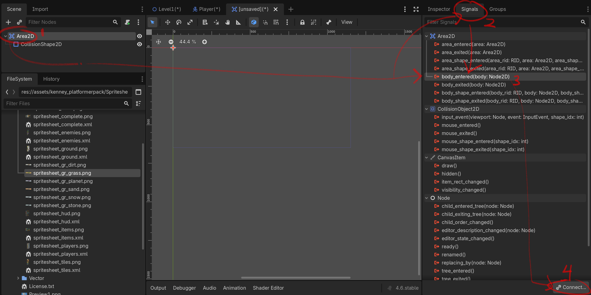

Pastikan ```Area2D``` terpilih pada bagian ```Connect To Node```, isi ```Method In Node``` dengan nama fungsi yang kamu inginkan atau biarkan default.
Jika sudah tekan tombol `Connect`

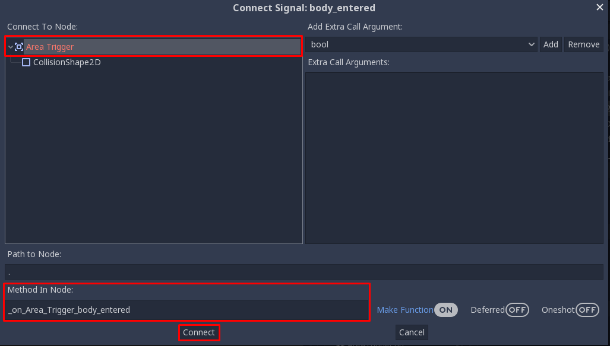

Maka script pada `Area2D` akan ditambah fungsi tersebut.

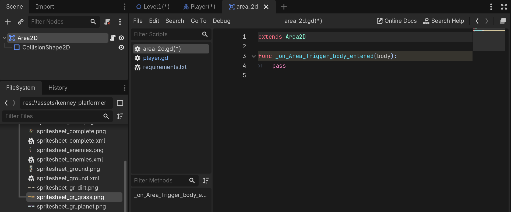

Silakan tambah cuplikan dibawah pada _script_ tersebut. (Jangan lupa ganti nama fungsi sesuai penamaan masing-masing)

```
extends Area2D

@export var sceneName: String = "Level 1"

func _on_Area_Trigger_body_entered(body):
    if body.get_name() == "Player":
        get_tree().change_scene_to_file(str("res://scenes/" + sceneName + ".tscn"))
```

Secara singkat fungsi tersebut akan dipicu setiap kali ada objek dengan tipe `PhysicsBody2D` yang masuk area collision.
Jika objek tersebut adalah `Player`, maka ubah _root node_ (_current scene_) dengan _scene_ bernama `sceneName` yang tersimpan di dalam folder `scenes`.

### Adding Signals to the Level

Simpan _scene_ dan script tersebut (Mulai sekarang disebut `AreaTrigger`) dan buka kembali _scene_ `Level1.tscn`.
Supaya pemain dapat jelas melihat goal, tambah node dengan tipe `Sprite` sebagai child dari node `Level1` dan ubah `Texture` menjadi ~~rektorat~~ roket atau bebas.

Kemudian tambahkan scene `AreaTrigger` sebagai _child_ dari _sprite_ tersebut, silakan atur _scaling_ sesuai keperluan.
Jangan lupa ubah variabel `sceneName` menjadi nama _scene_ yang akan ditampilkan ketika pemain menang, misalnya `WinScreen`.

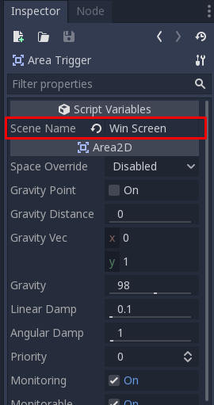

Lakukan hal yang sama untuk area dibawah level namun dengan ```Scene Name``` diisi dengan "Level 1".
Supaya ketika player jatuh ke jurang, scene akan di-reload.

Berikut contoh Level 1 yang sudah lengkap.

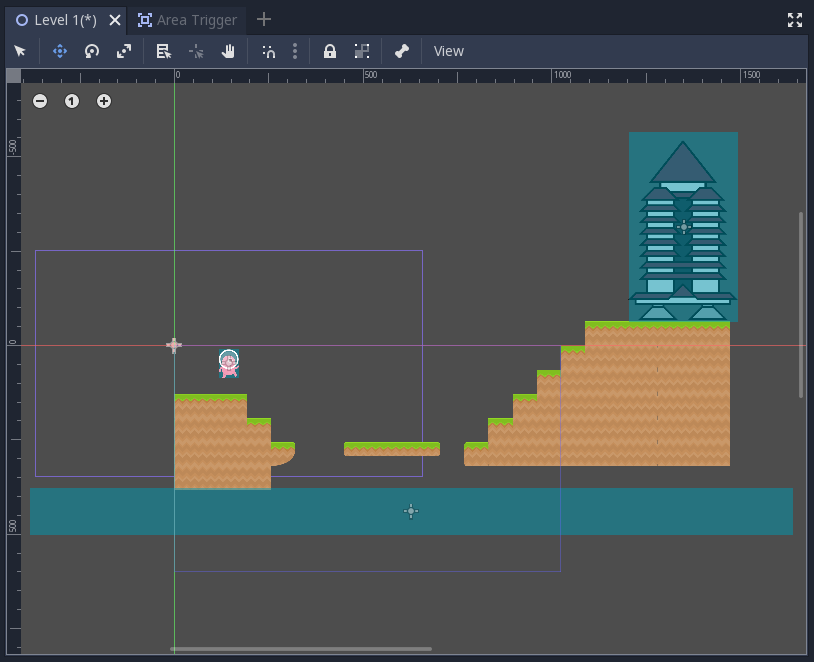

## Latihan: Membuat Rintangan Menggunakan Spawner

Saat ini level 1 hanya memiliki satu buah rintangan berupa jurang.
Untuk menambah variasi rintangan serta mempraktikkan pemrograman lebih lanjut,
maka bagian tutorial ini akan memperkenalkan kamu dengan implementasi _object spawner_.
Objek ini biasa digunakan untuk membuat objek secara dinamis ketika permainan berjalan.
Sebagai contoh, di permainan 2D _genre_ top-down shooter, _spawner_ biasa dipakai untuk membuat objek-objek peluru (_bullet_) yang berterbangan ke arah pemain.

Mari pikirkan rintangan yang akan ditambahkan ke dalam permainan.
Misalnya kita membayangkan dunia permainan mengalami fenomena cuaca absurd dimana kadang-kadang ada ikan yang jatuh dari langit.
Apabila pemain terkena ikan yang jatuh dari langit,
maka pemain langsung kalah dari permainan.

Dari uraian di atas, kamu akan membuat:

- [ ] Objek konkrit yang merepresentasikan ikan.
- [ ] _Script_ untuk objek ikan tersebut yang akan memicu kondisi kalah pemain ketika terkena ikan.

Buatlah _scene_ yang merepresentasikan objek ikan.
Buat _scene_ baru dengan _root node_ bertipe `RigidBody2D`.
Kemudian di dalam _scene_ tersebut, tampahkan _child node_ `Sprite` dan `CollisionShape2D`.
Atur _texture_ pada `Sprite` agar menggunakan gambar ikan yang tersedia di kumpulan aset (misal: `assets/kenney_platformerpack/PNG/Enemies/fishBlue.png`).
Kemudian atur bentuk _collider_ pada `CollisionShape2D` agar mencakup (_cover_) bentuk ikan.
Hasil akhirnya akan serupa seperti _screenshot_ berikut:

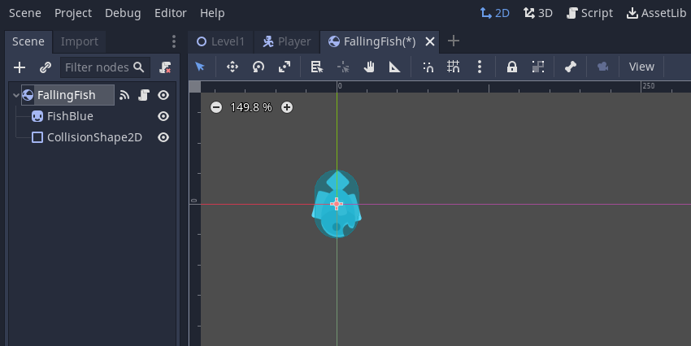

Sekarang buatlah _script_ baru untuk diasosiasikan ke _scene_ objek ikan.
Isi dari _script_ tersebut akan serupa dengan _script_ untuk kondisi kalah yang sudah pernah dibuat sebelumnya.
Perbedaannya akan ada pada tipe objek yang bertabrakan.
Pada implementasi kondisi kalah ketika terjatuh ke jurang,
kondisi kalah akan dipicu ketika objek `Player` masuk ke dalam `Area2D` abstrak di dalam jurang.
Sedangkan untuk kondisi kalah ketika terkena ikan,
kondisi kalah akan dipicu ketika objek `Player` bertabrakan dengan objek ikan.

Silakan coba pikirkan dan implementasikan sendiri _script_-nya,
supaya lebih terbiasa dengan pemrograman di Godot.
Jika butuh referensi, berikut ini adalah salah satu contoh _script_ yang mengimplementasikan kondisi kalah ketika `Player` bertabrakan dengan objek ikan:

```gdscript
extends Area2D

@export var sceneName = "LoseScreen"

func _on_FallArea_body_entered(body):
	if body.get_name() == "Player":
		get_tree().change_scene_to_file(str("res://scenes/" + sceneName + ".tscn"))
	else:
		body.queue_free()

```

> Note: Jangan lupa untuk menempelkan (_attach_) _script_ yang baru kamu buat ke _scene_ objek ikan.

### Membuat Spawner

Objek _spawner_ akan berupa objek abstrak di dalam dunia permainan, serupa dengan objek yang merepresentasikan jurang di Level 1.
Untuk membuat _spawner_, tambahkan _child node_ bertipe `Node2D` pada _scene_ Level 1.
Beri nama _child node_ baru tersebut sebagai `Spawner`.
Kemudian, atur posisi objek _spawner_ di dalam dunia Level 1 agar berada di langit-langit Level 1.
Misalnya di titik koordinat `(820, -645)`, seperti yang digambarkan pada _screenshot_ berikut:

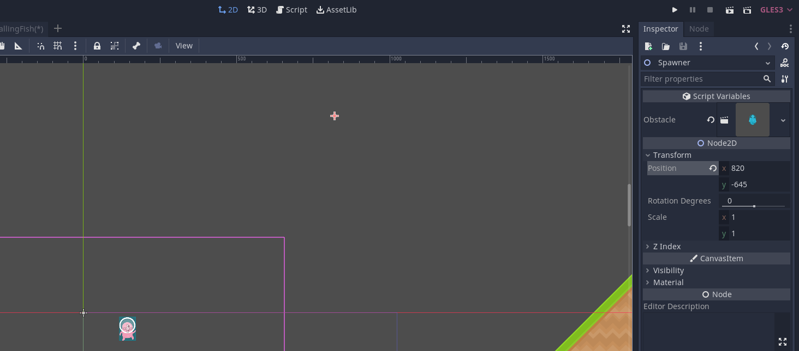

Setelah menempatkan objek _spawner_ di dalam Level 1,
buatlah _script_ baru bernama `Spawner.gd` dan tempelkan ke objek _spawner_.
Isi dari _script_ tersebut adalah sebagai berikut:

```gdscript
extends Node2D

@export var obstacle : PackedScene

func _ready():
	repeat()

func spawn():
	var spawned = obstacle.instantiate()
	get_parent().add_child(spawned)

	var spawn_pos = global_position
	spawn_pos.x = spawn_pos.x + randf_range(-1000, 1000)

	spawned.global_position = spawn_pos

func repeat():
	spawn()
	await get_tree().create_timer(1).timeout
	repeat()
```

Penjelasan dari isi _script_:

- `@export var obstacle : PackedScene` akan membuat variabel `obstacle` terdaftar di panel Inspector. Kamu nanti akan dapat mengisi variabel tersebut dengan _scene_ objek ikan.
- Fungsi `_ready()` memanggil fungsi `repeat()`. Fungsi `repeat()` akan dipanggil berulang kali selama permainan berjalan dengan interval antar pemanggilan `repeat()` selama 1 detik.
- Fungsi `repeat()` memanggil fungsi `spawn()`. Fungsi `spawn()` bertugas untuk melakukan instansiasi objek secara dinamis. Dalam hal ini, _scene_ yang dikandung oleh variabel `obstacle` akan diinstansiasi di sebuah posisi acak pada sumbu X.

Apabila sudah mengisi _script_ dan menempelkannya ke objek _spawner_,
silakan simpan perubahan dan coba _playtest_ permainannya.
Seharusnya jika diimplementasikan dengan benar,
objek ikan akan jatuh secara acak dan memicu kondisi kalah jika mengenai pemain.
Apabila masih belum berhasil, silakan konsultasi dengan pengajar yang tersedia di ruang lab.

## Latihan Mandiri: Membuat Level Baru Dengan Tile Map & Obstacle Berbeda

Sebagai bagian dari latihan mandiri, kamu diminta untuk praktik membuat level baru yang berbeda dari level pertama.
Kebutuhan minimum yang harus diimplementasikan pada level baru:

- Level menggunakan _tile map_ yang berbeda dari level pertama.
- Terdapat _spawner_ rintangan di level baru yang membuat objek berbeda dari ikan.
- Memiliki rintangan berupa jurang dan objek yang berjatuhan secara periodik.

Silakan berkreasi lebih lanjut untuk membuat level baru kamu makin menarik!
Jangan lupa untuk menjelaskan proses pengerjaan level baru ini di dalam sebuah dokumen teks `README.md`.
Cantumkan juga referensi-referensi yang digunakan sebagai acuan ketika menjelaskan proses implementasi.

## Skema Penilaian

Pada tutorial ini, ada empat kriteria nilai yang bisa diperoleh:

- **4** (_**A**_) apabila kamu mengerjakan tutorial dan latihan melebihi dari ekspektasi tim pengajar.
  Nilai ini dapat dicapai apabila mengerjakan seluruh Latihan dan Latihan Mandiri, ditambah dengan memoles (_polishing_) lebih lanjut permainannya.
- **3** (_**B**_) apabila kamu hanya mengerjakan tutorial dan latihan sesuai dengan instruksi.
  Nilai ini dapat dicapai apabila mengerjakan seluruh Latihan dan Latihan Mandiri.
- **2** (_**C**_) apabila kamu hanya mengerjakan tutorial hingga tuntas.
  Nilai ini dapat dicapai apabila mengerjakan seluruh Latihan namun tidak mengerjakan Latihan Mandiri.
- **1** (_**D**_) apabila kamu hanya sekedar memulai tutorial dan belum tuntas.
- **0** (_**E**_) apabila kamu tidak mengerjakan apapun atau tidak mengumpulkan.

## Pengumpulan

Kumpulkan semua berkas pengerjaan tutorial dan latihan ke dalam Git dan _push_ ke repositori Git pengerjaan tutorial 4.
Apabila kamu mengerjakan latihan mandiri, pastikan _scene_ dan _node_ sudah tercatat masuk ke dalam repositori Git.
Kemudian, kumpulkan tautan ke repositori Git hasil pengerjaan tutorial 4 kamu di slot pengumpulan yang tersedia di SCELE.

Tenggat waktu pengumpulan adalah **6 Maret 2024 pukul 21:00**.

## Referensi

- [Tilemaps](https://docs.godotengine.org/en/3.1/tutorials/2d/using_tilemaps.html)
- [Signals](https://docs.godotengine.org/en/3.1/getting_started/step_by_step/signals.html)
- [Kenney Assets](https://www.kenney.nl/assets/platformer-pack-redux)
- Materi tutorial pengenalan Godot Engine, kuliah Game Development semester
  gasal 2020/2021 Fakultas Ilmu Komputer Universitas Indonesia.
