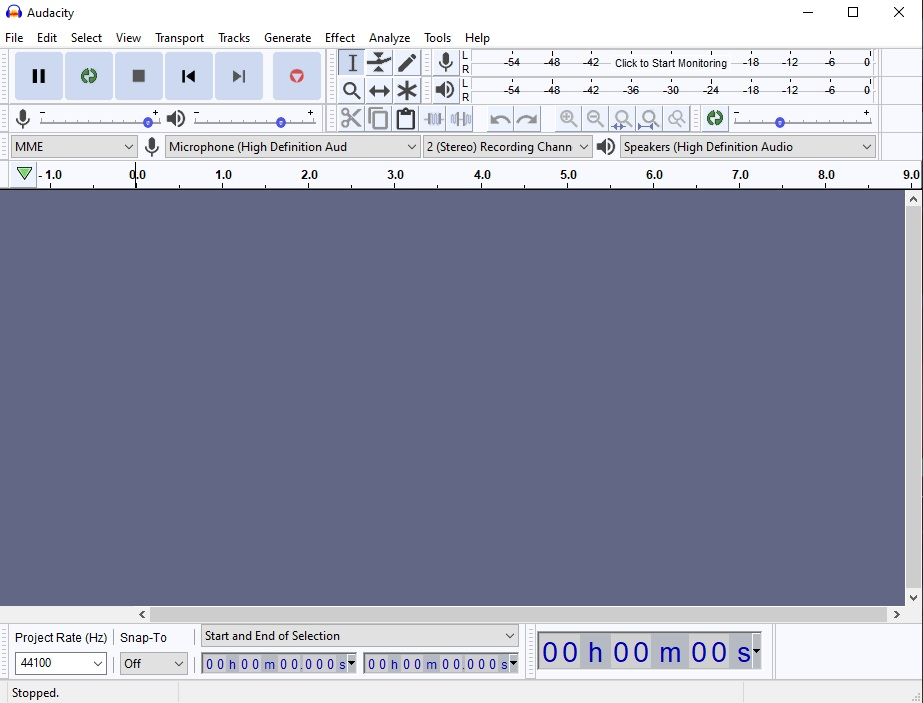
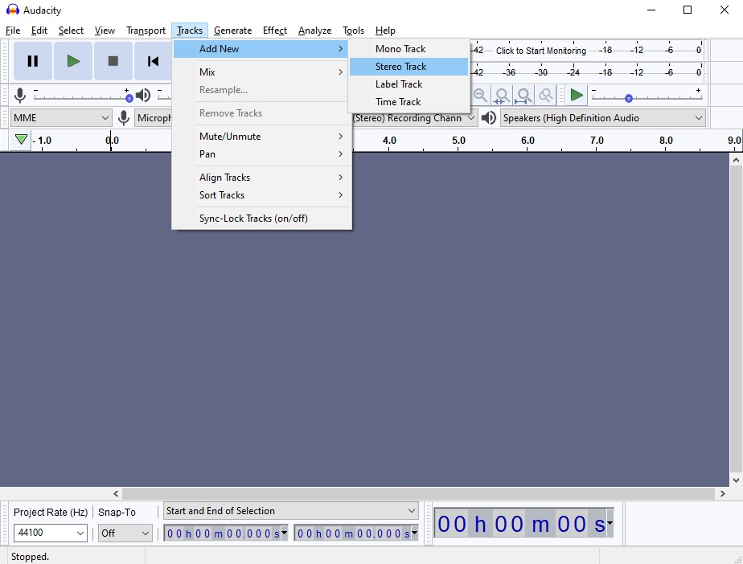
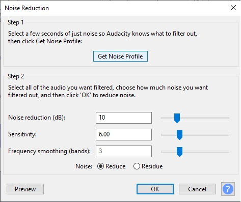

# Tutorial 5 - Assets Creation & Integration

Selamat datang pada tutorial kelima kuliah Game Development.

Pada tutorial kali ini, kamu akan mempelajari cara membuat _game asset_ sederhana menggunakan _tools_ yang sesuai kemudian mengintegrasikan ke game. Di akhir tutorial ini, diharapkan kamu paham dengan penggunaan _spritesheet_ dan _audio_ pada game 2D.

## Daftar Isi


- [Tutorial 5 - Assets Creation & Integration](#tutorial-5---assets-creation--integration)
  - [Daftar Isi](#daftar-isi)
  - [Pengantar](#pengantar)
  - [Persiapan](#persiapan)
  - [Animasi Sprite Sheet](#animasi-sprite-sheet)
  - [Aset Suara (Audio)](#aset-suara-audio)
  - [Latihan Mandiri: Membuat dan Menambah Variasi Aset](#latihan-mandiri-membuat-dan-menambah-variasi-aset)
  - [Skema Penilaian](#skema-penilaian)
  - [Pengumpulan](#pengumpulan)
  - [Referensi](#referensi)

## Pengantar

### What Is Game Asset?

Pada tutorial sebelumnya kita sudah membuat sebuah _level_ sederhana menggunakaan `TileMap` beserta mekanik kamera dan _trigger area_. Namun sebelum membuat suatu _level_ dalam game, dibutuhkan hal-hal yang menggambarkan tampilan dan suasana dalam game, yang lebih dikenal sebagai *Game Asset*.

Game asset meliputi:

- Desain 2D/3D
    - Karakter
    - Objek
    - Environment
- GUI
    - HUD
    - Icons
- Audio
    - BGM
    - SFX

Sebagian besar _programmer_ tidak bertugas untuk mendesain visual dan mengaransemen musik, tetapi _programmer_ harus dapat mengimplementasikan _assets_ ke dalam game. Maka dari itu, tutorial ini akan menjelaskan tentang:

- Apa itu _spritesheet_ dan cara menggunakannya dalam animasi
- Penggunaan _audio clip_ sebagai game sound effects

## Persiapan

Tutorial ini akan **melanjutkan Tutorial 3**. Oleh sebab itu, silakan buka kembali hasil pekerjaan Tutorial 3 kamu. Kemudian, salin satu berkas _spritesheet_ dan satu berkas _audio_ dari tautan berikut ini ke dalam folder `assets` Tutorial 3:

- [_Spritesheets_](https://github.com/CSUI-Game-Development/tutorial-5-template/blob/main/assets/spritesheet/player_tilesheet.png)
- [_Audio_](https://github.com/CSUI-Game-Development/tutorial-5-template/raw/main/assets/sound/bgm.wav)

Jangan lupa untuk menyimpan hasil pekerjaan di akhir pengerjaan Tutorial 5 sebagai _commit_ Git baru
dan _push_  ke repositori daring Git kamu.

## Animasi Sprite Sheet

```Sprite Sheet``` adalah file gambar *bitmap* yang berisi beberapa gambar yang lebih kecil dalam susunan *grid*. Dengan mengompilasi beberapa gambar menjadi satu berkas, kamu dapat membuat animasi hanya dengan memuat satu file. Efisiensi pemuatan ini dapat membantu dalam berbagai situasi, salah satunya *game development* dimana *performance* sangat penting dan sangat meminimalkan penggunaan *resource*.


Pembuatan *sprite sheet* tidak bergantung pada *tools*. Namun, *sprite sheet* lebih menekankan pada peletakan koordinat gambar pada satu berkas. Jika penempatan gambar per *frame* tidak rapih, sprite yang dihasilkan juga akan tidak sesuai dan terlihat aneh. Berikut *tools* untuk membuat *game assets* untuk dimasukkan ke dalam *sprite sheet*.

- Pixel Art
    - [PiskelApp](https://www.piskelapp.com/)
    - [Pixie](https://pixieengine.com/)
    - [Pixlr](https://pixlr.com/)
- Vector Art
    - [Adobe Illustrator](https://www.adobe.com/sea/products/illustrator.html)
    - [Figma](https://www.figma.com/)
- Raster Art
    - [Procreate](https://procreate.art/)
    - [IbisPaint](https://ibispaint.com)

Pembuatan aset secara manual tentu membutuhkan waktu dan keahlian. Saat ini sudah banyak tempat di Internet yang menyediakan aset-aset visual secara gratis. Walaupun gratis, jangan lupa membaca lisensi penggunaan aset tersebut!

Berikut adalah beberapa web yang menyediakan asset visual secara gratis.

- https://kenney.nl/assets
- https://www.gameart2d.com/freebies.html
- https://craftpix.net/freebies/

### AnimatedSprite vs (AnimationPlayer + AnimationTree)

Terdapat dua metode untuk membuat animasi dalam Godot, yaitu dengan menggunakan ```AnimatedSprite``` atau dengan menggunakan ```AnimationPlayer``` bersama dengan ```AnimationTree```.

```AnimatedSprite``` memungkinkan kamu untuk membuat animasi dengan cara **mengganti gambar secara cepat**. Kecepatan pergantian *frame* gambar diatur dengan menggunakan satuan *frame per second*. Metode ini merupakan metode paling sederhana untuk membuat animasi di godot. Metode ini juga lebih sering digunakan untuk membuat animasi pada karakter atau *game objects*.


Di sisi lain ```AnimationPlayer``` digunakan untuk membuat animasi yang lebih kompleks. ```AnimationPlayer``` memungkinkan kamu untuk menyimpan perubahan *property*. Sebagai contoh, kamu dapat *load spritesheet* di node ```Sprite``` dan menyimpan perubahannya dalam bagian dari gambar yang saat ini sedang ditampilkan. Hal ini akan terlihat seperti kamu sedang menggunakan node ```AnimatedSprite```.


```AnimationTree``` memungkinkan kamu untuk membuat *paths* di antara animation. Misalnya *path idle -> walk -> run*. Ketika karakter diam (*idle*) dan kemudian lari secara langsung, ```AnimationTree``` akan memainkan animasi *walk* terlebih dahulu sebelum *run*.


### Latihan: Membuat Animasi dengan AnimatedSprite

1. Buka kembali project Tutorial **3** di Godot.
2. Buat scene baru untuk membuat player dengan struktur seperti dibawah ini (jika sudah ada maka hanya perlu merubah node sprite menjadi ```AnimatedSprite```).

    

3. Selanjutnya adalah membuat **frame baru** untuk menempatkan sprite-sprite menjadi sebuah animasi

    

4. Setelahnya akan keluar window dibagian bawah untuk membuat animasi. Beri nama pada animasi yang ingin kalian buat dengan menekan 2x pada tulisan default

    

5. Di tutorial ini akan membuat contoh animasi berjalan menghadap kanan (nama animasinya jalan_kanan). Setelah memberi nama, selanjutnya adalah mengimport gambar untuk dijadikan animasi. Ada **dua teknik** yaitu dengan langsung memasukan file gambar yang berisi satu gambar utuh (button 1), atau dengan memasukan file spritesheet (button 2).

    
    > Note:
    >
    > - Import gambar dengan menggunakan button 1 hanya tinggal menekan button 1 dan memilih file gambar yang ingin di import (ingat, teknik ini akan mengimport keseluruhan gambar dalam file).
    > - Import gambar dengan button 2 sedikit berbeda. Disini pilih file yang berisi spritesheet dan akan muncul tampilan grid seperti dibawah ini.
    >
    > 

    Disini kalian harus mengatur banyaknya grid yang agar setiap satu grid mewakili satu gambar yang akan di import. Pada kasus ini ubah horizontal menjadi 9 (karena jumlah gambar pada satu baris ada 9), dan vertikal menjadi 3 (karena terdapat 3 baris). Selanjutnya pilih gambar dengan menekan grid yang diinginkan (disini bisa memilih multiple gambar).

    

6. Selanjutnya untuk mencoba apakah animasi sudah seperti yang diinginkan dengan menceklis box playing pada inspector node animatedSprite. (jika animasi terlalu lambat, bisa menambahkan fps di bagian pojok kiri bawah diatas tombol output. Untuk pengulangan animasi, bisa mengaktifkan loop dibawah fps)

    

7. Animasi telah siap digunakan. Tetapi jika kalian lihat, saat menjalankan scene posisi player akan mengikuti texture pertama pada animasi jalan_kanan. Maka dari itu sebaiknya kalian membuat beberapa animasi untuk kasus lainnya. Untuk menyatakan animasi mana yang menjadi inisiasi player saat main scene dijalankan, bisa mengaturnya pada properti `autoplay on load` yang berapa di samping loop button.

    

8. Terakhir tentunya adalah membuat script untuk mengaktifkan animasi ini. Berikut adalah kode yang diambil dari Tutorial 3:

    ```gdscript
    extends CharacterBody2D

    @export var SPEED := 200
    @export var JUMP_SPEED := -400
    @export var GRAVITY := 1200
    @onready var animplayer = $AnimatedSprite2D

    const UP = Vector2(0,-1)

    func _get_input():
      if Input.is_action_just_pressed("ui_accept") and is_on_floor():
        velocity.y = JUMP_SPEED

      # Get the input direction and handle the movement/deceleration.
      # As good practice, you should replace UI actions with custom gameplay actions.
      var direction := Input.get_axis("ui_left", "ui_right")
      var animation = "idle"
      if direction:
        animation = "walk right"
        velocity.x = direction * SPEED
        if direction>0:
          animplayer.flip_h = false
        else:
          animplayer.flip_h = true
      else:
        velocity.x = move_toward(velocity.x, 0, SPEED)
      animplayer.play(animation)

      move_and_slide()
      

    func _physics_process(delta: float) -> void:
      velocity.y += delta*GRAVITY
      _get_input()
      move_and_slide()

    ```

9. Fungsi utama untuk mengaktifkan animasi adalah dengan `animplayer.play(name: str)`. Coba perbarui fungsi `get_input()` dengan kode ini dan jalankan lagi main scene dengan menekan tombol keyboard kanan untuk menjalankan player.

    ```gdscript
    func _get_input():
      if Input.is_action_just_pressed("ui_accept") and is_on_floor():
        velocity.y = JUMP_SPEED

      # Get the input direction and handle the movement/deceleration.
      # As good practice, you should replace UI actions with custom gameplay actions.
      var direction := Input.get_axis("ui_left", "ui_right")
      var animation = "idle"
      if direction:
        animation = "walk right"
        velocity.x = direction * SPEED
        if direction>0:
          animplayer.flip_h = false
        else:
          animplayer.flip_h = true
      else:
        velocity.x = move_toward(velocity.x, 0, SPEED)
      
      if animplayer.animation!=animation:
        animplayer.play(animation)

      move_and_slide()
    ```

     `$AnimatedSprite` merupakan nama dari node dengan tipe `AnimatedSprite`. Kalian bisa melengkapi program diatas menjadi animasi lengkap sampai menunduk, lompat, atau animasi lainnya.

## Aset Suara (Audio)

Suara di dalam game merupakan pelengkap yang harus ada dalam setiap game. Suara ini dapat menggambarkan suasana, seperti bahagia, sedih, mendebarkan, dan sebagainya. Dengan menambahkan suara yang sesuai, pengalaman pemain akan meningkat drastis.

Suara dalam game biasa dibuat dengan menggunakan *sound editing tools*, seperti [FMOD](https://www.fmod.com/), [Wwise](https://www.audiokinetic.com/), dan [Audacity](https://www.audacityteam.org/) (Open Source). Dengan menggunakan *sound editing tools*, *game music composer* dapat membuat *game asset* mulai dari efek suara hingga musik yang mendukung penggambaran suasana game.

Seperti dalam pembuatan visual, penggunaan *sound editing tools* tentunya juga membutuhkan keahlian tersendiri. Maka dari itu, ada alternatif lain untuk *programmer* yang ingin menambahkan SFX dalam game, yaitu dengan menggunakan *free sound* dari internet. Berikut website sumber efek suara yang gratis.

- https://kenney.nl/assets?q=audio
- https://freesound.org/
- http://soundbible.com/

Walaupun kalian menggunakan suara gratis dari sumber-sumber di atas, jangan lupa berikan credit yang sesuai sebagai bentuk apresiasi kepada pembuat audio.

### Introduction to Sound Editing Tools

Sebelum mempelajari implementasi _sound_ di Godot, pertama-tama kita pelajari dulu salah satu *sound editing tools*. Tools yang digunakan kali ini adalah *tools open source*, yaitu **Audacity**. Sebelum memulai tutorial bagian ini, *download* dan *install* Audacity terlebih dahulu melalui [link berikut](https://www.audacityteam.org/download/). 
> NOTE
> Pada website audacity terbaru, terdapat beberapa pilihan cara untuk mengunduh audacity, jika kalian tidak ingin mengunduh dari MuseHub dan hanya menginginkan aplikasi audacitynya saja, silahkan pilih tombol yang dibawah


Berikut tampilan dari Audacity:



Selanjutkan kita akan langsung praktik menyiapkan rekaman suara dan memasukkannya ke dalam Godot.

### Latihan: Merekam dan Menggubah Suara

Audacity dapat merekam suara menggunakan microphone, membuka audio file, trimming audio, serta mengaplikasikan efek ke audio. Pertama, buat **audio track** melalui tab track pada toolbar dan pilih add new -> stereo track.



Track ini dapat diisi dengan suara hasil **rekaman**. Untuk memulai rekaman, tekan R atau tekan tombol rekaman. Jika sudah selesai merekam, tekan tombol stop.


Hasil rekaman akan otomatis terisi ke dalam track. Namun, saat ini suara tersebut masih penuh noise. Untuk mengurangi noise tersebut dapat menggunakan effect **Noise removal and repair/_noise reduction_**. Pertama, select interval audio track yang akan diberi effect. Kemudian, pilih effects pada toolbar dan pilih noise reduction.



Selanjutnya tekan noise profile agar Audacity dapat mengetahui jenis noise yang akan difilter. Lalu pilih efek noise reduction lagi dari toolbar untuk memunculkan noise reduction settings dan atur sesuai kebutuhan. Jika sudah, klik OK. Audacity akan mengolah suara dan memfilter noise dari suara.

Jika sudah selesai membuat audio, audio ini dapat diekspor ke bentuk yang dapat digunakan di Godot. Godot hanya support dua jenis audio file, yaitu **wav** dan **ogg**. Oleh karena itu, export audio dengan cara memilih file pada toolbar dan pilih export -> export as wav.


Audio yang sudah diexport dapat disimpan ke dalam folder `assets` pada project Godot kalian.

### Latihan: Menambahkan Audio ke Game

Selain SFX, terdapat juga audio yang dapat menggambarkan suasana game, yaitu **Background Music**. Berikut cara mengimplementasikan BGM dalam game. Pertama buka level scene yang telah kamu buat. Kemudian tambahkan node ```AudioStreamPlayer``` sebagai child dari root node.


Lihat pada tab inspector di sebelah kanan. Untuk menambahkan audio ke dalam node ```AudioStreamPlayer```, klik dropdown pada bagian stream dan pilih load.


Godot akan memunculkan *prompt* untuk memilih file. Pilih file `bgm.wav` pada directory `res://assets/sound`


Setelah file audio dipilih, audio wave akan muncul pada bagian stream di tab inspector.


Terdapat beberapa konfigurasi lainnya, yaitu:

* Volume db: Mengatur volume audio.
* Pitch scale: Mengatur pitch audio.
* Playing: Jika on(true), audio akan diplay saat itu juga.
* Autoplay: Jika on(true), audio akan langsung diplay saat scene pertama kali dibuka.
* Stream paused: Jika on(true), playback akan dipause.
* Max Distance: Jarak maksimal hingga audio tidak bisa didengar (digunakan ketika ```AudioStreamPlayer``` merupakan child dari suatu *game object*).
* Attenuation: Memperkecil audio berdasarkan jarak secara eksponensial.
* Bus: Menentukan bus mana audio akan dimainkan.

Untuk penjelasan lebih lanjut mengenai `AudioStreamPlayer` dapat diakses di [docs](https://docs.godotengine.org/en/stable/classes/class_audiostreamplayer2d.html)

Saat ini *audio* masih berjalan tanpa *looping*. Untuk membuat *audio looping*, pilih berkas `bgm.wav` pada tab **FileSystem** di sebelah kiri bawah. Kemudian, buka tab **Import** di sebelah kiri atas. Berikut tampilan dari tab **Import**:


Klik *loop* lalu klik *reimport*. Godot akan mengimport audio ulang dengan menambahkan konfigurasi yang sudah dipilih sebelumnya. Tes apakah *audio* sudah *looping* dengan menjalankan *scene*.

## Latihan Mandiri: Membuat dan Menambah Variasi Aset

Silakan eksplorasi lebih lanjut mengenai animasi berdasarkan _spritesheet_ dan audio. Untuk latihan mandiri yang dikerjakan di akhir tutorial, kamu diharapkan untuk:

- [ ] Membuat minimal 1 (satu) objek baru di dalam permainan yang dilengkapi dengan animasi menggunakan _spritesheet_ selain yang disediakan tutorial. Silakan cari _spritesheet_ animasi di beberapa koleksi aset gratis seperti Kenney.
- [ ] Membuat minimal 1 (satu) audio untuk efek suara (SFX) dan memasukkannya ke dalam permainan. Kamu dapat membuatnya sendiri atau mencari dari koleksi aset gratis.
- [ ] Membuat minimal 1 (satu) musik latar (_background music_) dan memasukkannya ke dalam permainan. Kamu dapat membuatnya sendiri atau mencari dari koleksi aset gratis.
- [ ] Implementasikan interaksi antara objek baru tersebut dengan objek yang dikendalikan pemain. Misalnya, pemain dapat menciptakan atau menghilangkan objek baru tersebut ketika menekan suatu tombol atau tabrakan dengan objek lain di dunia permainan.
- [ ] Implementasikan _audio feedback_ dari interaksi antara objek baru dengan objek pemain. Misalnya, muncul efek suara ketika pemain tabrakan dengan objek baru.

Beberapa ide lain yang bisa kamu coba kerjakan di luar latihan mandiri:

- [ ] Implementasi sistem audio yang relatif terhadap posisi objek. Misalnya, musik latar akan semakin terdengar samar ketika pemain semakin jauh dari posisi awal level.

Silakan berkreasi lebih lanjut untuk membuat Tutorial 3 dan 5 kamu lebih menarik dari sebelumnya!
Jangan lupa untuk menjelaskan proses pengerjaan tutorial ini di dalam berkas `README.md` yang sama dengan Tutorial 3. Silakan tambahkan subbab (_section_) baru yang berisi penjelasan proses pengerjaan Tutorial 5.
Cantumkan juga referensi-referensi yang digunakan sebagai acuan ketika menjelaskan proses implementasi.

## Skema Penilaian

Pada tutorial ini, ada empat kriteria nilai yang bisa diperoleh:

- **4** (_**A**_) apabila kamu mengerjakan tutorial dan latihan melebihi dari ekspektasi tim pengajar.
  Nilai ini dapat dicapai apabila mengerjakan seluruh Latihan dan Latihan Mandiri, ditambah dengan memoles (_polishing_) lebih lanjut permainannya.
- **3** (_**B**_) apabila kamu hanya mengerjakan tutorial dan latihan sesuai dengan instruksi.
  Nilai ini dapat dicapai apabila mengerjakan seluruh Latihan dan Latihan Mandiri.
- **2** (_**C**_) apabila kamu hanya mengerjakan tutorial hingga tuntas.
  Nilai ini dapat dicapai apabila mengerjakan seluruh Latihan namun tidak mengerjakan Latihan Mandiri.
- **1** (_**D**_) apabila kamu hanya sekedar memulai tutorial dan belum tuntas.
- **0** (_**E**_) apabila kamu tidak mengerjakan apapun atau tidak mengumpulkan.

## Pengumpulan

Kumpulkan semua berkas pengerjaan tutorial dan latihan ke dalam Git dan push ke repositori Git **pengerjaan tutorial 3**, karena **tutorial 5 ini melanjutkan pengerjaan tutorial 3**.

Apabila kamu mengerjakan latihan mandiri, pastikan scene dan node sudah tercatat masuk ke dalam repositori Git.

Kumpulkan tautan ke repositori Git hasil pengerjaan tutorial 5 kamu di slot pengumpulan yang tersedia di SCELE.

Tenggat waktu pengumpulan adalah **14 Maret 2025 pukul 21:00**.

## Referensi

- [Kenney Assets](https://www.kenney.nl/assets/platformer-pack-redux)
- Materi tutorial pengenalan Godot Engine, kuliah Game Development semester
  gasal 2020/2021 Fakultas Ilmu Komputer Universitas Indonesia.
