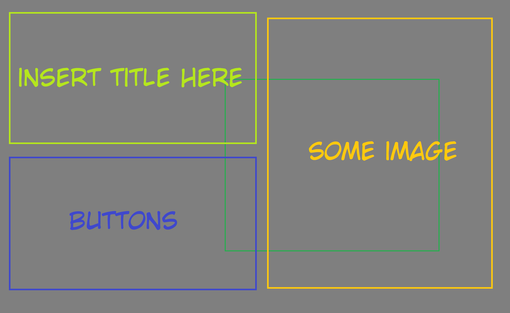
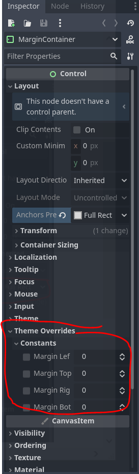
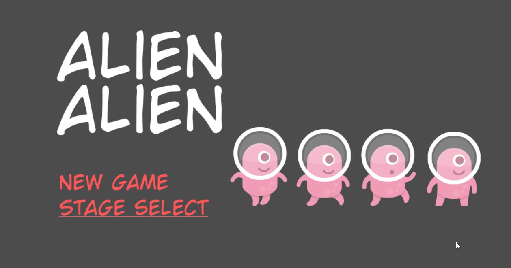
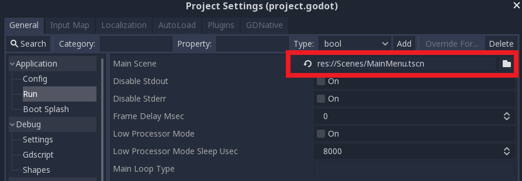

# Tutorial 6 - Menu and In-Game Graphical User Interface

Selamat datang pada tutorial keenam kuliah Game Development.
Pada tutorial kali ini, kamu akan mempelajari cara membuat _menu screen_, _game over screen_,
dan _in-game GUI_.

Di akhir tutorial ini, diharapkan kamu paham cara menggunakan _Container_, _Label_, _Button_,
serta unsur-unsur lain untuk menyusun menu dan antar muka dalam _game_.

## Daftar Isi

- [Tutorial 6 - Menu and In-Game Graphical User Interface](#tutorial-6---menu-and-in-game-graphical-user-interface)
    - [Daftar Isi](#daftar-isi)
    - [Pengantar](#pengantar)
    - [Tampilan Antar Muka](#tampilan-antar-muka)
    - [Latihan: Membuat Menu Utama](#latihan-membuat-menu-utama)
    - [Latihan: Membuat GUI Life Counter](#latihan-membuat-gui-life-counter)
    - [Latihan: Membuat Layar Game Over](#latihan-membuat-layar-game-over)
    - [Latihan Mandiri: Fitur Tambahan](#latihan-mandiri-fitur-tambahan)
    - [Skema Penilaian](#skema-penilaian)
    - [Pengumpulan](#pengumpulan)
    - [Referensi](#referensi)
    - [Selingan Menarik (Intermezzo)](#selingan-menarik-intermezzo)

## Pengantar

> Penting! Untuk tutorial kali ini, silakan menggunakan [templat proyek yang telah disediakan di GitHub](https://github.com/CSUI-Game-Development/tutorial-6-template)
> **ATAU** melanjutkan dari pengerjaan proyek **Tutorial 4**.
> Jika melanjutkan proyek **Tutorial 4**, silakan mengerjakan di repositori Git pengerjaan tutorial tersebut dan membuat _branch_ baru (misal: _branch_ `tutorial-6`).

## Tampilan Antar Muka

Saat kamu pertama kali memulai suatu game, apa yang pertama kali muncul?
_Splash screen_ dengan gambar logo perusahaan pembuat game tersebut?


Atau _splash screen_ dengan ilustrasi tokoh dari game tersebut?


Pada umumnya, mayoritas game akan memiliki menu utama (_main menu_).
_Main menu_ adalah layar utama yang muncul pertama kali ketika mulai bermain game.
Biasanya terdapat tombol atau instruksi untuk memulai permainan pada _main menu_.

Selain _main menu_, di dalam game juga terdapat tampilan antar muka yang menampilkan informasi terkait kondisi permainan sekarang secara visual.
Tampilan antar muka tersebut dinamakan sebagai _game_ GUI (_Graphical User Interface_).
GUI digunakan untuk menampilkan banyak hal, seperti:

- Jumlah sumber daya (misal: darah tokoh, uang virtual) yang dimiliki pemain.
- Kondisi pemain relatif terhadap lawan-lawannya (misal: peringkat ketika balapan, posisi pemain pada dunia permainan).
- Pilihan untuk masuk ke menu lain terkait permainan (biasanya pada game _mobile_ yang dapat merespon aksi _tap_/sentuh layar, misal: tombol untuk membuka daftar tokoh yang bisa dikendalikan pemain).
- Dan lain-lain.

Kemudian yang tidak kalah penting adalah tampilan saat pemain mencapai kondisi akhir permainan,
seperti layar yang menampilkan kondisi menang atau kondisi kalah.

Pada Tutorial 4, kita sudah berhasil membuat game _platformer_ 2D yang cukup dasar.
Namun saat menjalankan proyek, _scene_ yang dijalankan langsung level 1 dan tidak ada menu yang muncul terlebih dahulu.

### Contoh Layar Menu Utama, Layar Kondisi Menang/Kalah, dan GUI

Berikut ini adalah beberapa contoh layar menu, layar kondisi akhir permainan,
dan GUI pada beberapa game populer:


Tentu saja contoh-contoh di atas hanyalah representasi kecil dari sekian banyak contoh layar permainan.
Apabila kamu ada contoh lain yang menarik, silakan cerita ketika sesi tutorial berlangsung. 😃

Pada tutorial ini kita akan melakukan hal berikut:

- Membuat layar menu utama (_main menu_)
- Membuat indikator nyawa (_life counter_)
- Membuat layar kalah (_game over screen_)

## Latihan: Membuat Menu Utama

### Visualisasi

Untuk menghasilkan sebuah UI yang baik, sebaiknya kita membuat sebuah _mockup_ terlebih dahulu.
Apa saja yang ingin kita tampilkan di menu utama, dan posisi segala hal yang ingin kita tampilkan.
Visualisasi boleh digambar di kertas, dan tidak harus bagus-bagus.
Cukup untuk memberikan gambaran kasar apa yang ingin kita buat.

Berikut adalah contoh visualisasi main menu:



### Membuat Containers, Labels, dan Buttons

Salah satu cara untuk menyusun sebuah menu dengan rapi adalah menggunakan containers.
_Container_ pada konteks desain UI pada game merupakan elemen yang akan menampung komposisi elemen UI.

Jika kamu familiar dengan desain Web, anggaplah _container_ serupa dengan _tag_ `<div>` yang sering dipakai untuk membungkus elemen-elemen HTML pada sebuah halaman Web.
_Container_ di Godot akan membungkus elemen-elemen UI pada permainan yang dikembangkan.

Beberapa _container_ yang terdapat di _engine_ Godot antara lain:

- `MarginContainer` untuk menyusun elemen dengan _padding_
- `HBoxContainer` untuk menyusun elemen secara horizontal
- `VBoxContainer` untuk menyusun elemen secara vertikal
- `CenterContainer` untuk menyusun elemen secara _centered_

Sesuai dengan visualisasi yang telah dilakukan di atas, kita dapat menyusun main menu ini dengan susunan container sebagai berikut:

Kotak terbesar seukuran _game window_, dan terdapat padding di bagian ujung window.
Oleh karena itu kita menggunakan parent `MarginContainer`.
Kemudian layar dibagi dua kiri kanan, maka menggunakan `HBoxContainer`.

Di bagian kiri ada judul dan button, maka ada `VBoxContainer`.
_Button_ sendiri akan kita susun dengan `VBoxContainer` juga.
Sedangkan sebelah kanan cukup kita berikan `CenterContainer` untuk gambar.


> Catatan: Kamu tidak harus mengikuti struktur dan _layout_ persis sama seperti di atas.
> Bahkan diperbolehkan jika kamu tidak ingin menggunakan container sama sekali untuk menu utama.
> Namun container sangat membantu untuk visualisasi dan kerapihan.

Mulai dengan membuat _scene_ baru. Karena _root node_ UI yang kita inginkan adalah container paling luar,
atur _root node_ menjadi sebuah `MarginContainer`.
Jangan lupa simpan (_save_) _scene_ tersebut, berikan nama `MainMenu.tscn`.


Pada tab Inspector, atur **Constants** pada **Theme Overrides** sebagai berikut:



Kemudian pada Viewport, tekan menu **Layout**, pada attribut anchor preset, pilih opsi **Full Rect**.
Ini dilakukan agar ukuran _container_ menyesuai ukuran _window_.


Setelah itu masukan VBoxContainer di dalam MarginContainer.

Sekarang masukkan elemen teks dan gambar ke dalam `VBoxContainer`.
Untuk teks, gunakan _node_ `Label`, dan untuk gambar gunakan node `TextureRect`.
Untuk contoh ini ada dua tombol, "New Game" dan "Stage Select", yang akan diimplementasikan menggunakan node `LinkButton`.

Untuk menambahkan teks pada `Label` atau `LinkButton` cukup menulis di tab Inspector bagian **Text**.
Untuk menambahkan gambar kepada `TextureRect`, sama seperti menambahkan _texture_ di `Sprite` yaitu di tab Inspector bagian **Texture**.
Saat selesai, mungkin struktur _scene_ dan _workspace_ kamu akan terlihat seperti _screenshot_ berikut:


Kamu pasti heran kenapa gambarnya besar sekali, kenapa tulisannya berada di pojok atas, dan kenapa semua tulisannya saling tumpang tindih. 
Karena masih belum terlihat rapi, sekarang tambahkan _container_ sesuai visualisasi di atas tadi.
Struktur _node_ dan _workspace_ seharusnya akan terlihat lebih rapi dan menyerupai _screenshot_ berikut:


Agar tulisan dan gambar berada di tengah layar, pada HBoxContainer, ubah Alignment menjadi Center. Kemudian lakukan hal yang sama pada VBoxContainer. Untuk membuat gambar tidak tersquish, ubah StretchMode menjadi Keep dan ubah ContainerSizing.Vertical menjadi Shrink Center


Agar judul dan tombol tidak terlalu berhimpitan, ubah **Separation** pada `VBoxContainer` ThemeOverrides.

Namun, pada saat ini tulisan judul dan tombol sangatlah membosankan. Hanya default font dari Godot. Apakah tidak ada cara untuk mengubahnya?? Apakah kita perlu membuat suatu objek khusus untuk tiap ukuran font yang kita perlukan. Untungnya pada Godot 4.3 sudah mudah mengubah style dari font. Kita hanya perlu mengubah konfigurasi ThemeOverrides pada node `Label` dan juga `LinkButton`


Untuk mengubah ukuran TextureRect, Anda bisa melakukan:
Mengubah Strecth Mode menjadi KeepAspect pada `TextureRect`, mengubah `Container Sizing Horizontal` menjadi `Shrink Center`, Mengubah `Custom Minimum Size` sesuai keiinginan Anda.

Selamat! Layar menu utama kamu sudah terlihat cukup rapi!


 Tapi masih belum _clickable_ tentunya.
 Bagaimana caranya agar saat kita menekan tombol "New Game" dia akan melempar kita ke level 1?

### Latihan: Clickable Menu

Kita ingin agar saat tombol "New Game" ditekan, game akan menjalankan _scene_ level pertama.
Pada Tutorial 4, kita sudah belajar menggunakan **Signal**.
Sekarang kita akan menggunakannya lagi untuk menangani _event handler_ ketika ada aksi menekan tombol, yaitu `pressed()`.

Gunakan cuplikan _script__ berikut sebagai _script_ yang ditempelkan pada `LinkButton`:

```gdscript
extends LinkButton

export(String) var scene_to_load

func _on_New_Game_pressed():
	get_tree().change_scene(str("res://scenes/" + scene_to_load + ".tscn"))

```

Kemudian pastikan `LinkButton` sedang dipilih dan lihat tab Inspector.
Isi variabel `scene_to_load` pada tab Inspector dengan value "Level 1"


Berhasil! Sekarang tombol "New Game" kamu akan langsung membawa pemain ke level 1.



_"Mengapa saat saya tekan play (F5) yang jalan pertama bukan main menu?"_
Karena `MainMenu.tscn` belum diatur sebagai **Main Scene**.
**Main Scene** dapat diubah di Project -> Project Settings -> Application -> Run -> Main Scene.



## Latihan: Membuat GUI Life Counter

Sebelumnya kita sudah membuat kondisi dimana saat player jatuh, maka _scene_ akan di-_reload_ dengan player kembali ke tempat semula.
Namun tidak ada penalti sama sekali untuk jatuh. Sekarang kita akan mencoba membuat kondisi dimana setiap kali player jatuh, player akan kehilangan satu nyawa.
Saat sudah tidak ada nyawa lagi, maka permainan usai (_game over_).

### Global Variables

Jika kamu pernah menyentuh bahasa pemrograman apapun, pasti sudah familiar dengan yang namanya _global variable_.
_Global Variable_ adalah sebuah variabel yang terlihat (_visible_) oleh seluruh program.
Kita menggunakan _global variable_ untuk mendefinisikan nyawa player.
Nyawa player akan disimpan permanen (_persist_) walaupun _scene_ baru dipanggil atau diulang-ulang.
Variabel ini dapat dipanggil dari _script_ manapun.

Pertama, klik kanan folder `scripts` lalu tekan **New Script**:


Beri nama berkas _script_ tersebut `global.gd` lalu isi dengan _script_ berikut:

```gdscript
extends Node

var lives = 3
```

Pada Project Settings, cari tab Globals, lalu tambahkan script `global.gd` (tekan _icon_ folder di sebelah tulisan **Node Name** lalu cari berkas _script_-nya).
Setelah ditambahkan, akan muncul di dalam daftar. Pastikan kolom `Global Variable` dalam kondisi aktif (_enabled_).


Sekarang kita punya variable nyawa yang dapat diakses kapan saja. Mari kita tampilkan menggunakan _label_.

> Catatan: Bagi yang penasaran mengapa menggunakan _global variable_ untuk contoh ini,
> alasannya karena tiap kali _reload scene_, player juga ikut _reload_.
> Maka `lives` disimpan dalam _global variable_ agar tidak reset saat _scene reload_.

### GUI Scene

Buat sebuah scene baru dan beri nama `Life Counter.tscn` dengan _root node_ sebuah `MarginContainer`.
Buat sebuah _child node_ `Label`, lalu berikan _script_.

```gdscript
extends Label

func _process(delta):
	self.text = "Lives : " + str(global.lives)
```

Struktur akan terlihat seperti ini (`MarginContainer` telah di-_rename_ menjadi "GUI"):


Pada `Level 1.tscn`, tambahkan sebuah `CanvasLayer` _node_ sebagai _child node_ dari _node_ utama.
`CanvasLayer` merupakan _node_ yang membuat sebuah layer 2D tersendiri untuk seluruh _child_-nya.
`CanvasLayer` berguna untuk membuat _background_ untuk level, atau _user interface_ seperti yang akan kita buat sekarang.

Tambahkan `Life Counter.tscn` yang tadi kita buat sebagai _child node_ dari `CanvasLayer`.
Struktur `Level 1.tscn` akan terlihat seperti _screenshot_ berikut:


Coba jalankan `Level 1.tscn` kamu.
Sekarang sudah muncul tampilan _life counter_ di kiri atas yang mengikuti bentuk window yang ada.


Namun nyawa player belum berkurang ketika pemain mati.
Waktunya melakukan sedikit _scripting_!

Ubah script di `Area Trigger.gd` dengan kode berikut:

```gdscript
extends Area2D

export (String) var sceneName = "Level 1"

func _on_Area_Trigger_body_entered(body):
	var current_scene = get_tree().get_current_scene().get_name()
	if body.get_name() == "Player":
		if current_scene == sceneName:
			Global.lives -=1
		if (Global.lives == 0):
			pass
		else:
			get_tree().call_deferred("change_scene_to_file",(str("res://scenes/" + sceneName + ".tscn")))
```

> _What's happening above?_ Karena transisi dari level 1 ke 2 menggunakan fungsi yang sama,
> pertama kita periksa terlebih dahulu scene yang memanggil fungsi apakah sama dengan target scene (maka reload).
> Jika iya, nyawa berkurang satu. Baris `pass` di kondisi `global.lives == 0` akan kita isi sebentar lagi.
> (_you could probably already guess what goes there though_).


Sekarang nyawa player berkurang saat mati. Namun kita belum memasukkan kondisi dimana nyawa player 0, yaitu _game over_.

## Latihan: Membuat Layar Game Over

Untuk membuat layar _game over_, langkah-langkahnya sama dengan membuat layar menu utama.
Visualisasi layar _game over_ di contoh tutorial ini berupa tulisan `GAME OVER` dengan warna latar merah.
Jika ingin menambahkan warna latar, kita dapat menggunakan _node_ `ColorRect`.

Buatlah sebuah _scene_ baru dan beri nama `Game Over.tscn`, lalu atur sebuah `ColorRect` sebagai _root node_ di _scene_ tersebut.
Mirip seperti `MarginContainer` sebelumnya, pilih menu **Layout** pada _viewport_ dan pilih **Full Rect** agar kotak mengikuti ukuran _window_.
Silakan ubah warna sesuka hati.


Tambahkan label bertuliskan "GAME OVER", kemudian atur posisinya.
Selesailah Game Over screen kita!


Sekarang bagaimana caranya agar saat nyawa pemain 0 akan menampilkan layar ini? Pada `Area Trigger.gd` ubah baris `pass` menjadi:

```gdscript
get_tree().change_scene_to_file(str("res://scenes/Game Over.tscn"))
```

Berhasil! Sekarang saat player nyawanya habis, layar _game over_ akan muncul.


Selamat, tutorial ini sudah selesai!

## Latihan Mandiri: Fitur Tambahan

Silakan baca referensi yang tersedia untuk membantu pengerjaan latihan mandiri.
Di akhir tutorial, kamu diharapkan untuk mengerjakan minimal 2 (dua) dari beberapa contoh fitur tambahan berikut:

- [ ] Tombol pada layar _game over_ untuk kembali ke menu utama.
- [ ] Fitur Select Stage (yang konon sudah ada _button_-nya di main menu namun tidak dihiraukan).
- [ ] Layar dan efek transisi antar level, dari level 1 ke level 2.
- [ ] Dan lain-lain (bebas), selama fitur tersebut melibatkan implementasi menu dan GUI di dalam game. _Get creative!_

Jangan lupa untuk menjelaskan proses pengerjaan tutorial ini di dalam berkas `README.md`.
Jika kamu melanjutkan Tutorial 4, silakan tambahkan subbab (_section_) baru di berkas `README.md` yang berisi penjelasan proses pengerjaan Tutorial 6.
Cantumkan juga referensi-referensi yang digunakan sebagai acuan ketika menjelaskan proses implementasi.

## Skema Penilaian

Pada tutorial ini, ada empat kriteria nilai yang bisa diperoleh:

- **4** (_**A**_) apabila kamu mengerjakan tutorial dan latihan melebihi dari ekspektasi tim pengajar.
  Nilai ini dapat dicapai apabila mengerjakan seluruh Latihan dan 2 (dua) fitur tambahan yang merupakan bagian dari Latihan Mandiri, ditambah dengan memoles (_polishing_) lebih lanjut permainannya.
- **3** (_**B**_) apabila kamu hanya mengerjakan tutorial dan latihan sesuai dengan instruksi.
  Nilai ini dapat dicapai apabila mengerjakan seluruh Latihan dan 2 (dua) fitur tambahan yang merupakan bagian dari Latihan Mandiri.
- **2** (_**C**_) apabila kamu hanya mengerjakan tutorial hingga tuntas.
  Nilai ini dapat dicapai apabila mengerjakan seluruh Latihan namun tidak mengerjakan Latihan Mandiri.
- **1** (_**D**_) apabila kamu hanya sekedar memulai tutorial dan belum tuntas.
  Nilai ini dapat dicapai apabila belum tuntas mengerjakan Latihan.
- **0** (_**E**_) apabila kamu tidak mengerjakan apapun atau tidak mengumpulkan.

## Pengumpulan

Kumpulkan semua berkas pengerjaan tutorial dan latihan ke repositori Git.
Kemudian, _push_ riwayat _commit_-nya ke repositori Git pengerjaan Tutorial 6.
Ingat kembali instruksi di awal Tutorial 6, kamu dapat memilih membuat repositori baru khusus untuk pengerjaan Tutorial 6
**atau** menggunakan repositori Tutorial 4 sebagai templat untuk mengerjakan Tutorial 6.
Jika melanjutkan Tutorial 4, jangan lupa untuk mengambil aset yang dibutuhkan dari templat proyek Tutorial 6.

Apabila kamu mengerjakan latihan mandiri, pastikan _scene_ dan _node_ yang kamu buat dan ubah telah tercatat masuk ke dalam repositori Git.
Kumpulkan tautan ke repositori Git hasil pengerjaan Tutorial 6 kamu di slot pengumpulan yang tersedia di SCELE.

Tenggat waktu pengumpulan adalah **Jumat, 21 April 2025, pukul 21:00**.

## Referensi

- [Main Menu](https://docs.godotengine.org/en/3.1/getting_started/step_by_step/ui_main_menu.html)
- [GUI Design](https://docs.godotengine.org/en/3.1/getting_started/step_by_step/ui_game_user_interface.html)
- [Kenney Assets](https://www.kenney.nl/assets/platformer-pack-redux)
- Materi tutorial pengenalan Godot Engine, kuliah Game Development semester
  gasal 2020/2021 Fakultas Ilmu Komputer Universitas Indonesia.

## Selingan Menarik (Intermezzo)

Berikut ini adalah gambar _meme_ yang diambil dari [sebuah _thread_ di Reddit](https://www.reddit.com/r/gachagaming/comments/13z8fva/when_you_play_too_many_gachas/):


Gambar tersebut menampilkan _screenshot_ dari sebuah game yang diubah sehingga mengandung elemen-elemen GUI dari banyak game lain.
Apa saja judul game yang bisa kamu kenali dari elemen GUI-nya pada _meme_ tersebut?
Jika kamu mengenali satu atau lebih elemen GUI di _screenshot_ tersebut, apa fungsi elemen GUI tersebut di game aslinya?

> Silakan didiskusikan dengan rekan-rekan sekelas ketika membahas materi mengenai _Interface_ pada game, atau dijadikan bahan obrolan santai di grup pertemanan masing-masing.
