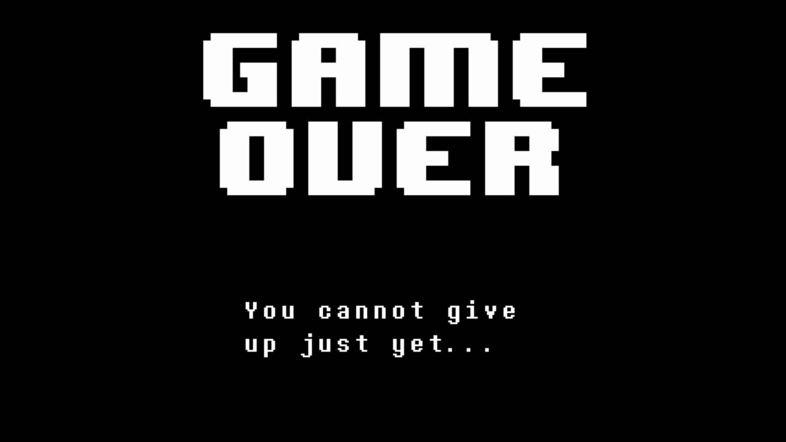
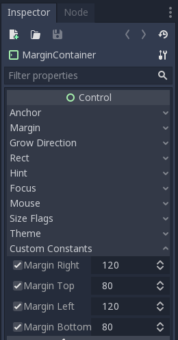
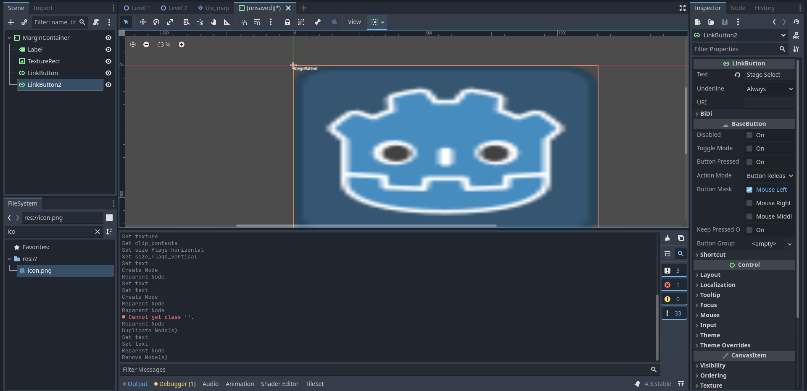
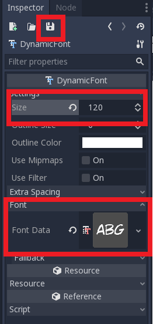
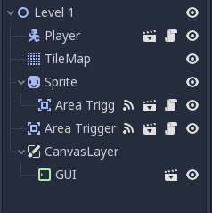

# Tutorial 6 - Menu and In-Game Graphical User Interface

Selamat datang pada tutorial keenam kuliah Game Development.
Pada tutorial kali ini, kamu akan mempelajari cara membuat _menu screen_, _game over screen_,
dan _in-game GUI_.

Di akhir tutorial ini, diharapkan kamu paham cara menggunakan _Container_, _Label_, _Button_,
serta unsur-unsur lain untuk menyusun menu dan antar muka dalam _game_.

## Daftar Isi

> TODO: Generate the table of contents written in Markdown format with proper links to each section & subsection

## Pengantar

> Penting! Untuk tutorial kali ini, diperbolehkan menggunakan [templat proyek yang telah disediakan di GitHub](https://github.com/CSUI-Game-Development/tutorial-6-template)
> **ATAU** melanjutkan dari pengerjaan proyek tutorial sebelumnya.
> Jika melanjutkan proyek tutorial sebelumnya, silakan mengerjakan di repositori Git pengerjaan tutorial tersebut dan membuat _branch_ baru (misal: _branch_ `tutorial-6`).

## Menu Utama

Saat kamu pertama kali memulai suatu game, apa yang pertama kali muncul?
_Splash screen_ dengan gambar logo perusahaan pembuat game tersebut?


Atau _splash screen_ dengan ilustrasi tokoh dari game tersebut?


Pada umumnya, mayoritas game akan memiliki menu utama (_main menu_).
_Main menu_ adalah layar utama yang muncul pertama kali ketika mulai bermain game.
Biasanya terdapat tombol atau instruksi untuk memulai permainan pada _main menu_.

Selain _main menu_, di dalam game juga terdapat tampilan antar muka yang menampilkan informasi terkait kondisi permainan sekarang secara visual.
Tampilan antar muka tersebut dinamakan sebagai _game_ GUI (_Graphical User Interface_).
GUI digunakan untuk menampilkan banyak hal, seperti:

- Jumlah sumber daya (misal: darah tokoh, uang virtual) yang dimiliki pemain.
- Kondisi pemain relatif terhadap lawan-lawannya (misal: peringkat ketika balapan, posisi pemain pada dunia permainan).
- Pilihan untuk masuk ke menu lain terkait permainan (biasanya pada game _mobile_, misal: tombol untuk membuka daftar tokoh yang bisa dikendalikan pemain).
- Dan lain-lain.

Kemudian yang tidak kalah penting adalah tampilan saat pemain mencapai kondisi akhir permainan,
seperti layar yang menampilkan kondisi menang atau kondisi kalah.

Pada tutorial sebelumnya, kita sudah berhasil membuat game _platformer_ 2D yang cukup dasar.
Namun saat menjalankan proyek, _scene_ yang dijalankan langsung level 1 dan tidak ada menu yang muncul terlebih dahulu.

### Contoh Layar Menu Utama, Layar Kondisi Menang/Kalah, dan GUI

Berikut ini adalah beberapa contoh layar menu, layar kondisi akhir permainan,
dan GUI pada beberapa game populer:





Tentu saja contoh-contoh di atas hanyalah representasi kecil dari sekian banyak contoh layar permainan.
Apabila kamu ada contoh lain yang menarik, silakan cerita ketika sesi tutorial berlangsung. 😃

Pada tutorial ini kita akan melakukan hal berikut:

- Membuat layar menu utama (_main menu_)
- Membuat indikator nyawa (_life counter_)
- Membuat layar kalah (_game over screen_)

## Creating a Main Menu Screen

### Visualization

Untuk menghasilkan sebuah UI yang baik, sebaiknya kita membuat sebuah mockup terlebih dahulu. Apa saja yang ingin kita tampilkan di menu utama, dan posisi segala hal yang ingin kita tampilkan. Visualisasi boleh digambar di kertas, dan tidak harus bagus-bagus. Cukup untuk memberikan gambaran kasar apa yang ingin kita buat. Berikut adalah contoh visualisasi main menu:


### Containers, Labels, and Buttons

Salah satu cara untuk menyusun sebuah menu dengan rapi adalah menggunakan containers. Beberapa container yang terdapat di Godot Engine antara lain:
- ```MarginContainer``` untuk menyusun elemen dengan padding
- ```HBoxContainer``` untuk menyusun elemen secara horizontal
- ```VBoxContainer``` untuk menyusun elemen secara vertikal
- ```CenterContainer``` untuk menyusun elemen secara centered

Sesuai dengan visualisasi yang telah dilakukan di atas, kita dapat menyusun main menu ini dengan susunan container sebagai berikut:
Kotak terbesar seukuran _game window_, dan terdapat padding di bagian ujung window. Oleh karena itu kita menggunakan parent ```MarginContainer```. Kemudian layar dibagi dua kiri kanan, maka menggunakan ```HBoxContainer```. Di bagian kiri ada judul dan button, maka ada ```VBoxContainer```. Button sendiri akan kita susun dengan ```VBoxContainer``` juga. Sedangkan sebelah kanan cukup kita berikan ```CenterContainer``` untuk gambar.


> Note: Kamu tidak harus mengikuti struktur dan layout persis sama seperti di atas. Bahkan diperbolehkan jika kamu tidak ingin menggunakan container sama sekali untuk menu utama. Namun container sangat membantu untuk visualisasi dan kerapihan.

Mulai dengan membuat scene baru. Karena root node UI yang kita inginkan adalah container paling luar, atur root node menjadi sebuah ```MarginContainer```. Jangan lupa save scene tersebut, berikan nama ```MainMenu.tscn```.


Pada tab Inspector, atur ```Custom Constants``` sebagai berikut:



Kemudian pada Viewport, tekan menu ```Layout``` dan pilih opsi ```Full Rect```. Ini dilakukan agar ukuran container menyesuai ukuran window.


Sekarang kita masukkan elemen text dan gambar ke dalam ```MarginContainer```. Untuk text menggunakan node ```Label```, dan untuk gambar dapat menggunakan node ```TextureRect```. Untuk contoh ini ada dua tombol, "New Game" dan "Stage Select", yang akan diimplementasikan menggunakan node ```LinkButton```.

Untuk menambahkan text pada ```Label``` atau ```LinkButton``` cukup menulis di tab Inspector bagian ```Text```.
Untuk menambahkan gambar kepada ```TextureRect```, sama seperti menambahkan texture di ```Sprite``` yaitu di tab Inspector bagian ```Texture```.
Saat selesai, mungkin struktur scene dan workspace kamu akan terlihat seperti ini.



You may have noticed: Tulisan pada ```Label``` dan ```LinkButton``` kecil sekali, dan di tab Inspector tidak ada pilihan ukuran atau jenis font. Ini dikarenakan pada Godot Engine **tidak ada fitur untuk mengubah ukuran dan jenis font secara langsung**. _So what do we do?_

### Creating Custom Fonts

Pada Godot Game Engine, untuk mengatur font dan ukuran sebuah tulisan dalam sebuah node, misal node ```Label```, kita harus menggunakan objek custom font. Untuk tutorial ini, kita akan membuat ```DynamicFont``` menggunakan font dengan ekstensi ```.ttf```. Sudah disediakan beberapa file ```.ttf``` di folder Assets/Fonts/Raw (jika ingin mencari font sendiri dipersilakan, bisa melalui website font gratis seperti [di sini](https://www.1001fonts.com/free-fonts-for-commercial-use.html).

Pertama, tekan tombol create resource pada tab Inspector. Kemudian buat sebuah ```DynamicFont```.


Masih pada tab Inspector, cari pilihan ```Font Data```, lalu tekan load dan cari file ```.ttf``` yang ingin digunakan. Setelah itu, kamu dapat mengatur size sesuka hati pada opsi ```Size```. Tekan save, dan simpan sebagai file ```.tres``` di folder Assets/Fonts. Selamat! Anda telah berhasil membuat sebuah ```DynamicFont```.



Untuk menggunakan font tersebut, cari opsi ```Custom Font``` di tab Inspector pada node ```Label``` atau ```LinkButton```, lalu load resource yang baru saja dibuat. **IMPORTANT:** Seperti yang telah dijelaskan sebelumnya, tidak ada cara mengatur ukuran dan jenis font secara langsung, jadi jika ingin membuat font dengan tipe atau ukuran yang berbeda, harus membuat ```DynamicFont``` yang berbeda.

Setelah menggunakan ```DynamicFont``` pada judul dan tombol kita, hasilnya terlihat seperti ini (tombol new game dan stage select diberi warna merah menggunakan ```Custom Colors``` pada tab Inspector):


Masih belum terlihat rapi. Sekarang kita tambahkan container sesuai visualisasi di atas tadi. Struktur node dan workspace anda harusnya menjadi lebih rapi:


Agar judul dan button tidak terlalu berhimpitan, ubah ```Margin``` pada ```VBoxContainer``` parent. Kemudian, ubah ```Alignment``` , pilih opsi ```Expand``` pada vertical di ```Size Flags```, lalu atur ```Separation``` pada ```Custom Constants```.


Selamat! Menu Screen kamu sudah terlihat cukup rapi!


 Tapi masih belum clickable tentunya. Bagaimana caranya agar saat kita menekan tombol "New Game" dia akan melempar kita ke level 1?

### Clickable Menu

Kita ingin agar saat tombol "New Game" ditekan, game akan menjalankan scene level pertama. Kemarin kita sudah belajar menggunakan _Signals_. Sekarang kita akan menggunakan _Signal_ lagi yaitu ```pressed()```.

Gunakan cuplikan script berikut pada script ```LinkButton```
```
extends LinkButton

export(String) var scene_to_load

func _on_New_Game_pressed():
	get_tree().change_scene(str("res://Scenes/" + scene_to_load + ".tscn"))

```

Kemudian isi variabel ```scene_to_load``` pada tab Inspector dengan value "Level 1"


Berhasil! Sekarang tombol "New Game" kamu akan langsung membawa pemain ke level 1


_"Mengapa saat saya tekan play (F5) yang jalan pertama bukan main menu?"_ Karena ```MainMenu.tscn``` belum di-set sebagai Main Scene. Main Scene dapat diubah di Project Settings -> Application -> Run -> Main Scene.


## Creating a Life Counter

Kemarin kita sudah membuat kondisi dimana saat player jatuh, scene akan di reload dengan player kembali ke tempat semula. Namun tidak ada penalti sama sekali untuk jatuh. Sekarang kita akan mencoba membuat kondisi dimana setiap kali player jatuh, akan kehilangan satu nyawa. Saat sudah tidak ada nyawa lagi, maka terjadi **GAME OVER**.

### Global Variables

Jika kamu pernah menyentuh bahasa pemrograman apapun (obviously), pasti sudah familiar dengan yang namanya _Global Variable_. _Global Variable_ adalah sebuah variabel yang terlihat (visible) oleh seluruh program. Kita menggunakan _Global Variable_ untuk mendefinisikan nyawa player, yang akan _persist_ walaupun scene baru dipanggil atau diulang-ulang. Variabel ini dapat dipanggil dari script manapun.

Pertama, klik kanan folder Scripts lalu tekan New Script...


Beri nama script tersebut ```global.gd``` lalu isi dengan script berikut:

```
extends Node

var lives = 3
```

Pada Project Settings, cari tab Autoload, lalu tambahkan script ```global.gd``` (tekan icon folder di sebelah tulisan Node Name lalu cari scriptnya). Setelah ditambahkan, akan muncul di list. Pastikan kolom ```Singleton``` dalam kondisi ```enabled```.


Sekarang kita punya variable nyawa yang dapat diakses kapan saja. Mari kita tampilkan menggunakan label.

> Side note buat yang bertanya mengapa menggunakan global variable untuk contoh ini, alasannya karena tiap kali reload scene, player juga ikut reload. Maka ```lives``` disimpan dalam global agar tidak reset saat scene reload.

### Adding the GUI

Buat sebuah scene baru dan beri nama ```Life Counter.tscn``` dengan root node sebuah ```MarginContainer```. Buat sebuah child node ```Label```, lalu berikan script. Jangan lupa berikan **custom font** kepada node ```Label```.

```
extends Label

func _process(delta):
	self.text = "Lives : " + str(global.lives)
```

Struktur akan terlihat seperti ini (```MarginContainer``` di rename menjadi "GUI"):


Pada ```Level 1.tscn```, tambahkan sebuah ```CanvasLayer``` node sebagai child node dari node utama. ```CanvasLayer``` merupakan node yang membuat sebuah layer 2D tersendiri untuk seluruh child nya. ```CanvasLayer``` berguna untuk membuat background untuk level, atau user interface seperti yang akan kita buat sekarang.

Tambahkan ```Life Counter.tscn``` yang tadi kita buat sebagai child node dari ```CanvasLayer```. Struktur ```Level 1.tscn``` anda akan terlihat seperti ini:



Coba jalankan ```Level 1.tscn``` kamu. Sekarang sudah muncul tampilan life counter di kiri atas yang mengikuti bentuk window yang ada.


Namun nyawa player belum berkurang saat mati. Waktunya melakukan sedikit scripting!

Ubah script di ```Area Trigger.gd``` dengan kode berikut:

```
extends Area2D

export (String) var sceneName = "Level 1"

func _on_Area_Trigger_body_entered(body):
	var current_scene = get_tree().get_current_scene().get_name()
	if body.get_name() == "Player":
		if current_scene == sceneName:
			global.lives -=1
		if (global.lives == 0):
			pass
		else:
			get_tree().change_scene(str("res://Scenes/" + sceneName + ".tscn"))
```

> _What's happening above?_ Karena transisi dari level 1 ke 2 menggunakan function yang sama, pertama kita periksa terlebih dahulu scene yang memanggil fungsi apakah sama dengan target scene (maka reload). Jika iya, nyawa berkurang satu. Baris ```pass``` di kondisi ```global.lives``` == 0 akan kita isi sebentar lagi (_you could probably already guess what goes there though_).


Sekarang nyawa player berkurang saat mati. Namun kita belum memasukkan kondisi dimana nyawa player 0, yaitu **GAME OVER**.

## Creating a Game Over Screen

### Using Background Coloring

Untuk membuat Game Over screen, step by step nya sama dengan membuat Main Menu. Visualisasi game over saya adalah tulisan game over dengan warna latar merah. Jika ingin menambahkan warna latar, kita dapat menggunakan node ```ColorRect```.

Buatlah sebuah scene baru, beri nama ```Game Over.tscn```, lalu set sebuah ```ColorRect``` sebagai root node. Mirip seperti ```MarginContainer``` tadi, agar kotak mengikuti ukuran window, pada Viewport tekan menu ```Layout``` dan pilih ```Full Rect```. Ubah warna sesuka hati.


Tambahkan label bertuliskan "GAME OVER", dengan DynamicFont yang menurut kamu cocok, kemudian atur posisinya. Selesailah Game Over screen kita!


Sekarang bagaimana caranya agar saat nyawa pemain 0 akan menampilkan layar ini? Pada ```Area Trigger.gd``` ubah script ```pass``` menjadi:

```
get_tree().change_scene(str("res://Scenes/Game Over.tscn"))
```

Berhasil! Sekarang saat player nyawanya habis, GAME OVER screen akan muncul.


Selamat, tutorial ini sudah selesai!

## Bonus To Do

Apabila masih ada waktu atau ingin lanjut berlatih mandiri, silakan baca
referensi yang tersedia untuk belajar mengimplementasikan fitur tambahan.
Tidak ada kriteria khusus untuk ini, kamu bebas menambahkan apapun yang kamu
suka. Beberapa contoh yang bisa dikerjakan:

- Button pada Game Over Screen untuk kembali ke Main Menu
- Fitur Select Stage (yang konon sudah ada _button_-nya di main menu namun
  tidak dihiraukan)
- Transition screen antara stage 1 dan stage 2
- dll. _Get creative!_

Jika mengerjakan fitur tambahan, buat file baru bernama `T6_[NPM].md` dimana
`[NPM]` adalah NPM kamu (misal: `t6_1506757913`) di folder yang sama dengan
[`README.md`](README.md) ini. Tulis teks menggunakan format [Markdown](https://docs.gitlab.com/ee/user/markdown.html).

## Instruksi Pengerjaan

1. Dalam repositori pribadi kamu, silakan sinkronisasi _branch_ ```master``` dengan repositori _upstream_.
   Instruksi lebih lanjut bisa dibaca [disini](https://help.github.com/en/articles/syncing-a-fork).
2. Jika terdapat _conflict_, mohon diselesaikan secara damai.
   Jika tidak yakin bagaimana caranya, silakan ambil mata kuliah *Advanced Programming* atau baca [ini](https://help.github.com/en/articles/resolving-a-merge-conflict-using-the-command-line).
3. Setelah semua selesai, buat _branch_ baru dari _branch_ ```master``` dengan nama ```tutorial-x``` dimana ```x``` adalah nomor tutorial (misal: tutorial-6).
4. Ganti _current branch_ menjadi ```tutorial-x``` tersebut, silakan kerjakan tutorial di dalam _branch_ yang bersangkutan.
   Setiap _branch_ tutorial **tidak perlu** di _merge_ ke _branch_ ```master```.

## Skema Penilaian

Pada tutorial ini, ada empat kriteria nilai yang bisa diperoleh:

1. **A** apabila kamu mengerjakan tutorial dan latihan melebihi dari ekspektasi
   tim pengajar.
2. **B** apabila kamu hanya mengerjakan tutorial sesuai yang diminta oleh
   deskripsi tutorial.
3. **C** apabila kamu mengerjakan tutorial secara minimalis atau tidak
   lengkap/tuntas.
4. **E** apabila kamu tidak mengerjakan apapun atau tidak mengumpulkan.

## Pengumpulan

Kumpulkan dengan memasukkan berkasnya ke dalam Git dan _push_ ke _fork_ materi
tutorial ini di repositori milik pribadi. **Jangan _push_ atau membuat Merge
Request ke repositori _upstream_ materi tutorial kecuali jika kamu ingin
kontribusi materi atau memperbaiki materi yang sudah dipublikasikan!**

Tenggat waktu pengumpulan adalah **Jumat, 23 Oktober 2020, pukul 21:00**.

## Referensi

- [Main Menu](https://docs.godotengine.org/en/3.1/getting_started/step_by_step/ui_main_menu.html)
- [GUI Design](https://docs.godotengine.org/en/3.1/getting_started/step_by_step/ui_game_user_interface.html)
- [Kenney Assets](https://www.kenney.nl/assets/platformer-pack-redux)
- Materi tutorial pengenalan Godot Engine, kuliah Game Development semester
  gasal 2020/2021 Fakultas Ilmu Komputer Universitas Indonesia.

## Selingan Menarik (Intermezzo)

Berikut ini adalah gambar _meme_ yang diambil dari [sebuah _thread_ di Reddit](https://www.reddit.com/r/gachagaming/comments/13z8fva/when_you_play_too_many_gachas/):


Gambar tersebut menampilkan _screenshot_ dari sebuah game yang digubah sehingga mengandung elemen-elemen GUI dari banyak game lain.
Apa saja judul game yang bisa kamu kenali dari elemen GUI-nya pada _meme_ tersebut?

> Catatan: Pertanyaan di atas tidak perlu dijawab dan tidak akan masuk sebagai bahan ujian. 😅
