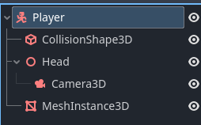
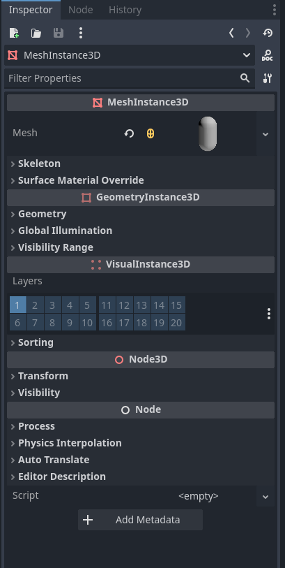
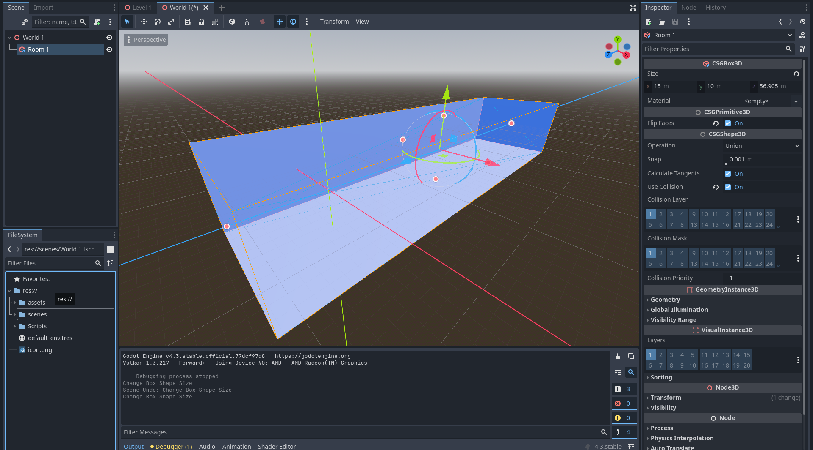
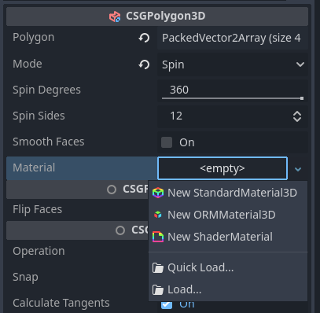
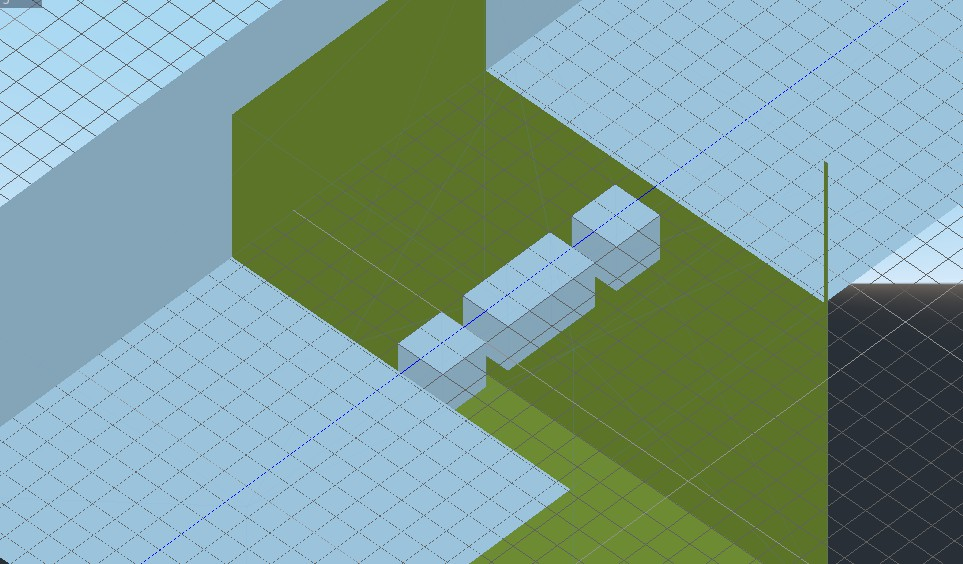

# Tutorial 7 - Basic 3D Game Mechanics & Level Design

Selamat datang pada tutorial ketujuh kuliah Game Development.
Pada tutorial kali ini, kamu akan mempelajari cara membuat game dalam bentuk tiga dimensi (3D).
Spesifiknya, kamu akan belajar mengimplementasikan _game mechanics_ dan desain level sederhana di game 3D.

Di akhir tutorial ini, diharapkan kamu paham cara menggunakan *node* 3D,
mengimplementasikan interaksi objek di bidang 3D menggunakan teknik *raycast*,
dan membuat level bidang 3D sederhana.

## Daftar Isi

- [Tutorial 7 - Basic 3D Game Mechanics & Level Design](#tutorial-7---basic-3d-game-mechanics--level-design)
  - [Daftar Isi](#daftar-isi)
  - [Pengantar](#pengantar)
    - [2D vs 3D](#2d-vs-3d)
    - [Objectives & Prerequisites](#objectives--prerequisites)
  - [Latihan: Basic 3D Plane Movement](#latihan-basic-3d-plane-movement)
  - [Latihan: Object Interaction](#latihan-object-interaction)
  - [Latihan: Membuat Level 3D Menggunakan CSG](#latihan-membuat-level-3d-menggunakan-csg)
  - [Latihan Mandiri: Eksplorasi Mechanics 3D](#latihan-mandiri-eksplorasi-mechanics-3d)
  - [Skema Penilaian](#skema-penilaian)
  - [Pengumpulan](#pengumpulan)
  - [Referensi](#referensi)

## Pengantar

> Note: [Templat proyek tutorial 7 tersedia di GitHub (klik)](https://github.com/CSUI-Game-Development/tutorial-7-template).

### 2D vs 3D

Pada tutorial yang dilakukan sebelum masa UTS, kita sudah membuat game dua dimensi (2D)
dimana pemain dapat bergerak pada ruang dua dimensi. Pemain dapat bergerak ke atas,
bawah, kiri, dan kanan. Pada game 3D, terdapat sumbu tambahan pada ruang koordinat,
yaitu sumbu Z yang memberikan unsur kedalaman dan volume. Hal ini menyebabkan pengembangan
game 3D agak berbeda dengan 2D. Menggambar objek tidak menggunakan *sprite*, tetapi menggunakan
*tool* 3D khusus, yang kemudian di-*export* ke sebuah format agar dapat di-*import* ke Godot.
*Physics* juga berbeda dalam penggunaannya karena menggunakan vektor 3D.

Berikut adalah contoh perbedaan game 2D dan 3D.


> Risk of Rain (atas) dan Risk of Rain 2 (bawah)

### Objectives & Prerequisites

Pada tutorial ini kita akan membuat sebuah game *first-person* dimana pemain dapat bergerak,
melompat, dan berinteraksi dengan objek.

Dikarenakan pengembangan game 3D akan berbeda dengan 2D, perlu diketahui bahwa beberapa *node* yang sebelumnya
digunakan pada pengembangan game 2D tidak akan bekerja pada space 3D, sehingga kalian harus menggunakan
*node* yang dapat bekerja pada space 3D. Selain itu, kalian juga harus me-*review* kembali dasar-dasar
pelajaran Aljabar Linear dan Fisika Dasar karena *physics* pada space 3D lebih kompleks dibandingkan
dengan pada space 2D. Terakhir, terdapat koordinat baru, yaitu koordinat Z, yang digunakan untuk
menunjukkan arah depan/belakang.

## Latihan: Basic 3D Plane Movement

Kita ingin membuat sebuah karakter yang dikendalikan oleh pemain di dunia 3D. Untuk itu,
kita akan membuat sebuah objek ```CharacterBody``` (mirip dengan ```CharacterBody2D```) yang dapat bergerak ke semua arah dan dapat melompat.

Buat sebuah *Scene* baru, tambahkan *node* ```CharacterBody```, rename menjadi *Player*
dan tambahkan ```MeshInstance3D``` dan ```CollisionShape3D``` sebagai *child node* dari *node*
*Player*. Tambahkan satu lagi *child node* berupa ```Node3D```, rename menjadi *Head*, dan
tambahkan ```Camera3D``` sebagai *child node* dari *Head*.



Pada node ```CollisionShape3D```, pada tab *Inspector*, berikan sebuah ```Shape``` yaitu ```CapsuleShape``` untuk
memberi *collision* pada pemain, lalu putar sebesar 90 derajat pada sumbu x.


Pada node ```MeshInstance3D```, pada tab *Inspector*, berikan *mesh* dengan bentuk ```CapsuleMesh``` untuk
memberi wujud pada pemain, lalu putar sebesar 90 derajat pada sumbu x.



Pindahkan/translasikan *node Head* agar berada di ujung atas objek.

Agar pemain dapat bergerak, tambahkan *script* pada *node Player* dengan isi sebagai berikut:

```
extends CharacterBody3D

@export var speed: float = 10.0
@export var acceleration: float = 5.0
@export var gravity: float = 9.8
@export var jump_power: float = 5.0
@export var mouse_sensitivity: float = 0.3

@onready var head: Node3D = $Head

func _ready():
	Input.set_mouse_mode(Input.MOUSE_MODE_CAPTURED)

func _input(event):
	if Input.is_action_just_pressed("ui_cancel"):
		Input.set_mouse_mode(Input.MOUSE_MODE_VISIBLE)

func _physics_process(delta):
	var movement_vector = Vector3.ZERO

	if Input.is_action_pressed("movement_forward"):
		movement_vector -= head.basis.z
	if Input.is_action_pressed("movement_backward"):
		movement_vector += head.basis.z
	if Input.is_action_pressed("movement_left"):
		movement_vector -= head.basis.x
	if Input.is_action_pressed("movement_right"):
		movement_vector += head.basis.x

	movement_vector = movement_vector.normalized()

	velocity.x = lerp(velocity.x, movement_vector.x * speed, acceleration * delta)
	velocity.z = lerp(velocity.z, movement_vector.z * speed, acceleration * delta)
	
	# Apply gravity
	if not is_on_floor():
		velocity.y -= gravity * delta

	# Jumping
	if Input.is_action_just_pressed("jump") and is_on_floor():
		velocity.y = jump_power

	move_and_slide()

```

Pada *Project* > *Project Settings*, pada tab *Input Map*, tambahkan action `movement_forward`,
`movement_backward`, `movement_left`, `movement_right`, `jump` dan `interact` sebagai berikut
apabila belum ada (akan digunakan nantinya):


Perhatikan bahwa:

1. ```head_basis``` merupakan vektor yang menunjukkan arah dari kepala pemain, sehingga jika
   menekan input untuk menggerakan pemain, ```movement_vector``` akan berisi
   arah sumbu x dari kepala pemain ketika bergerak ke kiri atau kanan, dan sumbu z dari kepala pemain
   ketika bergerak ke depan atau belakang.
2. Kita mengubah ```movement_vector``` menjadi ```movement_vector.normalized()```, karena
   jika diberikan input pada dua arah seperti ke depan dan ke kiri, maka pemain tidak akan
   maju dua kali lebih cepat.
3. Fungsi ```lerp``` berguna agar pergerakan pemain mulus sesuai dengan
   *acceleration* dari pemain ketika menekan input.
4. Fungsi ```move_and_slide()``` berfungsi untuk menggerakan pemain.

Tambahkan *scene Player* ke *scene Level*, lalu coba jalankan *scene* tersebut. Pemain sudah dapat
bergerak, namun pemain tidak dapat menggerakan kamera menggunakan *mouse* untuk menghadap arah lain. Untuk itu,
tambahkan kode berikut:

```
...
@onready var camera: Camera3D = $Head/Camera3D

var camera_x_rotation: float = 0.0

...

func _input(event):
	if event is InputEventMouseMotion and Input.get_mouse_mode() == Input.MOUSE_MODE_CAPTURED:
		head.rotate_y(deg_to_rad(-event.relative.x * mouse_sensitivity))

		var x_delta = event.relative.y * mouse_sensitivity
		camera_x_rotation = clamp(camera_x_rotation + x_delta, -90.0, 90.0)
		camera.rotation_degrees.x = -camera_x_rotation
...
```

Kode tersebut berguna untuk merotasikan *node Head* ketika mouse bergerak, dan juga mencegah rotasi melebihi
90 derajat ketika melihat ke atas atau bawah.

## Latihan: Object Interaction

Pada *scene Level*, terdapat sebuah node *switch* yang digunakan untuk menyalakan atau mematikan lampu *OmniLight3D*.
Agar objek *switch* tersebut dapat dilakukan sebuah interaksi (seperti mematikan dan menyalakan), tambahkan 2 buah script berikut:

> Interactable.gd

```
extends Node

class_name Interactable

func interact():
    pass
```

> Switch.gd (attach script ini pada node StaticBody di Switch)

```
extends Interactable

@export var light : NodePath
@export var on_by_default = true
@export var energy_when_on = 10
@export var energy_when_off = 3

@onready var light_node : Light3D = get_node(light)

var on = on_by_default

func _ready():
	light_node.energy = energy_when_on if on else energy_when_off

func interact():
	on = !on
	light_node.energy = energy_when_on if on else energy_when_off
```

Perhatikan bahwa kita meng*extend class* ```Interactable``` pada *Switch*, agar kode dapat digunakan kembali
jika ingin membuat objek ```Interactable``` lain.

Pada bagian *inspector*, attach *OmniLight3D* sebagai isi dari variable *Light*, seperti berikut:


Agar pemain dapat berinteraksi dengan objek lain, kita dapat menggunakan *node* ```RayCast3D```. ```RayCast3D```
merepresentasikan sebuah garis dari suatu titik ke titik lain, dan menkueri objek terdekat yang
ditemuinya. Tambahkan *node* ```RayCast3D``` sebagai *child* dari *Camera3D* pemain. **Pastikan
```RayCast3D``` menghadap arah yang sama dengan ```Camera3D``` dengan mengatur nilai *cast to* di *inspector* dan jangan lupa untuk meng-enable node ```RayCast3D``` melalui tab inspector.**


Pada *node* ```RayCast3D```, tambahkan *script* sebagai berikut:

```
extends RayCast3D

var current_collider

func _ready():
    pass

func _process(delta):
    var collider = get_collider()

    if is_colliding() and collider is Interactable:
        if Input.is_action_just_pressed("interact"):
            collider.interact()
```

Fungsi ini mengecek jika ```RayCast3D``` menyentuh sebuah objek lain yang berupa *Interactable*,
dan pemain dapat menekan tombol _interact_ (tombol E) untuk berinteraksi dengan objek tersebut. Dalam
kasus ini, berinteraksi dengan *switch* akan mematikan atau menyalakan lampu.


> (opsional) Anda dapat membuat animasi tombol ditekan seperti di atas!

## Membuat Level 3D Menggunakan Constructive Solid Geometry

Sekarang mari melihat sebuah fitur _engine_ Godot yang dapat digunakan untuk membuat level 3D.
Godot memiliki fitur Constructive Solid Geometry (CSG) yang dapat digunakan untuk membuat komposisi bentuk-bentuk 3D sederhana sehingga menghasilkan objek 3D.

Godot menyediakan _node_ CSG yang mempunyai 3 operasi boolean, diantaranya:

- Union: Penggabungan bentuk primitif dengan menghilangkan intersection.
- Intersection: Membuat sisa bentuk hasil penggabungan, sisanya dihilangkan.
- Substraction: Bentuk primitif kedua hasil gabungan dihilangkan dari yang
pertama dengan bagian yang menempel pada bentuk 1 juga hilang.

Contoh 3D level design dalam beberapa game:


Untuk keperluan tutorial kali ini, CSG sudah cukup untuk membuat level 3D secara sederhana atau sekedar membuat _prototype_ level 3D.
Pada pengembangan game 3D yang lebih serius, CSG biasanya hanya digunakan untuk _blocking out_, atau membuat desain kasar dari sebuah level 3D.
(Anggaplah seperti membuat _wireframe_, namun untuk desain levelnya).
Barulah setelah itu, model 3D dari level sesungguhnya dimasukkan ke dalam level, menggantikan objek 3D primitf yang dibuat menggunakan CSG.

## Latihan: Membuat Level 3D Menggunakan CSG

Buat _scene_ baru dengan type ```Node3D``` dengan nama ```Level 1```.
Dalam _scene_ tersebut, tambahkan player dengan _script_ yang sudah kalian implementasikan.


Klik kanan pada node ```Level 1``` dan pilih ```Add Child Node```, kemudian pilih ```Node3D```
dan rename node tersebut menjadi ```World 1```.

Setelah World 1 selesai dibuat, save node tersebut menjadi sebuah scene baru dengan klik kanan
pada node World 1 lalu klik ```Save Branch As Scene``` dengan nama ```World 1.tscn```.


### Empty Room

Masuk ke Editor Scene untuk World 1, disini kita akan memanfaatkan CSG untuk membuat ruangan kosong.
Pada Node World 1, buat child node baru dengan memilih ```CSGBox3D``` dan beri nama ```Room 1```.

Pada tab Inspector cek ```Flip Faces``` untuk membuat mesh menjadi inverted seperti tampilan Box Kosong dan
juga Cek ```Use Collision``` agar player tidak jatuh ketika berada di dalam ruangan, untuk sekarang Operation
pada CSG yang kita buat masih menggunakan mode ```Union```.

Masih pada tab Inspector, ubah ```Width```, ```Height```, dan ```Width``` dalam CSGBox sesuai keinginanmu lalu
atur posisi box pada *Viewport*.



Save Scene tersebut lalu kembali ke Scene ```Level 1``` dan coba Play.

> Note: Anda dapat menambahkan Node OmniLight3D atau DirectionalLigh3d untuk memudahkan pencahayaan pada saat membuat objek 3D.

### Making 3D Objects

Saat ini game terlihat membosankan, tidak ada gimmick apapun dan hanya ada ruang kosong. Kali ini kita akan mencoba
untuk membuat objek 3D untuk menghias room yang telah kita buat.

Untuk memudahkan penglihatan pada *viewport*, anda dapat mengubah proyeksi menjadi *Orthogonal* dengan mengklik menu
pojok kiri atas dalam *viewport*.


Buat sebuah 3D Scene baru dan beri nama ```ObjLamp```. Tambahkan child node baru dengan memilih ```CSGCombiner3D``` dan
beri nama ```lamp```. ```CSGCombiner3D``` berfungsi sebagai tempat untuk mengatur komponen CSG di dalamnya, jangan lupa
mencentang ```Use Collision``` karena objek yang akan dibuat merupakan benda padat.

Dalam ```lamp``` masukkan child note untuk membentuk bagian lampu.

- Buat ```CSGCylinder3D``` dengan cek *cone* pada tab Inspector untuk bagian bawah lampu.
- Buat ```CSGCylinder3D``` dan atur ukuran pada tab Inspector untuk menjadi tiang lampu.
- Buat ```CSGPolygon3D``` dengan memilih Mode *Spin* pada tab Inspector, lalu ubah proyeksi menjadi *Front View* dan atur

Titik pada polygon hingga membentuk trapesium untuk membentuk penutup lampu.


Setelah jadi, atur ketiga child node sehingga membentuk sebuah lampu! Save lalu masukkan Scene tersebut ke dalam Scene
 World 1 dengan klik kanan pada Node World 1 pilih ```Instance Child Scene```.

### Coloring 3D Objects

Masuk kembali pada Scene ```ObjLamp```. Untuk mewarnai penutup lampu, pilih CSGPolygon3D yang sudah dibuat lalu pada tab
Inspector klik dropdown ```Material``` dan pilih ```New StandardMaterial3D```.



Setelah StandardMaterial dipilih, klik gambar bola yang muncul pada menu ```Material```. Disini anda dapat mengatur tekstur
dari CSG yang dibuat, untuk sekarang klik menu ```Albedo``` dan ganti warna sesuai yang kalian inginkan.


Cara pewarnaan ini berlaku untuk semua objek CSG yang kalian buat kecuali ```CSGCombiner3D```.

### Adding Obstacles

Misalkan kita ingin menambahkan halangan untuk player dapat menuju goal seperti field yang berlubang atau jurang yang hanya dapat dilewati menggunakan function jump yang telah anda buat sebelumnya.

Buka Scene ```World 1```, lalu buat ```CSGCombiner``` baru dan centang ```Use Collision``` pada tab Inspector. Lalu masukkan Node ```Room 1``` ke dalam CSGCombiner yang telah dibuat. Tambahkan 2 ```CSGBox``` ke dalam CSGCombiner3D masing-masing akan menjadi room yang baru dan lubang. Atur sedemikian rupa menggunakan operation ```Union``` untuk membuat ruang baru dan lubang.


Lalu tambahkan ```CSGBox3D``` lagi diluar CSGCombiner3D agar player bisa melompati lubang untuk menyebrang.



### Adding Goal Condition

Sebelumnya kamu telah telah belajar menggunakan signals pada 2D level, kali ini kita akan mencoba menggunakan signals kembali untuk menambahkan goal condition.

Pertama buat scene baru (nama bebas) dengan ```Area3D``` sebagai root node.


Lalu tambahkan node ```CollisionShape3D``` sebagai child dari node ```Area3D``` tadi.
Jangan lupa untuk membuat _collision shape_ pada node ```CollisionShape3D``` (Kamu seharusnya sudah pernah melakukannya pada tutorial sebelumnya) kali ini buat bentuk *Sphere*.


Kemudian _attach_ sebuah script pada node ```Area3D``` (penamaan bebas).
Hapus semua baris kecuali baris pertama, kita akan menggunakan _Signals_ untuk fitur ini.

### Using Signals

Pertama select node ```Area3D``` lalu buka tab ```Node```.
Lalu pada subtab ```Signals``` pilih ```body_entered(Node body)``` dan klik tombol ```Connect``` di kanan bawah tab tersebut.


Pastikan ```Area3D``` terpilih pada bagian ```Connect To Node```, isi ```Method In Node``` dengan nama fungsi yang kamu inginkan atau biarkan default.
Jika sudah tekan tombol ```Connect```


Maka script pada ```Area3D``` akan ditambah fungsi tersebut.


Silakan tambah cuplikan dibawah pada script tersebut. (Jangan lupa ganti nama fungsi sesuai penamaan masing-masing)

```
extends Area3D

@export var sceneName := "Level 1"

func _on_Area_Trigger_body_entered(body):
	if body.get_name() == "Player":
		get_tree().change_scene_to_file(str("res://scenes/" + sceneName + ".tscn"))
```

Secara singkat fungsi tersebut akan tereksekusi setiap ada object dengan tipe ```Node``` yang masuk area collision.
Jika object tersebut adalah player, maka ubah root node (current scene) dengan variabel ```sceneName```.

### Adding It to the Level

Save scene dan script tersebut (Mulai sekarang disebut ```AreaTrigger```) dan buka kembali scene ```Level 1.tscn```.

Kemudian tambahkan scene ```AreaTrigger``` sebagai child dari sprite tersebut, silakan atur scaling sesuai keperluan.
Jangan lupa ubah variable ```Scene Name``` menjadi "Win Screen".


Lakukan hal yang sama untuk area lubang namun dengan ```Scene Name``` diisi dengan "Level 1".
Supaya ketika player jatuh ke jurang, scene akan di-reload.

Selamat, tutorial ini sudah selesai!

> Contoh ruangan (tidak perlu sama seperti ini):


## Latihan Mandiri: Eksplorasi Mechanics 3D

Silakan lanjutkan pengerjaan tutorial dengan mengeksplorasi bagaimana mengimplementasikan _game mechanics_ populer di game 3D.
Berhubung game yang dicontohkan di tutorial ini adalah game dengan _genre_ FPS (First-Person Shooter), maka silakan coba implementasikan salah satu dari _mechanics_ berikut:

- [ ] Pick up item & inventory system -- Player dapat mengambil sebuah objek pada level dan menyimpannya dalam sebuah sistem inventori
- [ ] Sprinting & crouching -- Player dapat memilih untuk jalan dengan kecepatan normal, berlari, atau berjalan sambil jongkok dengan kecepatan yang lebih lambat dari biasanya

Jika masih ada waktu atau masih penasaran, beberapa hal yang bisa coba kamu implementasikan:

- [ ] Membuat animasi objek 3D
- [ ] Membuat level 2 dari hasil pengerjaan tutorial
- [ ] Memoles estetika dari permainan (misal: menambahkan HUD, menambahkan aset 3D dari luar)
- Dan lain-lain. Silakan berkreasi!

## Skema Penilaian

Pada tutorial ini, ada empat kriteria nilai yang bisa diperoleh:

- **4** (_**A**_) apabila kamu mengerjakan tutorial dan latihan melebihi dari ekspektasi tim pengajar.
  Nilai ini dapat dicapai apabila mengerjakan seluruh Latihan dan 2 (dua) _game mechanics_ tambahan yang merupakan bagian dari Latihan Mandiri, ditambah dengan memoles (_polishing_) lebih lanjut permainannya.
- **3** (_**B**_) apabila kamu hanya mengerjakan tutorial dan latihan sesuai dengan instruksi.
  Nilai ini dapat dicapai apabila mengerjakan seluruh Latihan dan 1 (satu) _game mechanics_ tambahan yang merupakan bagian dari Latihan Mandiri.
- **2** (_**C**_) apabila kamu hanya mengerjakan tutorial hingga tuntas.
  Nilai ini dapat dicapai apabila mengerjakan seluruh Latihan namun tidak mengerjakan Latihan Mandiri.
- **1** (_**D**_) apabila kamu hanya sekedar memulai tutorial dan belum tuntas.
  Nilai ini dapat dicapai apabila belum tuntas mengerjakan Latihan.
- **0** (_**E**_) apabila kamu tidak mengerjakan apapun atau tidak mengumpulkan.

## Pengumpulan

Kumpulkan semua berkas pengerjaan tutorial dan latihan ke repositori Git.
Jangan lupa untuk menjelaskan proses pengerjaan tutorial ini di dalam berkas `README.md` yang tersimpan di repositori Git yang sama dengan pengerjaan tutorial.
Cantumkan juga referensi-referensi yang digunakan sebagai acuan ketika menjelaskan proses implementasi.
Kemudian, _push_ riwayat _commit_-nya ke repositori Git pengerjaan Tutorial 7 dan kumpulkan tautan (URL) repositori Git kamu di slot pengumpulan yang tersedia di SCELE.

Tenggat waktu pengumpulan adalah **Jumat, 28 Maret 2025, pukul 21:00**.

## Referensi

- [Godot 3D Tutorial](http://docs.godotengine.org/en/3.1/tutorials/3d/index.html)
- [Godot FPS Tutorial](http://docs.godotengine.org/en/3.1/tutorials/3d/fps_tutorial/index.html)
- [Kenney 3D Assets](https://www.kenney.nl/assets?q=3d)
- Materi tutorial pengenalan Godot Engine, kuliah Game Development semester
  gasal 2020/2021 Fakultas Ilmu Komputer Universitas Indonesia.
