# Tutorial 8 - Game Polishing & Balancing

Selamat datang pada tutorial kedelapan, terakhir di mata kuliah Game Development.

Pada tutorial kali ini, kamu akan mempelajari apa yang dimaksud dengan
**Game Polishing** dan ***Game Balancing***, dan juga mengimplementasikannya
untuk suatu 2D platformer sederhana. Penasaran? Yuk ikuti tutorialnya 😄

***

> **NOTICE**
>
> Untuk tutorial kali ini, diperbolehkan menggunakan
> [kode templat proyek game yang telah disediakan di GitHub (klik)](https://github.com/CSUI-Game-Development/tutorial-8-template)
> **ATAU** melanjutkan dari yang sudah dikerjakan di tutorial 6 kemarin.
>
> Jika ingin melanjutkan dari tutorial 6, silakan buat _branch_ baru di repositori
> Git tutorial 6 yang akan berisi hasil pengerjaan tutorial ini
> (misal: _branch_ `tutorial-8`).

## Daftar isi

- [Tutorial 8 - Game Polishing & Balancing](#tutorial-8---game-polishing--balancing)
  - [Daftar Isi](#daftar-isi)
  - [Game Polishing](#game-polishing)
    - [Pengantar: Game Feel dan Polishing](#pengantar-game-feel-dan-polishing)
    - [Contoh: Visual Polishing](#contoh-visual-polishing)
    - [Contoh: Sound Polishing](#contoh-sound-polishing)
  - [Latihan 1: Menambahkan Percepatan/Perlambatan untuk Pergerakan Player](#latihan-1-menambahkan-percepatanperlambatan-untuk-pergerakan-player)
    - [Memperbarui Player.gd](#memperbarui-playergd)
  - [Latihan 2: Menambahkan Partikel Lari](#latihan-2-menambahkan-partikel-lari)
    - [Apa itu Particles?](#apa-itu-particles)
    - [Konfigurasi Partikel Lari](#konfigurasi-partikel-lari)
    - [Menghubungkan Partikel dengan pergerakan Player](#menghubungkan-partikel-dengan-pergerakan-player)
  - [Game Balancing](#game-balancing)
    - [Pengantar: Apa itu Game Balancing?](#pengantar-apa-itu-game-balancing)
    - [Contoh: Balancing untuk _Rage Game_](#contoh-balancing-untuk-rage-game)
    - [Contoh: Perfect Imbalance](#contoh-perfect-imbalance)
  - [Latihan 3: Balancing Spawn Rate](#latihan-3-balancing-spawn-rate)
  - [Skema Penilaian](#skema-penilaian)
  - [Pengumpulan](#pengumpulan)
  - [Referensi](#referensi)


## Game Polishing

### Pengantar: Game Feel dan Polishing

**Game Feel** adalah konsep abstrak yang menunjuk ke "sensasi" (feel) yang dialami oleh
pemain ketika memainkan game. Game feel yang baik memberikan pemain pengalaman yang menarik
(engaging) dan "rewarding". Idealnya, game menarik untuk dimainkan bahkan ketika dalam
bentuk yang paling sederhana.

**Game Polishing** adalah proses "meningkatkan" (enhancing) interaksi yang ada di dalam
game, misal lewat efek visual, efek suara, animasi, musik, partikel, dan lain sebagainya.
Polish adalah salah satu dari enam metrik Game Feel, sehingga proses Game Polishing akan
mengubah pengalaman pemain ketika memainkan game.

> We can think of polishing as giving more _feedback_ for _interactions_ in the game
> without changing the underlying system.

Di bagian selanjutnya, kita akan melihat beberapa contoh polishing yang diterapkan
di game-game populer:

### Contoh: Visual Polishing

Di Celeste (2018), partikel, animasi, _camera shake_, dan efek visual lainnya
digunakan untuk menyampaikan interaksi yang dilakukan oleh pemain dengan game.
Contohnya:


(1) Berbagai partikel dan animasi ketika karakter digerakkan

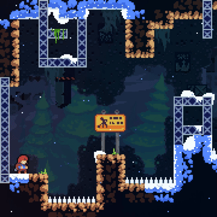

(2) _Camera shake_ dan partikel ketika karakter tewas


(3) Partikel pada environment level yang memberitahu arah rintangan arus angin

### Contoh: Sound Polishing

Di Portal 2 (2011), musik secara dinamis berubah sesuai aksi yang dilakukan
pemain untuk menyelesaikan level. Hal ini memberikan petunjuk bagi pemain bahwa
mereka mendekati solusi dari puzzle. Perhatikan juga berbagai efek audio yang hadir
pada tiap interaksi yang dilakukan oleh pemain seperti menembak portal, mengangkat
objek, dan menyalakan sensor laser.

<iframe width="560" height="315" src="https://www.youtube.com/embed/rZKz0PqpPVs?si=93UC1hY8-GJZ6XBv" title="YouTube video player" frameborder="0" allow="accelerometer; autoplay; clipboard-write; encrypted-media; gyroscope; picture-in-picture; web-share" referrerpolicy="strict-origin-when-cross-origin" allowfullscreen></iframe>

### Tambahan: Polishing Non-Game Feel

Ada juga yang sifat polishing yang tidak berhubungan dengan "Game Feel"
namun tetap berkontribusi memberikan pemain _experience_ yang lebih baik,
misal opsi untuk mengubah _keybind_ atau _control scheme_ permainan atau opsi
mengubah level audio sesuai tipenya serta mengaktifkan/menonaktifkan subtitel.

## Latihan 1: Menambahkan percepatan/perlambatan untuk pergerakan Player

Selama mengerjakan tutorial game development ini, game yang sudah dibuat cukup sederhana.
Mulai dari platformer 2D hingga first person 3D sederhana. Namun, ketika dimainkan,
game tersebut masih terasa "hambar".

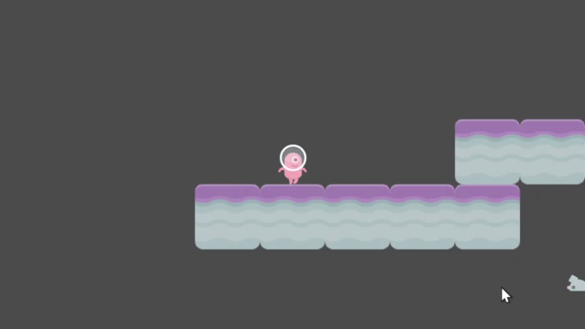

Di latihan ini, kita akan mencoba meningkatkan _Game Feel_ dengan cara menambahkan
percepatan dan perlambatan pergerakan untuk pergerakan karakter pemain.

### Memperbarui Player.gd

Pertama, buka script `Player.gd` yang telah disediakan di template (_atau gunakan level yang
sudah kamu buat di tutorial 6 sebelumnya_). Ubah variabel `speed` dari tipe `int` menjadi
`float`, dan tambahkan konstanta `ACCELERATION` dan `DECELERATION` dengan value seperti berikut:

```GDScript
...
const ACCELERATION = 400.0
const DECELERATION = 400.0

@export var speed: float = 400.0
...
```

Kemudian, ubah cara penetapan `velocity.x` di `get_input()` menjadi menggunakan fungsi `lerp()`

```GDScript
func get_input():
    if is_on_floor() and Input.is_action_just_pressed("jump"):
        velocity.y = jump_speed
    if Input.is_action_pressed("right"):
        sprite.flip_h = false
        velocity.x = lerp(velocity.x, speed, ACCELERATION / speed)  ## naik perlahan (kanan)
    elif Input.is_action_pressed("left"):
        sprite.flip_h = true
        velocity.x = lerp(velocity.x, -speed, ACCELERATION / speed)  ## naik perlahan (kiri)
    else:
        velocity.x = lerp(velocity.x, 0.0, DECELERATION / speed)  ## turun perlahan
```


> Untuk informasi lebih lanjut tentang interpolasi menggunakan fungsi `lerp()`, baca
> dokumentasi di [Interpolation — Godot Docs](https://docs.godotengine.org/en/stable/tutorials/math/interpolation.html)

Sekarang, kita coba mainkan in-game.

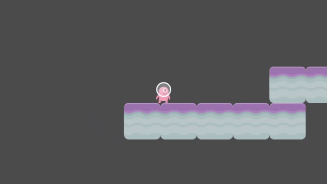

Apabila kamu belum melihat perbedaannya, tidak masalah. Kita masih perlu menambahkan
**_polishing_** untuk memberitahu pemain apakah karakter sedang berlari dalam kecepatan maksimum
atau tidak.

## Latihan 2: Menambahkan Partikel Lari

Setelah menambahkan mekanik tersebut, kita perlu mengkomunikasikan dengan pemain kapan karakter
sedang "berlari". Kita dapat melakukan ini dengan menggunakan **particles** yang hanya muncul
ketika `velocity` Player ekivalen dengan kecepatan maksimum `speed`.

### Apa itu Particles?

Particles merupakan teknik dalam game development untuk menampilkan atau mensimulasikan
efek _physics_ yang kompleks, seperti api, asap dari api tersebut, hujan, dan lain-lain.
Dengan menggunakan particles, game developer dapat memberikan tampilan visual yang lebih
detail dan lebih menarik kepada pemain.

Dalam game engine Godot, disediakan Node particle untuk game 2D yaitu `GPUParticles2D`.
Kita akan menggunakannya untuk mengimplementasikan _trail_ ketika karakter berlari di level.

### Konfigurasi Partikel Lari

Pertama, tambahkan node `GPUParticles2D` sebagai child node untuk root node di scene `Player`.
Akan ada _warning_ pada node tersebut karena kita perlu meng-assign properti `Process Material`
untuk setiap node `GPUParticles2D`. Buka tab Inspector dan _assign_ `ParticleProcessMaterial`
baru untuk properti `Process Material`.

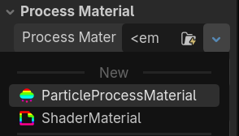

Sekarang kamu dapat melihat partikelmu bejalan, namun tampilannya belum sesuai dengan partikel
lari tujuan kita. _Assign_ properti `Texture` menggunakan gambar di `assets/kenney_platformerpack/PNG/Particles/brickGrey_small.png`.

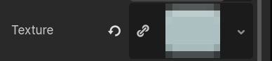

Kembali ke `Process Material`, buka kategori `Velocity` dan `Accelerations/Gravity`.
Supaya partikel muncul ke segala arah dan terbang ke atas (seperti partikel batu
tertendang oleh kaki), ubah `Gravity` nilai y menjadi `-100`.

Pada tab Spawn/Velocity terdapat atribut spread dan initial velocity.
Ubah `Spread` menjadi `180` derajat, dan `Initial Velocity` menjadi `50`.

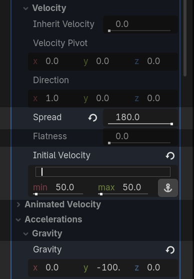

Selanjutya, supaya partikel tidak hanya muncul dari satu titik, buka kategori
`Spawn/Position` dan ubah `Emission Shape` menjadi `Box` diikuti dengan ubah nilai x
`Emission Shape Scale` menjadi `30`.

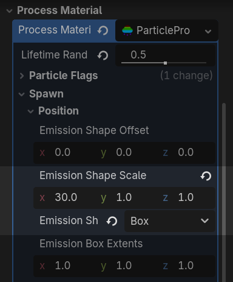

Untuk _finishing touches_, ubah `Time/Lifetime` menjadi `0.5` dan
nilai y dari `Transform/Position` menjadi `40` supaya sesuai letak kaki karakter.

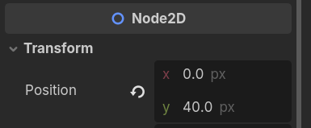

Sekarang coba jalankan gamenya.

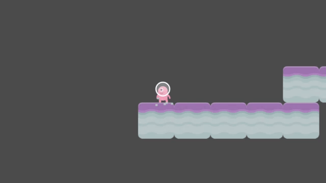

### Menghubungkan Partikel dengan pergerakan Player

Partikel sudah berjalan dan dikonfigurasi, namun kita ingin partikel hanya ada ketika
karakter sedang dalam keadaan berlari (velocity maksimal). Kita dapat mengatur kapan
partikel terpancar dengan mengganti nilai dari atribut `Emitting` node partikel.

Buka script `Player.gd` dan tambahkan baris berikut:

```GDScript
@onready var particle = $GPUParticles2D
```

Lalu, buat fungsi baru untuk memunculkan/menyembunyikan partikel ketika karakter
sedang lari atau tidak seperti berikut:

```GDScript
func set_particles():
    if abs(velocity.x) == speed and is_on_floor():
        particle.set_emitting(true)
    else:
        particle.set_emitting(false)
```

Terakhir, tambahkan pemanggilan fungsi `set_particles()` di dalam `_physics_process()`:

```GDScript
func _physics_process(delta):
    ...
    get_input()
    set_particles()
    ...
```

Done! Sekarang particle sudah terlihat seperti _trail_ lari karakter pemain!


> Untuk informasi lebih lanjut tentang node `GPUParticles2D`, Anda dapat baca
> dokumentasi di [GPUParticles2D — Godot Docs](https://docs.godotengine.org/en/stable/classes/class_gpuparticles2d.html)

## Game Balancing

### Pengantar: Apa itu Game Balancing?

Pada tutorial sebelumnya, kamu sudah mempelajari mengenai _basic 2D level_ design dan membuat
suatu level dengan rintangan. Namun, apakah kamu yakin level tersebut sudah pasti bisa
diselesaikan oleh pemain? Apakah pemain merasa level terlalu gampang atau kurang menantang?
Jika jawaban kamu belum sesuai dengan harapan dari game desainer, maka kamu perlu melakukan
Game Balancing pada level tersebut.

Berbeda dengan Game Polishing yang hanya mengubah tampilan dari fitur yang ada di game,
**Game Balancing** mengubah sistem yang ada di game. Hal ini bisa dilakukan dengan
memodifikasi Rules, Complexity, Player Progression, Variables, dan lain sebagainya.

Di bagian selanjutnya, kita akan melihat beberapa contoh mengenai game balancing:

### Contoh: Balancing untuk _Rage Game_

Dalam game Cat Mario, level sengaja dibuat sangat susah karena game Cat Mario didesain untuk
menjadi _Rage Game_. Namun dalam pembuatan levelnya, pasti tetap dilakukan balancing agar level
yang dibuat dapat diselesaikan oleh pemain dalam keadaan ***Rage*** bukan sampai ***Rage Quit***.


### Contoh: Perfect Imbalance

Dalam permainan League of Legends, balancing dilakukan setiap saat karena permainan MOBA memang
merupakan game multiplayer yang dirancang agar menjadi game yang [Perfect Imbalance](https://www.youtube.com/watch?v=e31OSVZF77w),
dimana balancing dilakukan agar permainan tetap menyenangkan bagi pemain dengan memberikan
perubahan meta di setiap patch _change_-nya.


<iframe width="560" height="315" src="https://www.youtube.com/embed/e31OSVZF77w?si=GvMLMMKMcag9H-ZP" title="
Perfect Imbalance - Why Unbalanced Design Creates Balanced Play - Extra Credits" frameborder="0" allow="accelerometer; autoplay; clipboard-write; encrypted-media; gyroscope; picture-in-picture; web-share" referrerpolicy="strict-origin-when-cross-origin" allowfullscreen></iframe>

## Latihan 3: Balancing Spawn Rate

### Balancing Spawn Rate

Sekarang, kita akan mencoba untuk melakukan balancing pada game yang sudah kita buat.
Di template sudah disediakan satu platform dengan rintangan berupa Enemy Spawner.

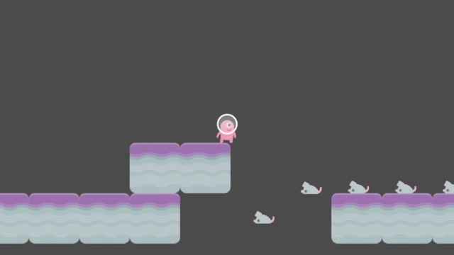

Terlihat bahwa kita sebagai pemain tidak dapat melewati level karena _spawn rate_
spawner terlalu agresif, sehingga pemain tidak dapat melompati tikus-tikus yang
ada untuk menuju akhir level.
Salah satu solusi adalah mengubah variabel `Spawn Rate` dari Spawner. Coba ubah
dari nilai sebelumnya menjadi `5` detik dan mainkan kembali.

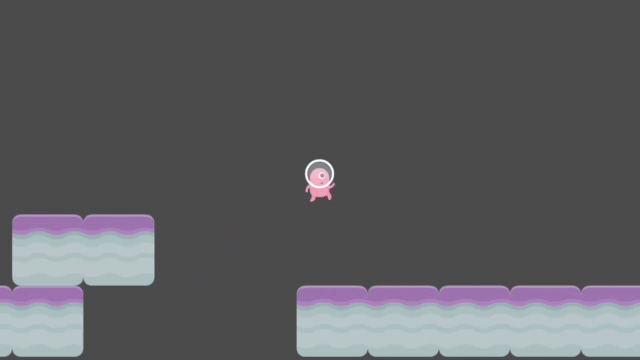

Hmmm... pemain sudah bisa melewati rintangan untuk mencapai akhir level.
Namun sepertinya hal itu dapat dilakukan dengan cukup mudah.
Ingat, kita harus dapat membuat pemain berada dalam [***FLOW***](https://www.gamasutra.com/view/feature/166972/cognitive_flow_the_psychology_of_.php)
agar pemain tidak merasa permainan terlalu mudah ataupun terlalu sulit.

Oleh karena itu, silahkan bereksperimen nilai `Spawn Rate` yang menurut kamu tepat untuk game ini.
Setelah kalian menemukan nilai `Spawn Rate` yang menurut kalian tepat, coba mainkan
kembali untuk memastikan bahwa level sudah _balanced_.

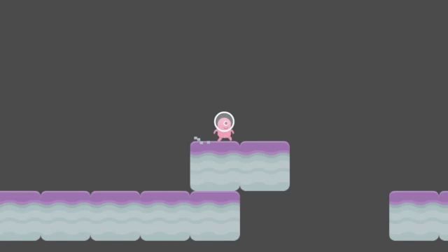

Selamat, tutorial ini sudah selesai! 🥳

## Skema Penilaian

Pada tutorial ini, ada empat kriteria nilai yang bisa diperoleh:

- **4** (_**A**_) apabila kamu mengerjakan tutorial dan latihan melebihi dari ekspektasi tim pengajar.
  Nilai ini dapat dicapai apabila mengerjakan seluruh Latihan.
- **3** (_**B**_) apabila kamu hanya mengerjakan tutorial dan latihan sesuai dengan instruksi.
  Nilai ini dapat dicapai apabila mengerjakan seluruh Latihan.
- **2** (_**C**_) atau **1** (_**D**_) apabila kamu hanya sekedar memulai tutorial dan belum tuntas.
- **0** (_**E**_) apabila kamu tidak mengerjakan apapun atau tidak mengumpulkan.

## Pengumpulan

Kumpulkan semua berkas pengerjaan tutorial dan latihan ke repositori GitHub.

Jangan lupa untuk menjelaskan proses pengerjaan tutorial ini di dalam berkas `README.md` yang
tersimpan di repositori GitHub. Cantumkan juga referensi-referensi yang digunakan sebagai acuan
ketika menjelaskan proses implementasi.

Kemudian, _push_ riwayat _commit_-nya ke repositori GitHub pengerjaan tutorial 8 dan kumpulkan
tautan (URL) repositori GitHub kamu di slot pengumpulan yang tersedia di SCELE.
Jika kamu menggunakan kembali repositori GitHub tutorial 6, maka pastikan pekerjaan tutorial ini
kamu taruh di dalam _branch_ baru.

Tenggat waktu pengumpulan adalah **Jum'at, 1 Mei 2025, pukul 21:00**.

## Referensi

- [2D particle systems](https://docs.godotengine.org/en/4.6/tutorials/2d/particle_systems_2d.html)
- [GPUParticles2D](https://docs.godotengine.org/en/4.6/classes/class_gpuparticles2d.html)
- [Kenney Assets](https://www.kenney.nl/assets/platformer-pack-redux)
- Materi tutorial pengenalan Godot Engine, kuliah Game Development semester
  gasal 2020/2021 Fakultas Ilmu Komputer Universitas Indonesia.
- Materi tutorial Getting to Release: Game Polishing/Game Feel, kuliah Game Development
  semester genap 2024/2025 Fakultas Ilmu Komputer Universitas Indonesia.
