# Tutorial 8 - Game Polishing & Balancing

Selamat datang pada tutorial kedelapan, terakhir di mata kuliah Game Development.

Pada tutorial kali ini, kamu akan mempelajari apa yang dimaksud dengan
***Game Feel***, **Game Polishing** dan ***Game Balancing***.
Penasaran? Yuk ikuti tutorialnya

***

> **NOTICE**
>
> Untuk tutorial kali ini, diperbolehkan menggunakan
> [kode templat proyek game yang telah disediakan di GitHub (klik)](https://github.com/CSUI-Game-Development/tutorial-8-template)
> **ATAU** melanjutkan dari yang sudah dikerjakan di tutorial 6 kemarin.
> Jika ingin melanjutkan tutorial 6 kemarin,
> silakan buat _branch_ baru di repositori Git tutorial 6 yang akan berisi hasil
> pengerjaan tutorial ini (misal: _branch_ `tutorial-8`).😄

## Daftar isi

- [Tutorial 8 - Game Polishing & Balancing](#tutorial-8---game-polishing--balancing)
  - [Daftar Isi](#daftar-isi)
  - [Game Polishing](#game-polishing)
    - [Pengantar: Game Feel dan Polishing](#pengantar-game-feel-dan-polishing)
    - [Contoh: Visual Polishing](#contoh-visual-polishing)
    - [Contoh: Sound Polishing](#contoh-sound-polishing)
    - [Latihan 1: Creating Particles](#latihan-creating-particles)
      - [Particles](#particles)
      - [Creating an Environment Particle](#creating-an-environment-particle)
      - [Creating a Trail Particle](#creating-a-trail-particle)
  - [Game Balancing](#game-balancing)
    - [Pengantar: Apa itu Game Balancing?](#pengantar-apa-itu-game-balancing)
    - [Contoh: Balancing untuk _Rage Game_](#contoh-balancing-untuk-rage-game)
    - [Contoh: Perfect Imbalance](#contoh-perfect-imbalance)
    - [Latihan 2: Game Balancing](#latihan-game-balancing)
      - [Balancing Spawn Rate](#balancing-spawn-rate)
  - [Skema Penilaian](#skema-penilaian)
  - [Pengumpulan](#pengumpulan)
  - [Referensi](#referensi)


## Game Polishing

### Pengantar: Game Feel dan Polishing

<!--Selama mengerjakan tutorial game development ini, game yang sudah dibuat cukup sederhana.
Mulai dari platformer 2D sederhana hingga first person (shooter?) 3D sederhana. Namun dalam
game yang sudah dibuat masih belum ada "pemanis" yang diberikan ke pemain agar game yang
dimainkan terlihat/terasa oleh pemain. Apa saja sih pemanisnya itu? Banyak hal yang dapat
dilakukan oleh game developer agar dapat membuat game lebih menarik bagi pemain, hal ini
dapat berupa visual ataupun audio. Dalam visual, game developer dapat membuat asset yang
menarik bagi pemain, menggunakan post-processing agar asset yang ada lebih terlihat bersih,
ataupun menambahkan detail-detail kecil berupa animasi ataupun particle yang dapat membuat
game terlihat lebih dinamik.-->

**Game Feel** adalah konsep abstrak yang menunjuk ke "sensasi" (feel) yang dialami oleh
pemain ketika memainkan game. Game feel yang baik memberikan pemain pengalaman yang menarik
(engaging) dan "rewarding". Idealnya, game menarik untuk dimainkan bahkan ketika dalam
bentuk yang paling sederhana.

**Game Polishing** adalah proses "meningkatkan" (enhancing) interaksi yang ada di dalam
game, misal lewat efek visual, efek suara, animasi, musik, partikel, dan lain sebagainya.
Polish adalah salah satu dari enam metrik Game Feel, sehingga proses Game Polishing akan
mengubah pengalaman pemain ketika memainkan game.

> We can think of polishing as giving more _feedback_ for _interactions_ in the game
> without changing the underlying system.

Di bagian selanjutnya, kita akan melihat beberapa contoh polishing yang diterapkan
di game-game populer:

### Contoh: Visual Polishing

<!-- FOCUS ON VISUALS POLISH -->

Di Celeste (2018), partikel, animasi, _camera shake_, dan efek visual lainnya
digunakan untuk menyampaikan interaksi yang dilakukan oleh pemain dengan game.
Contohnya: (1) Berbagai partikel dan animasi ketika karakter digerakkan, (2)
_camera shake_ dan partikel ketika karakter tewas, dan (3) partikel pada
environment level yang memberitahu arah rintangan arus angin.


### Contoh: Sound Polishing

<!-- FOCUS ON AUDIO POLISH -->

Di Portal 2 (2012), musik secara dinamis berubah sesuai aksi yang dilakukan
pemain untuk menyelesaikan level. Hal ini memberikan petunjuk bagi pemain bahwa
mereka mendekati solusi dari puzzle.


### Tambahan: Polishing Non-Game Feel

<!-- ini aku kurang yakin sihhh -->

Ada juga yang sifat polishing yang tidak berhubungan dengan "Game Feel"
namun tetap berkontribusi memberikan pemain _experience_ yang lebih baik,
misal opsi untuk mengubah _keybind_ atau _control scheme_ permainan atau opsi
mengubah level audio sesuai tipenya serta mengaktifkan/menonaktifkan subtitel.

## Latihan: Menambahkan percepatan/perlambatan untuk pergerakan Player

Selama mengerjakan tutorial game development ini, game yang sudah dibuat cukup sederhana.
Mulai dari platformer 2D sederhana hingga first person (shooter?) 3D sederhana. Namun, ketika
dimainkan, game tersebut masih terasa "hambar". Di tutorial ini, kita akan ...

## Latihan: Menambahkan Particles

Setelah menambahkan...

<!--
## Latihan: Creating Particles

### Particles

Particles merupakan teknik dalam game development untuk menampilkan atau mensimulasikan efek physics yang kompleks, seperti api, asap dari api tersebut, hujan, dan lain-lain. dengan menggunakan particle, game developer dapat memberikan tampilan visual yang lebih detail dan lebih menarik kepada pemain. Dalam game engine Godot, disediakan Node particle untuk game 2D yaitu ```GPUParticles2D```. Dengan menggunakan node ```GPUParticles2D``` kamu dapat membuat berbagai macam efek yang ingin kamu buat. Untuk melakukan itu kamu dapat bermain dengan properties yang ada pada node ```GPUParticles2D```, pada tutorial ini, kamu akan mencoba untuk membuat particle hujan pada level yang sudah disediakan, dan juga particle trail ketika player berjalan di level. Untuk penjelasan properties yang digunakan akan dijelaskan dengan sejalannya tutorial. Berikut adalah perbedaan hasil akhir yang diharapkan dengan level tanpa penggunaan particle:

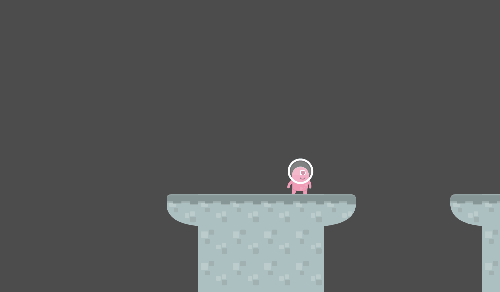

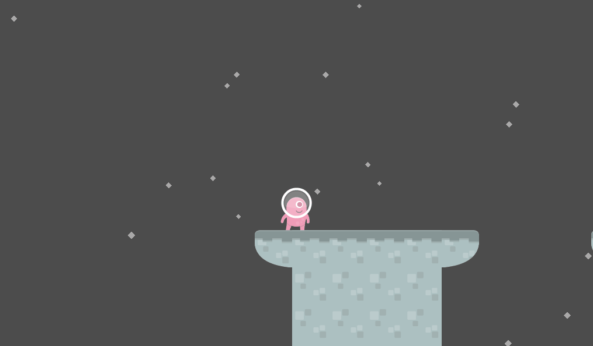

### Creating an Environment Particle

Pertama, buka template Level 1 yang telah disediakan (atau gunakan level yang sudah kamu buat di tutorial 6 sebelumnya), lalu tambahkan node GPUParticles2D kepada root Node yang ada.

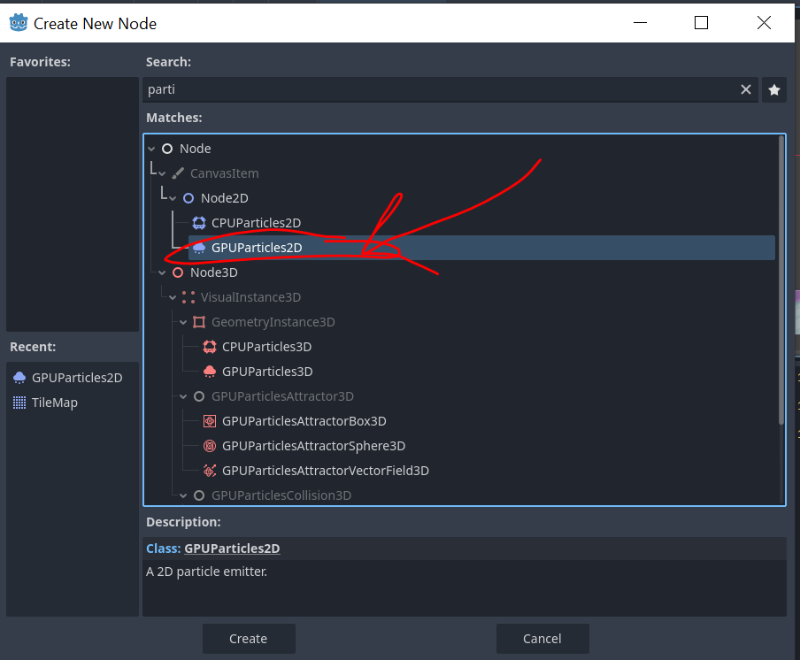

Ketika berhasil ditambahkan, node GPUParticles2D akan menampilkan warning, hal ini dikarenakan kamu perlu menambahkan ParticlesMaterial kepada Node GPUParticles2D agar dapat berjalan. Hal ini dapat ditemukan di tab inspector, ```Process Material```, lalu tambahkan ParticlesMaterial yang baru.

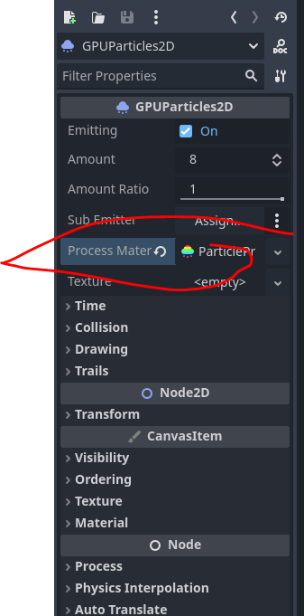

Sekarang kamu dapat melihat particlemu bejalan, namun hanya berupa titik-titik kecil yang berjatuhan, sekarang kita akan mengubah particle ini agar menjadi hujan yang kita inginkan. (Perlu cukup zoom in untuk lihat)

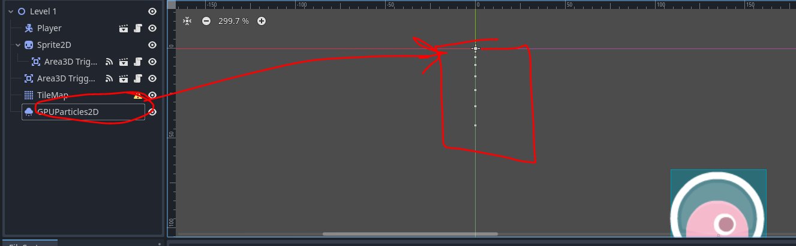

Karena kita ingin membuat hujan, kita ingin agar titik-titik particle yang kita punya berjumlah banyak, dan bertahan lama di layar. Untuk melakukan itu pada tab inspector, ubah ```Amount``` menjadi 100, ```Lifetime``` menjadi 4.
Pada Godot 4.3, lifetime mempengaruhi jumlah emisi per detiknya dengan rumus $(amount * amount_scale) / lifetime$. Something to know saja.

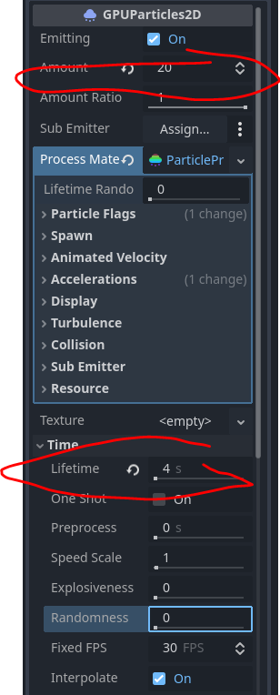

- Properti ```Amount``` melambangkan banyaknya titik particle yang ingin kita punya.
- Properti ```Lifetime``` melambangkan lamanya suatu titik particle akan hidup di dunia game kita.

Selanjutnya, kita ingin agar titik particle kita dapat terlihat dari kamera, sehingga kita perlu untuk mengubah ukuran dari particle kita. Klik ```ParticlesMaterial``` yang sudah kita tambahkan sebelumnya, lalu pada tab ```Display/Scale``` ubah ```Scale max``` menjadi 10. Dikarenakan perbedaan antara ```scale min``` dan ```scale max```, maka ukurannya akan secara random dipilih dalam rentang tersebut saat intansiasi masing-masing partikel.

- Properti ```Scale``` melambangkan ukuran dari suatu titik particle.

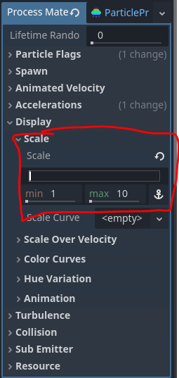

Selanjutnya, agar particle yang kita miliki tidak hanyak muncul dari suatu titik saja, kita akan mengubah area awal particle dari titik menjadi persegi panjang yang sangat panjang agar dapat menutupi seluruh level. Pada tab ```Spawn/Position```, ubah ```Emision Shape``` menjadi box, dan ubah ```Emision Box Extents``` value x menjadi 2000. Dari sini particle sudah mulai terlihat seperti hujan.

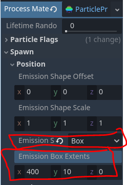

Selanjutnya, agar particle yang kita punya terlihat seperti hujan, kita dapat mengubah warnanya. Pada tab ```Display/Color Curves```, ubah ```Color``` menjadi warna biru (#84a6b6). Jika kalian ingin mencoba mengubah atribut lain, sangat dipersilahkan untuk membuat particle yang lebih bagus dan dinamis.

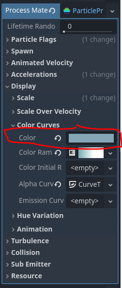

Selanjutnya, kita ingin agar hujan kita memiliki kecepatan yang lebih cepat agar menghasilkan ilusi hujan yang lebat. Untuk melakukan ini, pada tab ```Velocity```, ubah ```Spread``` menjadi 20 agar persebaran particle tidak terlalu jauh. Lalu pada tab ```Accelerations/Gravity``` ubah gravity x menjadi -500 dan gravity y menjadi 500 agar particle kita terpengaruh gravitasi ke arah kiri bawah.

- Properti ```Spread``` melambangkan derajat persebaran particle. 180 derajat menandakan particle akan keluar ke segala arah.
- Properti ```Gravity``` melambangkan besarang gravitasi yang diterima oleh titik particle kita.

Sepertinya particle yang sudah kita buat sudah mirip dengan hujan, coba kita liat dalam in-game.


Loh? kok ketika kita gerak particlenya hilang? Itu karena particle hanya akan ditampilkan jika drawing areanya berada di camera. Oleh karena itu kita harus mengubah drawing area particle kita dan juga posisinya. Pada tab ```Drawing``` ubah ```Visibilty Rect``` menjadi $w=2000$ dan $h=500$ untuk mengubah ukuran drawing area particle dan titik tengahnya.
Ingatlah kalau lokasi ```Drawing area``` ini lah yang menentukan apakah particle kalian di-render atau tidak, sehingga pastikan ```position``` dari drawing area masuk ke dalam kamera dalam game.

- Properti ```Visibility Rect``` melambangkan ukuran drawing area (visibility area) dari particle kita.

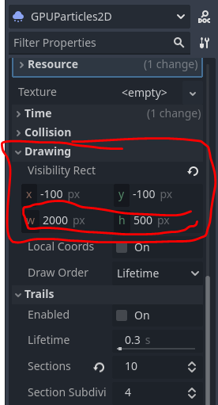
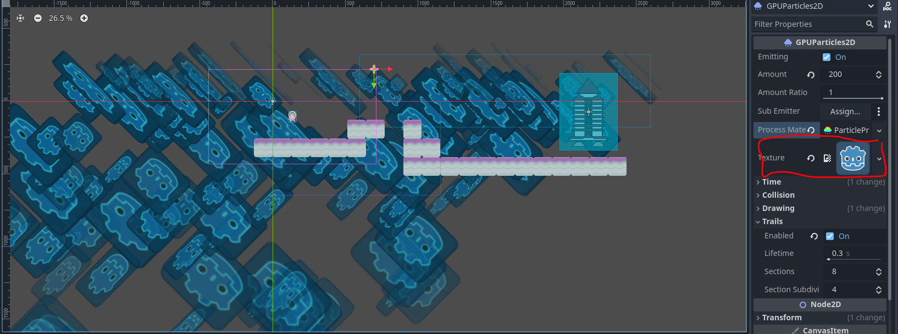

Sekarang, tinggal beberapa detail lagi yang akan kita buat. Yaitu memberikan trail pada particle particle agar tidak terlihat seperti kotak. Pada tab ```Trail``` ubah ```Enabled``` menjadi $True$, untuk memberikan ekor pada partikel.

- Properti ```Trail``` melambangkan ada tidaknya ekor dari partikel yang digenerasi.

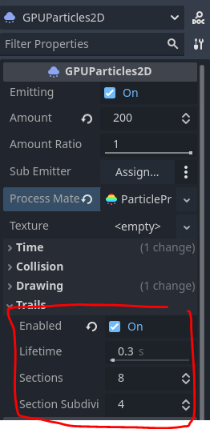

Done! Sekarang particle sudah terlihat seperti hujan!

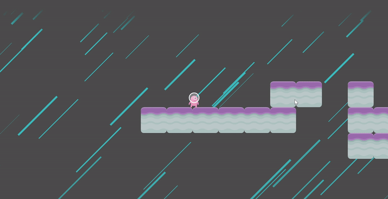

Btw, kalian bisa mengganti tekstur dari partikel layaknya sebuah ```Sprite2D```. Dengan konfigurasi sebelumnya, jika meng-assign ```texture```denan icon.svg, kita akan mendapatkan tampilan seperti berikut.


Dalam implementasi aslinya, kalian bisa mengganti tekstur dengan snowflake sebagai contoh agar terlihat seperti sedang turun salju.


### Creating a Trail Particle Jalan

Sekarang kita akan membuat particle trail saat player berjalan. Pertama buka scene ```player.tscn```. Lalu tambahkan kembali Node GPUParticles2D. Dan tambahkan kembali ```ParticlesMaterial```. Berbeda dengan particle environment sebelumnya, untuk particle ini kita akan menggunakan aset yang disediakan. Pada tab ```Texture```, ubah ```Texture``` menjadi menggunakan asset ```Asserts/kenney_platformerpack/PNG/Particles/brickGrey_small.png```.
- Properti ```Texture``` melambangkan texture yang ingin kita pakai untuk particle kita, jika tidak ada akan menggunakan kotak (seperti pada particle environment hujan)

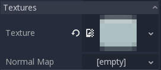

Selanjutnya, berbeda dengan sebelumnya, sekarang kita tidak ingin jumlah particle yang cukup banyak karena akan memenuhi trail kita, dan lifetime dari particle tidak perlu lama karena trail tidak akan lama berada di layar, oleh karena itu pada tab ```GPUParticles2D```, ubah ```Amount``` menjadi 4 dan ```Lifetime``` menjadi 0.5.

Selanjutnya, agar particle muncul ke segala arah dan terbang ke atas, ubah ```Gravity``` nilai y menjadi -200, Pada tab ```Spawn/Velocity``` terdapat atribut spread dan initial velocity. Ubah ```Spread``` menjadi 180 derajat, dan ```Initial Velocity``` menjadi 50.

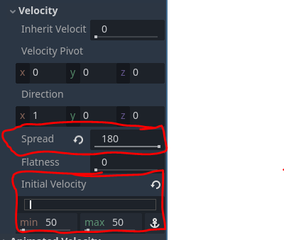

Selanjutya, agar particle tidak hanya muncul dari satu titik, ubah ```Spawn/Position/Emission Shape``` menjadi box dengan nilai ```x``` 30. Lalu pindahkan pula node GPUParticles2D ke bagian kaki player, pada tab ```Transform``` ubah nilai y menjadi 30.

Selanjutnya, agar particle tidak terus mengikuti player, ubah ```Local Coord``` menjadi ```off```.

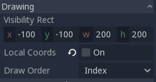

Sekarang, karena sepertinya sudah terlihat bagus, kita coba mainkan di in-game.


Sepertinya sudah terlihat cukup bagus, sekarang masalahnya particle selalu berjalan, sedangkan kita hanya ingin particle berjalan ketika player berada di lantai dan sedang berjalan. Untuk melakukan itu kita dapat menggunakan script untuk mengatur kapan particle berjalan dengan mengganti atribut ```Emitting```, dimana atribut ini melambangkan keadaan particle berjalan atau tidak (mengeluarkan particle atau tidak). Untuk itu kita perlu mengubah script ```Player.gd```. Tambahkan baris ini di bagian deklarasi variable:

```gdscript
@onready var particle = $GPUParticles2D
```

Lalu ubah fungsi ```get_input``` menjadi:

```gdscript
func get_input():
	velocity.x = 0
	if is_on_floor() and Input.is_action_just_pressed('jump'):
		velocity.y = jump_speed
	if Input.is_action_pressed('right'):
		velocity.x += speed
		if is_on_floor():
			particle.set_emitting(true)
	elif Input.is_action_pressed('left'):
		velocity.x -= speed
		if is_on_floor():
			particle.set_emitting(true)
	else:
		particle.set_emitting(false)

```


Done! Sekarang particle sudah terlihat seperti trail jalan player!-->

## Game Balancing

### Pengantar: Apa itu Game Balancing?

<!--Pada tutorial-4 kemarin, kamu sudah mempelajari mengenai basic 2D level design, dan mencoba untuk mendesain suatu level. Namun, apakah kamu yakin level yang kamu buat sudah pasti bisa diselesaikan oleh pemain? apakah kamu yakin level yang kamu buat tidak membuat pemain kesal dan akhirnya berhenti memainkan game kamu? Jika tidak, maka kamu perlu untuk memainkan kembali level yang kamu buat dan lakukan *Game Balancing* pada level tersebut. Banyak hal yang dapat dilakukan untuk melakukan _balancing_ pada suatu level, mulai dari mengubah nilai-nilai yang digunakan dalam script yang digunakan, hingga mengubah level design yang sudah dibuat agar level lebih _balanced_.-->

Pada tutorial sebelumnya, kamu sudah mempelajari mengenai _basic 2D level_ design dan membuat
suatu level dengan rintangan. Namun, apakah kamu yakin level tersebut sudah pasti bisa
diselesaikan oleh pemain? Apakah pemain merasa level terlalu gampang atau kurang menantang?
Jika jawaban kamu belum sesuai dengan harapan dari game desainer, maka kamu perlu melakukan
Game Balancing pada level tersebut.

Berbeda dengan Game Polishing yang hanya mengubah tampilan dari fitur yang ada di game,
**Game Balancing** mengubah sistem yang ada di game. Hal ini bisa dilakukan dengan
memodifikasi Rules, Complexity, Player Progression, Variables, dan lain sebagainya.

Di bagian selanjutnya, kita akan melihat beberapa contoh mengenai game balancing:

### Contoh: Balancing untuk _Rage Game_

Dalam game Cat Mario, level sengaja dibuat sangat susah karena game Cat Mario didesin untuk menjadi _Rage Game_. Namun dalam pembuatan levelnya, pasti tetap dilakukan balancing agar level yang dibuat dapat diselesaikan oleh pemain dalam keadaan ***Rage*** bukan sampai ***Rage Quit***.

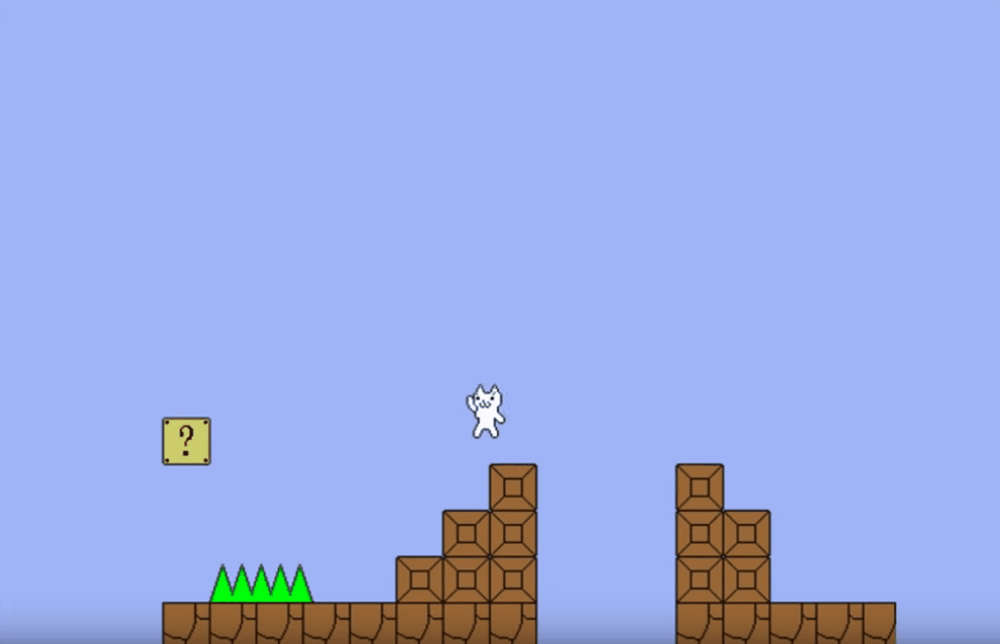

### Contoh: Perfect Imbalance

Dalam permainan League of Legends, balancing dilakukan setiap saat karena permainan MOBA memang merupakan game multiplayer yang dirancang agar menjadi game yang [Perfect Imbalance](https://www.youtube.com/watch?v=e31OSVZF77w), dimana balancing dilakukan agar permainan tetap menyenangkan bagi pemain dengan memberikan perubahan meta di setiap patch change-nya.

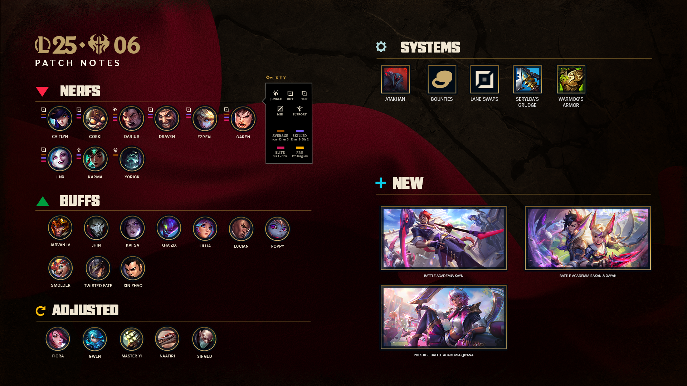

<iframe width="560" height="315" src="https://www.youtube.com/embed/e31OSVZF77w?si=GvMLMMKMcag9H-ZP" title="
Perfect Imbalance - Why Unbalanced Design Creates Balanced Play - Extra Credits" frameborder="0" allow="accelerometer; autoplay; clipboard-write; encrypted-media; gyroscope; picture-in-picture; web-share" referrerpolicy="strict-origin-when-cross-origin" allowfullscreen></iframe>

### Latihan: Game Balancing

#### Balancing Spawn Rate

Sekarang kita akan mencoba untuk melakukan balancing pada game yang sudah kita buat. Untuk itu sudah disediakan template scene ```Spawner.tscn```, masukkan scene tersebut ke Level 1, di akhir platform tengah (posisi transform x 1700 y 280). Lalu coba mainkan gamenya.

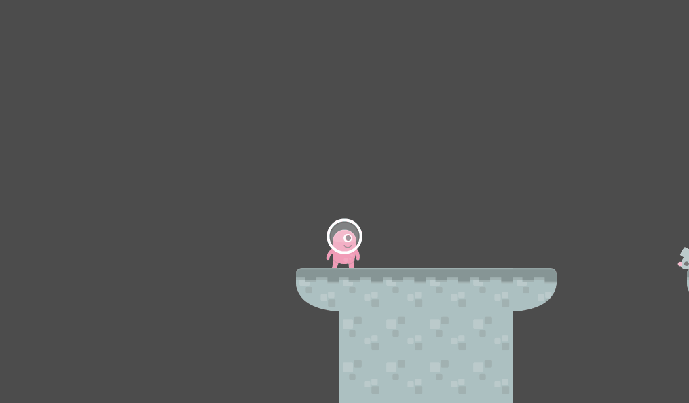

Dapat dilihat bahwa kita sebagai pemain tidak dapat menyelesaikan permainan dikarenakan spawner terlalu banyak memunculkan musuh, sehingga pemain tidak dapat melompati tikus-tikus yang ada untuk menuju akhir level. Oleh karena itu perlu dilakukan game balancing terhadap game ini. Coba kamu mainkan lagi dan coba pikirkan apa yang kira kira membuat pemain tidak bisa melompati tikus-tikus yang ada. Setelah memainkan beberapa kali, semoga kamu menyadari bahwa karena terlalu banyak tikus dan **Spawn Rate** antar tikus terlalu kecil, membuat tidak ada celah yang dapat dimanfaatkan pemain untuk melewati rintangan tersebut. Dan jika kamu sudah melihat tab inspector pada Spawner, sudah disedikan variable ```Spawn Rate``` yang dapat diubah, coba ubah menjadi 2 detik dan coba mainkan kembali.


Hmm pemain sudah bisa melewati rintangan untuk mencapai akhir level. Namun sepertinya pemain dapat melakukan hal itu dengan cukup mudah. Ingat, kita harus dapat membuat pemain berada dalam [***FLOW***](https://www.gamasutra.com/view/feature/166972/cognitive_flow_the_psychology_of_.php) agar pemain tidak merasa permainan terlalu mudah ataupun terlalu sulit. Oleh karena itu, silahkan cari nilai yang menurut kamu tepat sebagai ```Spawn Rate```. Dalam tutorial ini, akan menggunakan nilai 1 sebagai ```Spawn Rate``` yang digunakan. Setelah kalian mencoba dan menemukan nilai ```Spawn Rate``` yang tepat menurut kalian, coba mainkan kembali untuk memastikan bahwa level sudah balanced.


Selamat, tutorial ini sudah selesai!

<!-- ## Latihan Mandiri: Rencana Polishing & Balancing Pada Game Proyek Kelompok

Pada tutorial kali ini, tidak ada latihan mandiri spesifik untuk berlatih mengenai _polishing_ dan _balancing_.
Namun sebagai gantinya, kamu diminta untuk merefleksikan kegiatan _playtesting_ terbuka yang diadakan di area kantin gedung baru Fasilkom UI pekan lalu.

Silakan ingat kembali pengalaman kamu pada kegiatan _playtesting_ pekan lalu dan evaluasi hasil _playtesting_ yang telah kamu kumpulkan bersama tim.
Kemudian harap jawab pertanyaan-pertanyaan berikut:

1. Apa saja hal-hal positif yang kamu identifikasi dari pengalaman para pemain ketika mencoba game kelompok?
2. Apa saja hal-hal negatif (atau, _pain points_) yang kamu identifikasi dari pengalaman para pemain ketika mencoba game kelompok?
3. Dari _feedback_-_feedback_ yang telah diperoleh, apakah ada isu yang terkait pencapaian kondisi _flow_ oleh pemain?
    - Misalnya, apakah ada tantangan di dalam game yang masih kurang tepat dengan kemampuan pemain pada level tertentu?
    - Atau, apakah ada rancangan level di dalam game yang dirasa terlalu membosankan bagi pemain?
4. Dari jawaban kamu terhadap pertanyaan 1 hingga 3, tuliskan secara singkat, dalam bentuk _bullet points_, apa saja hal yang ingin kamu _polish_ dan _balance_?
5. Untuk masing-masing poin di jawaban pertanyaan 4, jabarkan secara singkat (1 - 3 kalimat) mengenai rencana kerja kamu untuk mengimplementasikan usulan tersebut. -->

## Skema Penilaian

Pada tutorial ini, ada empat kriteria nilai yang bisa diperoleh:

- **4** (_**A**_) apabila kamu mengerjakan tutorial dan latihan melebihi dari ekspektasi tim pengajar.
  Nilai ini dapat dicapai apabila mengerjakan seluruh Latihan.
  <!-- dan menjawab seluruh pertanyaan pada Latihan Mandiri -->
- **3** (_**B**_) apabila kamu hanya mengerjakan tutorial dan latihan sesuai dengan instruksi.
  Nilai ini dapat dicapai apabila mengerjakan seluruh Latihan.
   <!-- dan menjawab pertanyaan 1 - 3 pada Latihan Mandiri. -->
- **2** (_**C**_) atau **1** (_**D**_) apabila kamu hanya sekedar memulai tutorial dan belum tuntas.
<!-- - **2** (_**C**_) apabila kamu hanya mengerjakan tutorial hingga tuntas.
  Nilai ini dapat dicapai apabila mengerjakan seluruh Latihan namun tidak mengerjakan Latihan Mandiri.
- **1** (_**D**_) apabila kamu hanya sekedar memulai tutorial dan belum tuntas.
  Nilai ini dapat dicapai apabila belum tuntas mengerjakan Latihan. -->
- **0** (_**E**_) apabila kamu tidak mengerjakan apapun atau tidak mengumpulkan.

## Pengumpulan

Kumpulkan semua berkas pengerjaan tutorial dan latihan ke repositori Git.
Jangan lupa untuk menjelaskan proses pengerjaan tutorial ini di dalam berkas `README.md` yang tersimpan di repositori Git.
Cantumkan juga referensi-referensi yang digunakan sebagai acuan ketika menjelaskan proses implementasi.
Kemudian, _push_ riwayat _commit_-nya ke repositori Git pengerjaan tutorial 8 dan kumpulkan tautan (URL) repositori Git kamu di slot pengumpulan yang tersedia di SCELE.
Jika kamu menggunakan kembali repositori Git tutorial 6, maka pastikan pekerjaan tutorial ini kamu taruh di dalam _branch_ baru!

Tenggat waktu pengumpulan adalah **Rabu, 16 Mei 2025, pukul 21:00**.

## Referensi

- [Particle System 2D](https://docs.godotengine.org/en/3.1/tutorials/2d/particle_systems_2d.html)
- [GPUParticles2D](https://docs.godotengine.org/en/3.1/classes/class_particles2d.html)
- [Kenney Assets](https://www.kenney.nl/assets/platformer-pack-redux)
- Materi tutorial pengenalan Godot Engine, kuliah Game Development semester
  gasal 2020/2021 Fakultas Ilmu Komputer Universitas Indonesia.
