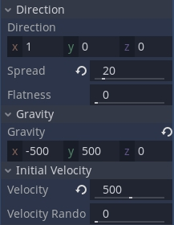
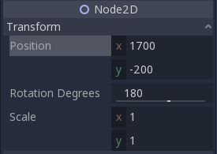
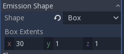

# Tutorial 8 - Game Polishing & Balancing

Selamat datang pada tutorial kelima kuliah Game Development. Pada tutorial kali ini, kamu akan mempelajari cara apa yang dimaksud dengan ***Game Polishing*** dan juga ***Game Balancing***. Dalam ***Game Polishing*** kamu akan belajar mengenai ***Particles***. Sedangkan dalam ***Game Balancing*** kamu akan mencoba untuk melakukan *balancing* sederhana.

## Daftar isi

- [Tutorial 8 - Game Polishing & Balancing](#tutorial-8---game-polishing--balancing)
  - [Daftar Isi](#daftar-isi)
  - [Pengantar](#pengantar)
    - [Game Polishing](#game-polishing)
    - [Game Balancing](#game-balancing)
  - [Latihan: Creating Particles](#latihan-creating-particles)
    - [Particles](#particles)
    - [Creating an Environment Particle](#creating-an-environment-particle)
    - [Creating a Trail Particle](#creating-a-trail-particle)
  - [Latihan: Game Balancing](#latihan-game-balancing)
    - [Balancing Spawn Rate](#balancing-spawn-rate)
  - [Latihan Mandiri: Rencana Polishing & Balancing Pada Game Proyek Kelompok](#latihan-mandiri-rencana-polishing--balancing-pada-game-proyek-kelompok)
  - [Skema Penilaian](#skema-penilaian)
  - [Pengumpulan](#pengumpulan)
  - [Referensi](#referensi)


## Pengantar

> IMPORTANT: Untuk tutorial kali ini, diperbolehkan menggunakan kode templat proyek game yang telah disediakan
> **ATAU** melanjutkan dari yang sudah dikerjakan di tutorial 6 kemarin. Jika ingin melanjutkan tutorial 6 kemarin,
> silakan buat _branch_ baru di repositori Git tutorial 6 yang akan berisi hasil pengerjaan tutorial ini.

### Game Polishing

Selama mengerjakan tutorial game development ini, game yang sudah dibuat cukup sederhana. Mulai dari platformer 2D sederhana hingga first person (shooter?) 3D sederhana. Namun dalam game yang sudah dibuat masih belum ada "pemanis" yang diberikan ke pemain agar game yang dimainkan terlihat / terasa oleh pemain. Apa saja sih pemanisnya itu? Banyak hal yang dapat dilakukan oleh game developer agar dapat membuat game lebih menarik bagi pemain, hal ini dapat berupa visual ataupun audio. Dalam visual, game developer dapat membuat asset yang menarik bagi pemain, menggunakan post-processing agar asset yang ada lebih terlihat bersih, ataupun menambahkan detail-detail kecil berupa animasi ataupun particle yang dapat membuat game terlihat lebih dinamik.

Berikut adalah beberapa contoh polishing yang ada dalam game-game populer:

Dalam game Hollow Knight, particle banyak digunakan untuk membuat animasi yang ada semakin menarik. Seperti contohnya particle saat menyerang, particle saat menghancurkan pintu ataupun membunuh musuh, hingga particle pada environment level.


Dalam game GTA V, polishing yang dapat dilihat pada scene _wasted_ adalah effect slow-motion yang ada, perubahan color balancing untuk memberikan efek kalah/mati, hingga penggunaan sound fx yang sangat khas.


### Game Balancing

Pada tutorial-4 kemarin, kamu sudah mempelajari mengenai basic 2D level design, dan mencoba untuk mendesain suatu level. Namun, apakah kamu yakin level yang kamu buat sudah pasti bisa diselesaikan oleh pemain? apakah kamu yakin level yang kamu buat tidak membuat pemain kesal dan akhirnya berhenti memainkan game kamu? Jika tidak, maka kamu perlu untuk memainkan kembali level yang kamu buat dan lakukan *Game Balancing* pada level tersebut. Banyak hal yang dapat dilakukan untuk melakukan _balancing_ pada suatu level, mulai dari mengubah nilai-nilai yang digunakan dalam script yang digunakan, hingga mengubah level design yang sudah dibuat agar level lebih _balanced_.

Berikut adalah beberapa contoh mengenai game balancing:

Dalam game Cat Mario, level sengaja dibuat sangat susah karena game Cat Mario didesin untuk menjadi _Rage Game_. Namun dalam pembuatan levelnya, pasti tetap dilakukan balancing agar level yang dibuat dapat diselesaikan oleh pemain dalam keadaan ***Rage*** bukan sampai ***Rage Quit***.


Dalam permainan League of Legends, balancing dilakukan setiap saat karena permainan MOBA memang merupakan game multiplayer yang dirancang agar menjadi game yang [Perfect Imbalance](https://www.youtube.com/watch?v=e31OSVZF77w), dimana balancing dilakukan agar permainan tetap menyenangkan bagi pemain dengan memberikan perubahan meta di setiap patch change-nya.


## Latihan: Creating Particles

### Particles

Particles merupakan teknik dalam game development untuk menampilkan atau mensimulasikan efek physics yang kompleks, seperti api, asap dari api tersebut, hujan, dan lain-lain. dengan menggunakan particle, game developer dapat memberikan tampilan visual yang lebih detail dan lebih menarik kepada pemain. Dalam game engine Godot, disediakan Node particle untuk game 2D yaitu ```Particles2D```. Dengan menggunakan node ```Particles2D``` kamu dapat membuat berbagai macam efek yang ingin kamu buat. Untuk melakukan itu kamu dapat bermain dengan properties yang ada pada node ```Particles2D```, pada tutorial ini, kamu akan mencoba untuk membuat particle hujan abu pada level yang sudah disediakan, dan juga particle trail ketika player berjalan di level. Untuk penjelasan properties yang digunakan akan dijelaskan dengan sejalannya tutorial. Berikut adalah perbedaan hasil akhir yang diharapkan dengan level tanpa penggunaan particle:


### Creating an Environment Particle

Pertama, buka template Level 1 yang telah disediakan (atau gunakan level yang sudah kamu buat di tutorial 6 sebelumnya), lalu tambahkan node Particles2D kepada root Node yang ada.


Ketika berhasil ditambahkan, node Particles2D akan menampilkan warning, hal ini dikarenakan kamu perlu menambahkan ParticlesMaterial kepada Node Particles2D agar dapat berjalan. Hal ini dapat ditemukan di tab inspector, ```Process Material```, lalu tambahkan ParticlesMaterial yang baru.


Sekarang kamu dapat melihat particlemu bejalan, namun hanya berupa titik-titik kecil yang berjatuhan, sekarang kita akan mengubah particle ini agar menjadi hujan abu yang kita inginkan. Karena kita ingin membuat hujan abu, kita ingin agar titik-titik particle yang kita punya berjumlah banyak, dan bertahan lama di layar. Untuk melakukan itu pada tab inspector, ubah ```Amount``` menjadi 500, ```Lifetime``` menjadi 4, dan ```Speed Scale``` menjadi 0.5.

- Properti ```Amount``` melambangkan banyaknya titik particle yang ingin kita punya.
- Properti ```Lifetime``` melambangkan lamanya suatu titik particle akan hidup di dunia game kita.
- Properti ```Speed Scale``` melambangkan kecepatan jalannya waktu untuk particle kita.


Selanjutnya, kita ingin agar titik particle kita dapat terlihat dari kamera, sehingga kita perlu untuk mengubah ukuran dari particle kita. Klik ```ParticlesMaterial``` yang sudah kita tambahkan sebelumnya, lalu pada tab ```Scale``` ubah ```Scale``` menjadi 10 dan agar kita mendapat variasi ukuran, ubah ```Scale Random``` menjadi 0.5.

- Properti ```Scale``` melambangkan ukuran dari suatu titik particle.
- Properti ```Scale Random``` melabangkan range random dari titik particle yang akan dibuat. 0 menandakan tidak ada random scale, 1 menandakan banyak random scale.


Selanjutnya, agar particle yang kita miliki tidak hanyak muncul dari suatu titik saja, kita akan mengubah area awal particle dari titik menjadi persegi panjang yang sangat panjang agar dapat menutupi seluruh level. Pada tab ```Emission Shape```, ubah ```Shape``` menjadi box, dan ubah ```Box Extents``` value x menjadi 2000. Dari sini particle sudah mulai terlihat seperti hujan.


Selanjutnya, agar particle yang kita punya terlihat seperti hujan abu, kita dapat mengubah warnanya. Pada tab ```Color```, ubah warna menjadi warna abu (#A9A9A9).


Selanjutnya, kita ingin agar hujan abu kita memiliki kecepatan yang lebih cepat agar menghasilkan ilusi hujan abu yang lebat. Untuk melakukan ini, pada tab ```Direction```, ubah ```Spread``` menjadi 20 agar persebaran particle tidak terlalu jauh. Lalu pada tab ```Gravity``` ubah gravity x menjadi -500 dan gravity y menjadi 500 agar particle kita terpengaruh gravitasi ke arah kiri bawah. Lalu, pada tab ```Initial Velocity```, ubah ```Velocity``` menjadi 500 agar particle kita sudah cepat dari awal mulai animasi particle.

- Properti ```Spread``` melambangkan derajat persebaran particle. 180 derajat menandakan particle akan keluar ke segala arah.
- Properti ```Gravity``` melambangkan besarang gravitasi yang diterima oleh titik particle kita.
- Properti ```Velocity``` melambangkan kecepatan awal titik particle ketika muncul di game.



Hmmm, kenapa particle yang sekarang ada pada awalnya muncul ke arah kanan terlebih dahulu? Itu karena dengan kita mengubah nilai ```Velocity``` menjadi lebih dari 0, particle yang kita punya akan dikenakan kecepatan sesuai dengan nilai ```Velocity``` ke arah kanan saja. Oleh karena itu kita harus merotasi particle kita agar arah particle ke arah kiri. Pada tab ```Transform``` pada Node2D, ubah rotation degrees menjadi 180. Lalu, pada tab ```Drawing```, ubah ```Local Coord``` menjadi off.

- Properti ```Transform``` merupakan posisi dari Node2D.
- Properti ```Local Coords``` melambangkan sifat dari particle, dimana jika ```on``` particle akan begerak sesuai dengan pergerakan node, sedangkan jika ```off``` particle yang sudah dinyalakan akan tetap berjalan sesuai physics yang ada dengan menghiraukan posisi node.


Sepertinya particle yang sudah kita buat sudah mirip dengan hujan abu, coba kita liat dalam in-game.


Loh? kok ketika kita gerak particlenya hilang? Itu karena particle hanya akan ditampilkan jika drawing areanya berada di camera. Oleh karena itu kita harus mengubah drawing area particle kita dan juga posisinya. Pada tab ```Drawing``` ubah ```Visibilty Rect``` menjadi (-2000, -1000, 4000, 1000) untuk mengubah ukuran drawing area particle dan titik tengahnya. Lalu pada tab ```Transform``` ubah posisi x menjadi 1700 dan posisi y menjadi -200 agar particle berada di tengah level.

- Properti ```Visibility Rect``` melambangkan ukuran drawing area (visibility area) dari particle kita.




Sekarang, tinggal beberapa detail lagi yang akan kita buat. Yaitu merotasi titik particle agar tidak terlihat seperti kotak, dan membuat particle tidak menutupi sprite level ktia. Pada tab ```Angle``` ubah ```Angle``` menjadi 45, untuk merotasi kotak particle sebanyak 45 derajat. Lalu pada tab ```Canvas Item```, ```Visibility``` ubah ```Show behind parent``` menjadi ```on``` agar particle kita berada di belakang sprite parent.

- Properti ```Angle``` melambangkan rotasi dari titik particle kita.
- Properti ```Show behind parent``` merupakan properti dari CanvasItem untuk membuat sprite berada di belakang sprite parent.


Done! Sekarang particle sudah terlihat seperti hujan abu!


### Creating a Trail Particle

Sekarang kita akan membuat particle trail saat player berjalan. Pertama buka scene ```player.tscn```. Lalu tambahkan kembali Node Particles2D. Dan tambahkan kembali ```ParticlesMaterial```. Berbeda dengan particle environment sebelumnya, untuk particle ini kita akan menggunakan aset yang disediakan. Pada tab ```Texture```, ubah ```Texture``` menjadi menggunakan asset ```Asserts/kenney_platformerpack/PNG/Particles/brickGrey_small.png```.
- Properti ```Texture``` melambangkan texture yang ingin kita pakai untuk particle kita, jika tidak ada akan menggunakan kotak (seperti pada particle environment hujan abu)


Selanjutnya, berbeda dengan sebelumnya, sekarang kita tidak ingin jumlah particle yang cukup banyak karena akan memenuhi trail kita, dan lifetime dari particle tidak perlu lama karena trail tidak akan lama berada di layar, oleh karena itu pada tab ```Particles2D```, ubah ```Amount``` menjadi 4 dan ```Lifetime``` menjadi 0.5.


Selanjutnya, agar particle muncul ke segala arah dan terbang ke atas, ubah ```Gravity``` nilai y menjadi -200, ```Spread``` menjadi 180 derajat, dan ```Initial Velocity``` menjadi 50.


Selanjutya, agar particle tidak hanya muncul dari satu titik, ubah ```Emission Shape``` menjadi box dengan nilai x 30. Lalu pindahkan pula node Particles2D ke bagian kaki player, pada tab ```Transform``` ubah nilai y menjadi 30.




Selanjutnya, agar particle tidak terus mengikuti player, ubah ```Local Coord``` menjadi ```off```.


Sekarang, karena sepertinya sudah terlihat bagus, kita coba mainkan di in-game.


Sepertinya sudah terlihat cukup bagus, sekarang masalahnya particle selalu berjalan, sedangkan kita hanya ingin particle berjalan ketika player berada di lantai dan sedang berjalan. Untuk melakukan itu kita dapat menggunakan script untuk mengatur kapan particle berjalan dengan mengganti atribut ```Emission```, dimana atribut ini melambangkan keadaan particle berjalan atau tidak (mengeluarkan particle atau tidak). Untuk itu kita perlu mengubah script ```Player.gd```. Tambahkan baris ini di bagian deklarasi variable:

```gdscript
onready var particle = self.get_node("Particles2D")
```

Lalu tambahkan baris ini di fungsi ```_process```:

```gdscript
if is_on_floor() and (Input.is_action_pressed("left") or Input.is_action_pressed("right")):
		particle.set_emitting(true)
	else:
		particle.set_emitting(false)
```


Done! Sekarang particle sudah terlihat seperti trail jalan player!

## Latihan: Game Balancing

### Balancing Spawn Rate

Sekarang kita akan mencoba untuk melakukan balancing pada game yang sudah kita buat. Untuk itu sudah disediakan template scene ```Spawner.tscn```, masukkan scene tersebut ke Level 1, di akhir platform tengah (posisi transform x 1700 y 280). Lalu coba mainkan gamenya.


Dapat dilihat bahwa kita sebagai pemain tidak dapat menyelesaikan permainan dikarenakan spawner terlalu banyak memunculkan musuh, sehingga pemain tidak dapat melompati tikus-tikus yang ada untuk menuju akhir level. Oleh karena itu perlu dilakukan game balancing terhadap game ini. Coba kamu mainkan lagi dan coba pikirkan apa yang kira kira membuat pemain tidak bisa melompati tikus-tikus yang ada. Setelah memainkan beberapa kali, semoga kamu menyadari bahwa karena terlalu banyak tikus dan **Spawn Rate** antar tikus terlalu kecil, membuat tidak ada celah yang dapat dimanfaatkan pemain untuk melewati rintangan tersebut. Dan jika kamu sudah melihat tab inspector pada Spawner, sudah disedikan variable ```Spawn Rate``` yang dapat diubah, coba ubah menjadi 2 detik dan coba mainkan kembali.


Hmm pemain sudah bisa melewati rintangan untuk mencapai akhir level. Namun sepertinya pemain dapat melakukan hal itu dengan cukup mudah. Ingat, kita harus dapat membuat pemain berada dalam [***FLOW***](https://www.gamasutra.com/view/feature/166972/cognitive_flow_the_psychology_of_.php) agar pemain tidak merasa permainan terlalu mudah ataupun terlalu sulit. Oleh karena itu, silahkan cari nilai yang menurut kamu tepat sebagai ```Spawn Rate```. Dalam tutorial ini, akan menggunakan nilai 1 sebagai ```Spawn Rate``` yang digunakan. Setelah kalian mencoba dan menemukan nilai ```Spawn Rate``` yang tepat menurut kalian, coba mainkan kembali untuk memastikan bahwa level sudah balanced.


Selamat, tutorial ini sudah selesai!

## Latihan Mandiri: Rencana Polishing & Balancing Pada Game Proyek Kelompok

Pada tutorial kali ini, tidak ada latihan mandiri spesifik untuk berlatih mengenai _polishing_ dan _balancing_.
Namun sebagai gantinya, kamu diminta untuk merefleksikan kegiatan _playtesting_ terbuka yang diadakan di area kantin gedung baru Fasilkom UI pekan lalu.

Silakan ingat kembali pengalaman kamu pada kegiatan _playtesting_ pekan lalu dan evaluasi hasil _playtesting_ yang telah kamu kumpulkan bersama tim.
Kemudian harap jawab pertanyaan-pertanyaan berikut:

1. Apa saja hal-hal positif yang kamu identifikasi dari pengalaman para pemain ketika mencoba game kelompok?
2. Apa saja hal-hal negatif (atau, _pain points_) yang kamu identifikasi dari pengalaman para pemain ketika mencoba game kelompok?
3. Dari _feedback_-_feedback_ yang telah diperoleh, apakah ada isu yang terkait pencapaian kondisi _flow_ oleh pemain?
    - Misalnya, apakah ada tantangan di dalam game yang masih kurang tepat dengan kemampuan pemain pada level tertentu?
    - Atau, apakah ada rancangan level di dalam game yang dirasa terlalu membosankan bagi pemain?
4. Dari jawaban kamu terhadap pertanyaan 1 hingga 3, tuliskan secara singkat, dalam bentuk _bullet points_, apa saja hal yang ingin kamu _polish_ dan _balance_?
5. Untuk masing-masing poin di jawaban pertanyaan 4, jabarkan secara singkat (1 - 3 kalimat) mengenai rencana kerja kamu untuk mengimplementasikan usulan tersebut.

## Skema Penilaian

Pada tutorial ini, ada empat kriteria nilai yang bisa diperoleh:

- **4** (_**A**_) apabila kamu mengerjakan tutorial dan latihan melebihi dari ekspektasi tim pengajar.
  Nilai ini dapat dicapai apabila mengerjakan seluruh Latihan dan menjawab seluruh pertanaan pada Latihan Mandiri.
- **3** (_**B**_) apabila kamu hanya mengerjakan tutorial dan latihan sesuai dengan instruksi.
  Nilai ini dapat dicapai apabila mengerjakan seluruh Latihan dan menjawab pertanyaan 1 - 3 pada Latihan Mandiri.
- **2** (_**C**_) apabila kamu hanya mengerjakan tutorial hingga tuntas.
  Nilai ini dapat dicapai apabila mengerjakan seluruh Latihan namun tidak mengerjakan Latihan Mandiri.
- **1** (_**D**_) apabila kamu hanya sekedar memulai tutorial dan belum tuntas.
  Nilai ini dapat dicapai apabila belum tuntas mengerjakan Latihan.
- **0** (_**E**_) apabila kamu tidak mengerjakan apapun atau tidak mengumpulkan.

## Pengumpulan

Kumpulkan semua berkas pengerjaan tutorial dan latihan ke repositori Git.
Jangan lupa untuk menjelaskan proses pengerjaan tutorial ini di dalam berkas `README.md` yang tersimpan di repositori Git.
Cantumkan juga referensi-referensi yang digunakan sebagai acuan ketika menjelaskan proses implementasi.
Kemudian, _push_ riwayat _commit_-nya ke repositori Git pengerjaan tutorial 8 dan kumpulkan tautan (URL) repositori Git kamu di slot pengumpulan yang tersedia di SCELE.
Jika kamu menggunakan kembali repositori Git tutorial 6, maka pastikan pekerjaan tutorial ini kamu taruh di dalam _branch_ baru!

Tenggat waktu pengumpulan adalah **Rabu, 7 Mei 2024, pukul 21:00**.

## Referensi

- [Particle System 2D](https://docs.godotengine.org/en/3.1/tutorials/2d/particle_systems_2d.html)
- [Particles2D](https://docs.godotengine.org/en/3.1/classes/class_particles2d.html)
- [Kenney Assets](https://www.kenney.nl/assets/platformer-pack-redux)
- Materi tutorial pengenalan Godot Engine, kuliah Game Development semester
  gasal 2020/2021 Fakultas Ilmu Komputer Universitas Indonesia.
